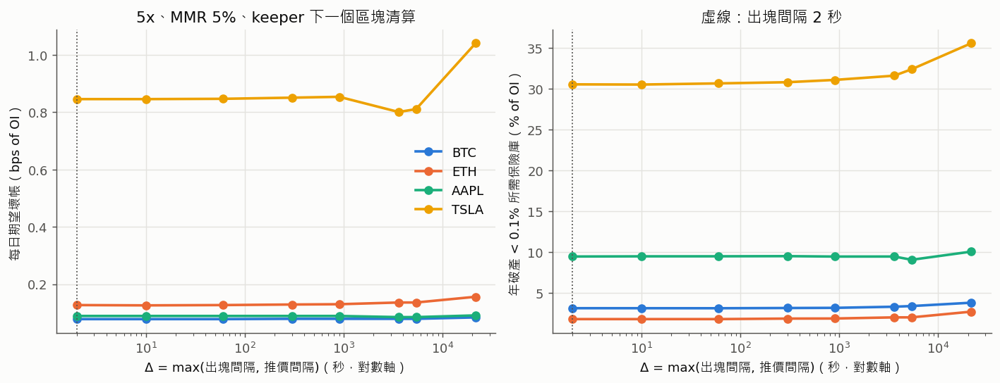
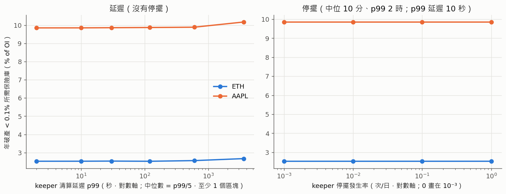
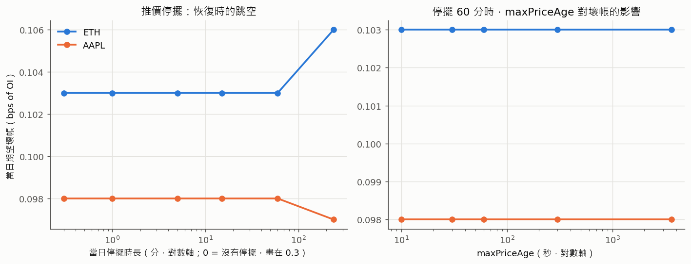
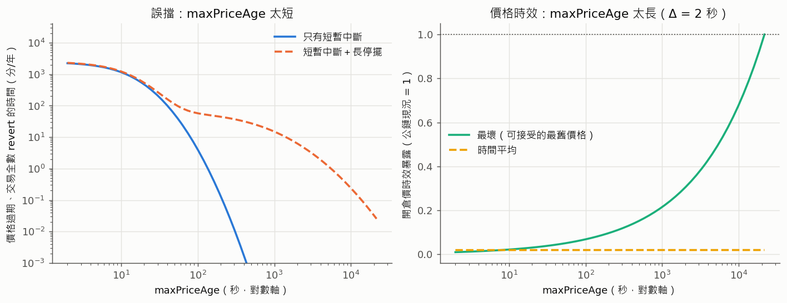
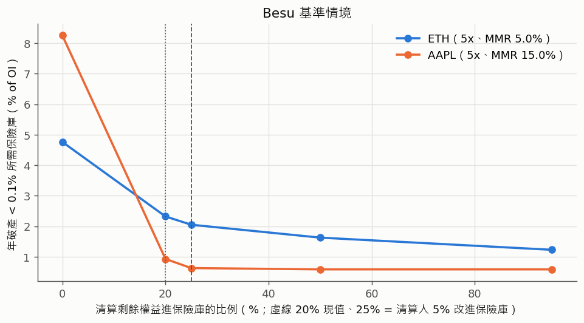
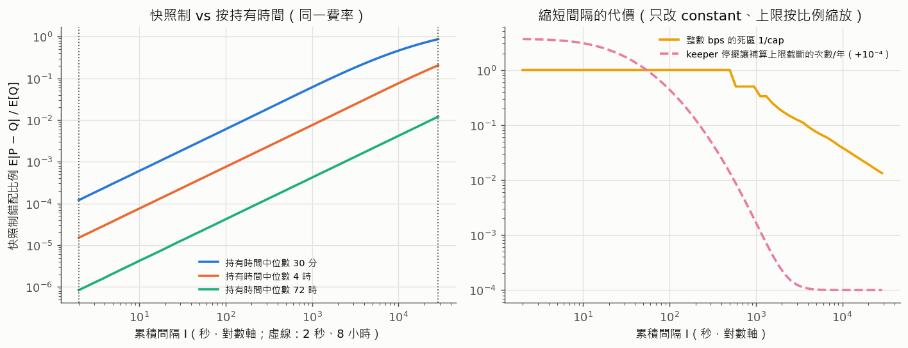
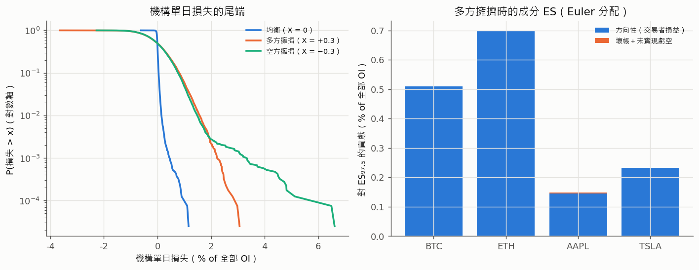
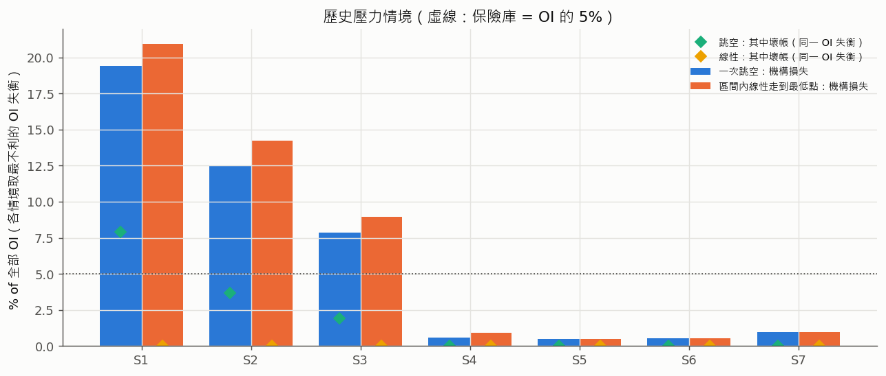

# 依 Besu 特性重新校準風險參數（Phase 3）

> 對象：要決定 Besu（QBFT 許可鏈）部署的槓桿、維持保證金率（MMR）、價格新鮮度、推價與 keeper 服務水準、清算分配與資金費的人，以及以「機構」角度看整本帳簿風險的人。
> 延續 Phase 1 [`RISK_MODEL_CFD.md`](RISK_MODEL_CFD.md) 的模型（清算價、帳簿、壞帳、保險庫打穿所需規模全部重用），只把「公鏈特性」換成「Besu 特性」。參數出處見 [`PARAMS_INVENTORY.md`](PARAMS_INVENTORY.md)；Besu 網路與腳本見 [`besu/`](../besu/)；治理與架構見 [`DESIGN_BESU.md`](DESIGN_BESU.md)。
> 程式：[`risk_model/besu.py`](../risk_model/besu.py)、[`risk_model/besu_institution.py`](../risk_model/besu_institution.py)、[`risk_model/run_besu.py`](../risk_model/run_besu.py)。一鍵重現：`risk_model/.venv/Scripts/python.exe risk_model/run_besu.py`（完整模式，本機約 16 分鐘，記憶體峰值 395 MB）；`--only <段落>` 只跑部分；CI 跑 `--quick`。亂數種子固定（20261005）。輸出在 `risk_model/output/besu/`（不進版控），圖在 [`docs/figures/besu_calibration/`](figures/besu_calibration/)。
> **揭露原則**（與 Phase 1 相同）：本文件只寫風險類別、等級、參數關係與建議，不寫可照做的利用門檻、時機或獲利數字。

## 0. 先講結論

1. **Δ = max(出塊間隔, 推價間隔)，Besu 上可以壓到一個區塊（2 秒）**：gas 免費，每個區塊推價沒有成本。但壞帳對 Δ 的敏感度很低：ETH 5x 的每日期望壞帳從 Δ = 6 小時的 0.156 bps 降到 Δ = 2 秒的 0.127 bps 就**收斂**（Δ ≤ 1 分鐘之後的差異在抽樣誤差內），剩下的是「跳躍本身一次跨過 MMR 緩衝」的下限，推價再快也消不掉（§1）。
2. **keeper 延遲與停擺對壞帳的影響也很小**：p99 延遲從 1 個區塊放寬到 2 分鐘，ETH 5x 需要的保險庫幾乎不變；放到 1 小時也只多約 6%。原因是延遲期間的擴散（σ√D）遠小於 5% 的 MMR 緩衝。**keeper 的服務水準主要由營運需求決定**（資金費結算、價格過期告警、壞帳倉位一定要有人清），不是由壞帳決定（§2）。
3. **Oracle 停擺的主要風險不是壞帳，而是停擺期間的交易可用性與開倉價時效**：單日 4 小時停擺只讓 ETH 的當日壞帳多約 3%，maxPriceAge 從 10 秒到 1 小時對**壞帳**沒有影響（§3；只指壞帳——停擺期間以舊價開倉的逆選擇是機構損失，不計入壞帳，§8 的 VaR 也沒有涵蓋）。maxPriceAge 的角色是「停擺時自動關門」：**建議 60 秒**（Base Sepolia 鏈上現值 6 小時；Besu PoC 部署預設 24 小時），可接受的最舊價格的時效暴露降到公鏈現況的約 5%，短暫中斷造成的誤擋約每年半小時（§4）。
4. **逐資產槓桿與 MMR**（保險庫 = OI 的 5%）：**前提是 `esgRegistry = 0`（碳定價整體停用，Phase 2 PoC 的 `Deploy.s.sol`）**——BTC 5x／5%、ETH 5x／5%、AAPL 5x／15%（替代：3x／5%）、TSLA 1x／5%；停用後碳分級的費率與槓桿差異、碳定價功能都不存在。**租戶部署（`DeployTenant.s.sol` 一定接 ESGRegistryV2）**的新資產一律 Unrated＝1x、費率按碳分級，槓桿由評等決定，另列一版（§5.2）。股票的財報跳空仍是主要風險（§5）。
5. **清算人獎勵 0%、全進保險庫**：`liquidatePosition` 沒有權限限制，帳戶白名單內的**任何**帳戶（含 trader、lp 角色）都能清算並拿走 5%，所以不改合約時「實質 0%／保險庫實質 25%」只是**上限、沒有保證**。ETH 5x 的保險庫需求介於 2.3%（獎勵全被他人拿走）與 2.05%（全由 keeper 清算並轉入）之間。要保證 0% 只有兩條路：(a) Besu 交易層外掛限制 `liquidatePosition` 只能由 keeper 呼叫（需自行開發、未經稽核），或 (b) 改合約常數（§6）。
6. **資金費每區塊累積**：快照制的錯配比例與累積間隔成正比，從 8 小時縮到每區塊可把它降約四個數量級；但**程式的費率是整數 bps**，只改間隔常數時，間隔短於約 6.4 分鐘（8h/75）費率就永遠是 0（15 分鐘時死區已達 50%），而且一次最多補 21 個區間會讓每區塊累積的補算窗只剩 42 秒。要真正每區塊累積必須同時改費率精度與補算上限（改合約，§7）。
7. **機構 VaR／ES**（整本帳簿、4 資產、相關性；每單位全部 OI）：多空均衡時單日 VaR₉₉ = 0.15%、ES₉₇.₅ = 0.18%；30% 的 OI 失衡時 VaR₉₉ ≈ 1.5–1.6%、ES₉₇.₅ ≈ 1.6%、10 日 ES₉₇.₅ ≈ 4.8–4.9%，幾乎全部是方向性風險：失衡時壞帳只佔 ES 的不到 1%，均衡時約 1/8（§8）。
8. **最嚴重壓力情境是 2020-03-12 型的加密崩跌**：機構單日損失約佔全部 OI 的 19–21%；若崩跌以一次跳空到達（例如推價停擺跨過整段崩跌），壞帳 8–15% of OI，是 5% 保險庫的 1.6–2.9 倍。均衡帳簿也會虧：清算把多方移出帳簿後，機構只剩下對空方的曝險（§9）。
9. **落地**：有 setter 的參數寫進 [`besu/config/risk-params.besu.json`](../besu/config/risk-params.besu.json)，以 `npm --prefix besu run risk-params` 用既有 setter 寫上鏈；constant（清算人 5%、資金費間隔與上限、補算上限、MAX_LEVERAGE、預設 MMR）**本 PR 不改**，§11 列出建議值、影響、確切位置與要重跑的測試（§10、§11）。

### 0.1 Besu 與公鏈的差異如何進入模型

| 面向 | 公鏈（Phase 1） | Besu | 模型怎麼改 | 節 |
|---|---|---|---|---|
| 最終性 | L2 sequencer 確認，最終性依附 L1，理論上可能重組 | QBFT 即時最終性，區塊一產生就不會被替換 | 不需要重組情境（Phase 1 也沒有模擬重組；這裡說明不必補） | §1.1 |
| Δ | 推價間隔（實測約 90 分）× 清算人反應 | Δ = max(出塊間隔, 推價間隔)，出塊 2 秒（可調） | 推價時點改為 Δ 的整數倍，在 2 秒細格點上模擬 | §1 |
| Oracle 風險 | 錯價、操縱（寫價沒有偏離上限） | 只有白名單帳戶能寫價：延遲與失效 | 加入推價停擺：停擺時長分布、停擺期間 maxPriceAge 讓交易 revert、恢復時價格一次跳到位 | §3、§4 |
| Gas | 要付 | 免費 | 每區塊推價、每區塊累積資金費的效果與代價 | §1、§7 |
| 清算人 | 任何人可清算（現況無 bot，Phase 1 假設平均 4 小時有人清） | 許可制 keeper | 改為 keeper 延遲分布（中位數、p99）＋停擺；評估清算人獎勵 0% | §2、§6 |
| 對手方 | exchange 合約的 USDC 池 | 機構本身 | 機構角度的 VaR／ES（多資產、相關性）與歷史壓力測試 | §8、§9 |

### 0.2 Besu 基準情境（假設，全部可調）

| 項目 | 基準值 | 依據 |
|---|---|---|
| 出塊間隔 | 2 秒 | `besu/.env.example` 的 `BESU_BLOCK_PERIOD=2` |
| 推價間隔 | 每個區塊（2 秒） | gas 免費；`oracle-pusher.mjs --interval 2` |
| keeper 清算延遲 | 對數常態，中位 2 秒（下一個區塊）、p99 10 秒，至少 1 個區塊 | 常駐 keeper 每個新區塊掃描一次（`besu/scripts/keeper.mjs`） |
| keeper 停擺 | 每日 0.01 次（每年約 3.7 次），時長對數常態：中位 10 分、p99 2 小時 | 假設（沒有 Besu 實測）；§2 做敏感度 |
| 推價停擺 | 每日 0.02 次（每年約 7 次），中位 5 分、p99 1 小時 | 假設；§3 做條件情境 |
| 推價短暫中斷（只用於 §4 的誤擋分析） | 每日 24 次，中位 12 秒、p99 1 分 | 假設（RPC 逾時、程式重啟） |
| maxPriceAge | 60 秒（§4 的建議值；Besu PoC 部署預設是原始碼的 24 小時，`Deploy.s.sol` 沒有呼叫 `setMaxPriceAge`） | §4 |
| 費率 | 手續費 0.10%、借貸費 1 bps/小時（所有資產） | Phase 2 PoC 部署沒有接 `esgRegistry`（`Deploy.s.sol` 建構子第三個參數為 0，碳定價整體停用），用全域 `TRADING_FEE_BPS = 10`、`BORROW_FEE_BPS_PER_HOUR = 1`（數值等於碳分級 Low）。租戶部署接碳分級時見 §5.2 |
| 價格過程 | Phase 1 的門檻法 Merton 參數；加密另加崩盤成分（每年 1 次、N(−15%, 5%²)） | `risk_model/data/calibrated_params.json` |
| 帳簿 | 每資產 60 個倉位、多空各半、全部用上限槓桿、過去 7 天開倉 | 與 Phase 1 相同 |
| 風險目標 | 年破產 < 0.1%、單日 ES₉₉ < 保險庫 10%、保險庫 = 該資產 OI 的 5% | 與 Phase 1 相同 |

## 1. 最終性與檢查間隔 Δ

### 1.1 最終性：為什麼不需要重組情境

公鏈上，一筆清算或推價交易在被「最終確認」之前，理論上可能因為鏈重組被替換，價格與清算結果都可能「倒帶」。QBFT 的區塊需要超過 2/3 驗證者簽名才會產生，一旦產生就是最終的（`besu/README.md` §8）。所以模型裡「某個時點鏈上看到的價格」與「某筆清算的結果」都不會事後改變，不需要加重組情境。Phase 1 本來也沒有模擬重組，這一點只是確認不必補。

連帶的影響：鏈上時間 `block.timestamp` 只在出塊時前進。若超過 1/3 驗證者離線，鏈會停止出塊，恢復後下一個區塊的時間戳記會一次跳過整段停擺；價格年齡（`block.timestamp − updatedAt`）因此包含鏈停擺的時間，§4 的 maxPriceAge 要涵蓋 QBFT 換輪的延遲。

### 1.2 Δ = max(出塊間隔, 推價間隔)

推價是一筆交易，只能落在區塊裡：推價間隔比出塊間隔短也沒有意義，所以

**Δ = max(出塊間隔, 推價間隔)**

Phase 1（§3.1）把檢查點拆成「推價時點」與「清算人到達」兩件事。Besu 上清算由 keeper 負責（§2），本節先令 keeper 在下一個區塊就清算，只看 Δ。

**壞帳可以拆成兩部分。** 一個多單在價格碰到清算價 S\* 時應該被清算，清算價與破產價相距 m·S₀（Phase 1 §2.2）。只有在「鏈上第一次看到的、已經低於 S\* 的價格」比 S\* 再低超過 m·S₀ 時，才會有壞帳。這個「穿越量」來自兩個來源：

1. **擴散**：兩次推價之間價格連續移動，穿越量的量級是 σ√Δ（Broadie–Glasserman–Kou 的離散監控修正是 0.5826·σ√Δ，Phase 1 §2.5）。ETH 的總波動 σ ≈ 65%／年，Δ = 2 秒時 σ√Δ = 0.65 × √(2 / 31,536,000) ≈ 0.016%，相對於 5% 的緩衝可以忽略；Δ = 6 小時時是 1.7%，開始有影響。
2. **跳躍**：一次跳空的大小與 Δ 無關，跳過緩衝就一定有壞帳。

所以 **Δ → 出塊間隔時，壞帳收斂到「只剩跳躍」的下限**。Δ 越小，擴散部分越接近 0，但跳躍部分不會消失。這與 Phase 1 §3.6(a) 的結論一致，Besu 只是把 Δ 推到了下限。

### 1.3 結果

5x、MMR 5%、keeper 下一個區塊清算、沒有停擺；每資產 12,000 天，所有 Δ 共用同一批市價路徑與帳簿（2 秒細格點，common random numbers）：

| 資產 | Δ = 2 秒 | 10 秒 | 1 分 | 15 分 | 1 時 | 6 時 |
|---|---|---|---|---|---|---|
| BTC 期望壞帳（bps/日）／ES₉₉／最小保險庫 | 0.078／7.8／3.1% | 0.078／7.8／3.1% | 0.078／7.8／3.1% | 0.079／7.9／3.2% | 0.079／7.9／3.3% | 0.084／8.4／3.8% |
| ETH | 0.127／12.7／1.8% | 0.126／12.6／1.8% | 0.127／12.7／1.8% | 0.130／13.0／1.9% | 0.136／13.6／2.0% | 0.156／15.3／2.7% |
| AAPL | 0.089／8.9／9.5% | 0.089／8.9／9.5% | 0.089／8.9／9.5% | 0.089／8.9／9.5% | 0.085／8.5／9.5% | 0.091／9.1／10.1% |
| TSLA | 0.85／84.6／30.5% | 0.85／84.6／30.5% | 0.85／84.7／30.7% | 0.85／85.4／31.1% | 0.80／80.1／31.6% | 1.04／95.8／35.6% |

（ES₉₉ 單位 bps of OI／日；最小保險庫＝同時滿足年破產 < 0.1% 與 ES 條件的最小 u₀，% of OI。完整表：`output/besu/tables/delta.csv`。）



讀法：

- **Δ ≤ 1 分鐘之後，四個資產的數字都不再變**（差異在抽樣誤差內）：Besu 每區塊推價已經在收斂區。對照 Phase 1 公鏈現況（推價約 90 分＋手動清算）的 sETH 5x：期望 0.166 bps、ES₉₉ 16.1 bps；Besu 基準降到 0.127 與 12.7，約少 25%。
- **股票幾乎不受 Δ 影響**：壞帳來自財報型大跳空（AAPL 門檻法 σ_J ≈ 10%、TSLA ≈ 18%），5x 的 MMR 緩衝擋不住，推價頻率幫不上忙；AAPL、TSLA 在 1 小時與 1.5 小時的數字略低於 2 秒，是抽樣誤差（每格同一批路徑，但清算時點不同）。
- 「最小保險庫」是 99.9% 分位數的估計，Phase 1 §7 #15 已說明不同樣本之間約有 ±1% of OI 的抽樣差異（例如 ETH 5x 在本節 1.8%、§2 的樣本 2.5%、§5 的樣本 1.7%）。

測試：`risk_model/tests/test_besu.py::test_delta_to_block_interval_without_jumps_gives_zero_bad_debt`（沒有跳躍時 Δ = 2 秒的壞帳 < 10⁻⁹、且隨 Δ 單調）、`test_delta_converges_with_jumps`（有跳躍時 2 秒與 10 秒的差遠小於 2 秒與 6 小時的差，且下限 > 0）。

## 2. 許可制 keeper：延遲與停擺（SLA 模型）

### 2.1 模型

Phase 1 把清算人當成「隨機到達的公開清算人」（Poisson、平均間隔 ρ）。Besu 上只有白名單帳戶能送交易，但 `liquidatePosition` 本身沒有權限限制：白名單內的任何帳戶（`besu/README.md` §3 的 trader、lp 角色也在內）都能清算。模型假設清算全由機構自營的 keeper 負責（其他帳戶的清算只會讓清算更早、不會更晚，對壞帳而言是保守的；對清算獎勵的歸屬則不是，見 §6.1），改用**服務水準（SLA）**描述：

- **延遲 D**：從「鏈上價格第一次達到清算價」到「清算交易被打包」的時間。取對數常態 D = 中位數 × e^{σZ}，σ 由 p99 反推：p99 = 中位數 × e^{2.326σ} ⇒ **σ = ln(p99/中位數)/2.326**。D 至少一個區塊。
- **停擺**：每日以 Poisson 發生（發生率 r），時長對數常態（中位數、p99）。停擺期間 keeper 不送任何交易，恢復後下一個區塊才處理。
- **執行價格**：清算在 t_c + D 執行，用的是那個時點鏈上最後一次推價的價格。若那時價格已回升到清算價之上，交易 revert（`PositionIsHealthy`），等下一次觸及；若價格年齡 > maxPriceAge，交易 revert（`StalePrice`），等下一次新價格。

**為什麼延遲的影響小（逐步推導）。** 延遲 D 期間，價格會繼續走：

1. 擴散部分：標準差 σ√D。ETH 的 σ ≈ 65%，D = 30 秒時 σ√D = 0.65 × √(30/31,536,000) ≈ 0.063%，D = 1 小時時約 0.69%，都遠小於 5% 的緩衝。
2. 跳躍部分：延遲期間發生跳躍的機率約 λ·D。ETH 一般跳躍每年約 100 次，D = 30 秒時 λD ≈ 100 × 30/31,536,000 ≈ 10⁻⁴。

所以除非延遲到小時級、而且同時遇到跳空，延遲幾乎不改變清算時的價格。

**單調性與共同亂數。** 程式用同一個標準常態 Z 產生每一筆延遲，只改尺度：p99 提高時，每一筆延遲都只會變長（`test_keeper_delays_monotone_in_p99`）。不同 SLA 因此看到同一批市價路徑、帳簿與延遲亂數，差異只來自 SLA 本身（`test_keeper_sla_monotonicity`、`test_keeper_outage_raises_bad_debt`、`test_keeper_outage_delays_execution`）。

### 2.2 結果

5x、MMR 5%，每資產 8,000 天、同一批路徑；延遲的中位數取 p99/5（至少一個區塊）：

| 資產 | p99 延遲 = 2 秒 | 10 秒 | 30 秒 | 2 分 | 10 分 | 1 時 |
|---|---|---|---|---|---|---|
| ETH 期望壞帳（bps/日）／最小保險庫 | 0.127／2.52% | 0.127／2.53% | 0.128／2.53% | 0.130／2.52% | 0.132／2.56% | 0.136／2.67% |
| AAPL | 0.105／9.85% | 0.105／9.85% | 0.105／9.86% | 0.105／9.87% | 0.105／9.89% | 0.105／10.2% |

| 資產 | 停擺 0 次/日 | 0.01 | 0.1 | 1 | 0.1 次/日、中位 2 小時（p99 12 小時） |
|---|---|---|---|---|---|
| ETH 期望壞帳（bps/日） | 0.127 | 0.127 | 0.127 | 0.127 | 0.128 |
| AAPL | 0.105 | 0.105 | 0.105 | 0.104 | 0.104 |



結論：

- **p99 延遲 ≤ 2 分鐘時，壞帳與理想情況（下一個區塊）在抽樣誤差內**；放到 1 小時，ETH 的期望壞帳多約 7%、最小保險庫多約 6%。
- **停擺對壞帳幾乎沒有影響**：中位 10 分鐘的停擺即使每天一次也看不出差異；每 10 天一次、中位 2 小時的長停擺只多約 1%。
- 所以 **keeper SLA 的目標由營運需求決定**，見 §10：
  1. 壞帳倉位（closeAmount ≤ 0）沒有任何清算獎勵，公鏈上沒有人有誘因去清（Phase 1 §6.3）。Besu 上由機構的 keeper 依 SLA 處理，這個問題才消失——前提是 keeper 一定在跑。
  2. 資金費要定期觸發（§7.4）：若改成短間隔累積，補算上限會把 keeper 的停擺容忍度壓到秒級。
  3. 價格過期與異常時，需要有人在分鐘內處理（切換 ReduceOnly、暫停）。
- 本節的停擺是 keeper 自己的停擺；推價停擺（價格不動）在 §3。

## 3. Oracle 風險：延遲與失效

### 3.1 為什麼從「操縱」換成「失效」

公鏈版的鏈上 exchange 讀 MockOracle，寫價沒有偏離上限（Phase 1 §7 #6）。Besu 上只有白名單帳戶能送交易、推價帳戶與 deployer 分離（`besu/README.md` §4），沒有公開的寫價面；剩下的主要風險是**推價程式、行情來源或節點連線停擺**。

### 3.2 停擺期間發生什麼（程式行為）

1. 鏈上價格凍結在停擺前最後一次推價。
2. 價格年齡 > maxPriceAge 之後，開倉（`_freshPrice`）、平倉與清算（`_requireFresh`）全部 revert（`PerpetualExchange.sol:1718-1736`）。
3. 市價在停擺期間繼續移動。恢復推價時，鏈上價格**一次跳到**停擺期間累積的變動（模型：停擺窗內的推價不存在，恢復後第一次推價的價格就是當時的市價）。

**跳空有多大（推導）。** 停擺 U 秒，恢復時的對數價格變動 = 擴散 N(0, σ²U) ＋ 期間內的跳躍。擴散部分的標準差 σ√U：ETH、U = 4 小時，0.65 × √(4/8,760) ≈ 1.4%，仍小於 5% 的 MMR 緩衝。期間內若有跳躍，那個跳躍在沒有停擺時一樣會造成壞帳。所以**停擺本身增加的壞帳只來自「擴散穿越量變大」**，要停擺到數小時以上、而且遇到大波動才明顯。

### 3.3 結果

**條件情境**（每個模擬日恰好發生一次、時長固定的推價停擺，開始時間均勻；5x、MMR 5%、keeper p99 10 秒；每資產 8,000 天、同一批路徑）：

| 資產 | 沒有停擺 | 1 分 | 5 分 | 15 分 | 60 分 | 240 分 |
|---|---|---|---|---|---|---|
| ETH 當日期望壞帳（bps）／P(>0) | 0.103／0.80% | 0.103／0.80% | 0.103／0.80% | 0.103／0.81% | 0.103／0.85% | 0.106／0.89% |
| AAPL | 0.098／0.13% | 0.098／0.13% | 0.098／0.13% | 0.098／0.13% | 0.098／0.13% | 0.097／0.14% |

**maxPriceAge 對壞帳的影響**（同上，停擺 60 分）：maxPriceAge = 10 秒、30 秒、60 秒、5 分、1 時，ETH 都是 0.103 bps、AAPL 都是 0.098 bps——**完全相同**。停擺期間鏈上價格凍結，本來就沒有新的倉位達到清算價；恢復後清算用的是新價格。maxPriceAge 只決定停擺期間「哪些交易還能用舊價格成交」，不決定壞帳。**這個結論只限壞帳**：停擺期間在 maxPriceAge 之內仍可用凍結的舊價格開倉，交易者取得的開倉價可能對機構不利（逆選擇，Phase 1 §3.5），這是機構（對手方）的損失，不會出現在壞帳或 `BadDebt` 事件裡，§8 的 VaR／ES 也沒有涵蓋（§12 #13）。maxPriceAge 的真正作用就是限制這種暴露的上限（§4）。

**無條件情境**（推價停擺每日 0.02 次與 0.2 次，基準時長分布）：與沒有停擺在抽樣誤差內相同。



結論：

- **推價停擺的風險等級：中**（壞帳面：低；可用性與價格時效面：中）。停擺期間交易者無法平倉、keeper 無法清算，恢復時價格一次跳到位；壞帳增加有限，但停擺期間的價格時效（開倉價可能不反映市價）由 maxPriceAge 控制，見 §4。
- **最嚴重的組合是「停擺跨過一段大行情」**：這就是 §9 壓力測試的「一次跳空」模式。
- **限制**：本節只量化壞帳；停擺期間以舊價開倉的逆選擇損失沒有量化（只在 §4 以相對時效暴露呈現），列為 §12 #13。

### 3.4 GuardedOracle 的偏離上限（`DESIGN_BESU.md` §7 待填）

Besu 部署沿用 `Deploy.s.sol`，exchange 讀 MockOracle（沒有偏離上限）。若改接 GuardedOracle（`DESIGN_BESU.md` §1 建議）：

- **偏離上限不能低於可能的單次跳空**，否則崩盤時正確的價格會被拒絕、價格凍結，清算全部停擺，等於人為製造 §3.3 的停擺。以本校準的加密崩盤成分（每年 1 次、平均 −15%）計，租戶範本的 10%（`maxDeviationBps = 1000`）每年約有 0.8 次會擋下真實價格；恢復推價時的跳空也可能超過它。
- 建議：單次偏離上限取 setter 允許的高端（≤ 5,000 bps），把「這次大跳是不是真的」交給第二來源確認（`setReferenceSource`；keeper 端已有「偏離 > 20% 需 ≥ 2 來源」的規則，`PARAMS_INVENTORY.md` §3.4）；時間窗累積上限（`setWindowLimit`）同理不應低於 §9 的單日壓力幅度。
- 這是建議方向，沒有對 GuardedOracle 參數做模擬；正式數值需在接 GuardedOracle 時另行校準。

## 4. maxPriceAge 與推價間隔

### 4.1 兩個方向的代價

maxPriceAge（以下記 A）是全域參數，同時決定兩件事：

1. **太短 → 誤擋**：正常運作中推價偶爾晚幾個區塊（RPC 逾時、程式重啟、QBFT 換輪），價格年齡就超過 A，所有開平倉與清算 revert。
2. **太長 → 價格時效**：推價停擺時，A 之內仍可用舊價格開倉（Phase 1 §3.5：價格時效屬高風險，開倉價的期望偏離約與 √價格年齡 成正比）。

### 4.2 誤擋的期望時間（推導）

正常運作時價格年齡在 [0, Δ] 之間（Δ = 2 秒）。一次推價中斷 U 秒（停擺前最後一次推價的年齡保守取 Δ），價格過期的時間是 (U + Δ − A)⁺。對數常態 U = m·e^{σZ} 時（m：中位數）：

E[(U − a)⁺] = m·e^{σ²/2}·Φ(σ − d) − a·Φ(−d)，d = ln(a/m)/σ

這和選擇權定價公式同型：「超過 a 的部分」的期望。乘上每日發生率，就得到每天價格過期的期望秒數（`besu.blocked_time_fraction`，有數值對照測試）。

### 4.3 時效暴露（相對量）

用 Phase 1 §3.5 的純擴散近似：開倉價偏離的期望 ∝ √價格年齡。定義兩個量，都除以公鏈現況（推價實測間隔、A = 6 小時）的同一個量：

- **最壞**：可接受的最舊價格 → √A。
- **時間平均**：在「可以開倉的時間」上平均 √年齡。正常運作時年齡在 [0, Δ] 均勻，平均是 (2/3)√Δ；停擺時年齡從 0 長到 min(U, A) 為止都還能開倉（推導與公式見 `besu.stale_exposure` 的說明）。

### 4.4 結果

| A | 只有短暫中斷：誤擋（分/年） | 加上長停擺（分/年） | 時效暴露：最壞（公鏈現況 = 1） | 時間平均 |
|---|---|---|---|---|
| 10 秒 | 1,160 | 1,220 | 0.022 | 0.019 |
| 30 秒 | 210 | 271 | 0.037 | 0.019 |
| **60 秒** | **29** | **87** | **0.053** | **0.019** |
| 2 分 | 1.8 | 53 | 0.075 | 0.019 |
| 5 分 | 0.01 | 37 | 0.12 | 0.019 |
| 1 時 | ≈ 0 | 2.3 | 0.41 | 0.019 |
| 6 時（Base Sepolia 鏈上現值） | ≈ 0 | ≈ 0 | 1 | 0.019 |
| 24 時（Besu PoC 部署預設：`Deploy.s.sol` 未呼叫 `setMaxPriceAge`，沿用原始碼 24h） | ≈ 0 | ≈ 0 | 2.0 | 0.019 |

（「加上長停擺」那一欄裡，長停擺本身就是真的停擺，交易在那段時間 revert 是預期行為；誤擋看第一欄。）



讀法與建議：

- **時間平均的時效由 Δ 決定**：每區塊推價時，不論 A 是多少，時間平均都降到公鏈現況的約 2%（√(2 秒) 對 √(約 90 分) 的量級）。A 只控制停擺期間的**最壞情況**。
- **建議 A = 60 秒（可接受範圍 30–120 秒）**：最壞時效暴露降到公鏈現況的約 5%；短暫中斷造成的誤擋約每年半小時，且相當於可以容忍連續約 30 個區塊沒有推價、或 QBFT 數輪換輪（`requesttimeoutseconds` 預設 4 秒，後續輪次逾時更長）。低於 30 秒誤擋急速增加；高於 2 分鐘時誤擋已接近 0，再拉長只會增加最壞時效暴露。
- **兩個現況**：Base Sepolia 鏈上是 6 小時；Besu PoC 部署沒有設定，是原始碼預設 24 小時（最壞時效暴露是 Base Sepolia 的 2 倍）。兩者都要靠部署後設定（§11.1）降到 60 秒。
- **依據小結**：maxPriceAge 由「小時」降到「秒到分鐘級」，是因為 Besu 的 Δ 從約 90 分降到 2 秒：公鏈上 A 的下限是「實測最長推價間隔」（Phase 1 §6.4），Besu 上正常的最長間隔只有幾個區塊，A 的下限隨之降到秒級。
- **推價間隔建議：每個區塊（2 秒）**。§1 顯示壞帳在 Δ ≤ 1 分鐘就收斂，但時效暴露仍與 √Δ 成正比，而 gas 免費，沒有理由放寬。
- **股票休市**：A = 60 秒時，休市期間推價一停，股票的平倉與清算也會 revert。建議沿用公鏈 keeper 的做法：休市前切 ReduceOnly、休市期間以心跳推最後收盤價，開盤時恢復（`PARAMS_INVENTORY.md` §3.4）；開盤的第一次推價就是隔夜跳空，風險已含在 §5、§9 的股票跳空裡。
- 測試：`test_max_price_age_tradeoff`、`test_stale_price_blocks_liquidation_until_next_push`。

## 5. 逐資產槓桿與 MMR（反推）

方法與 Phase 1 §6.1 相同：從 5x 往下試 L，MMR 由 5% 往上試（5%、7.5%、10%、15%，且 m < 1/L − f），第一組同時滿足「年破產 < 0.1%」與「單日 ES₉₉ < 保險庫 10%」的就是建議值。差別：

- 基礎設施用 Besu 基準情境（§0.2）；
- 同一資產的所有 (L, m) 共用同一批市價路徑（每組 12,000 天＋50,000 條一年 bootstrap 路徑）。

### 5.1 前提：`esgRegistry = 0`（碳定價整體停用）

下表只在 Phase 2 PoC 的部署方式下成立：`besu/scripts/deploy.sh` 沿用 `Deploy.s.sol`，exchange 建構子的 `esgRegistry` 是 0。此時：

- **碳定價整體停用**：所有資產用全域費率（0.10%＋1 bps/小時），槓桿上限都是 `MAX_LEVERAGE = 5`，只受 `setMaxLeverageFor` 收緊。碳分級的費率差異、槓桿差異與碳定價相關功能（`PARAMS_INVENTORY.md` §1.1；ADR-003、ADR-005、ADR-006）在這種部署裡**全部不存在**。這是部署選擇，不是風險模型的建議；要不要停用碳定價由擁有者決定。
- 正式的租戶部署（`DESIGN_BESU.md` §1.6：Besu 上用 `DeployTenant.s.sol`）**一定接 ESGRegistryV2**：新 registry 的每個資產都是 Unrated（＝ High 那一列：1x、手續費 1%、借貸費 10 bps/小時），有效槓桿 = min(`setMaxLeverageFor`, 碳分級上限)。下表的 5x 在這種部署裡**不會生效**（`apply-risk-params.mjs` 讀回不一致時會提示）。

| 資產 | 建議 L／MMR | 最小保險庫（% of OI） | 被排除的較高組合 |
|---|---|---|---|
| BTC | **5x／5%** | 3.7%（5x／7.5% 時 2.2%） | — |
| ETH | **5x／5%** | 1.7% | — |
| AAPL | **5x／15%**（替代：3x／5%，2.3%） | 1.1% | 5x／5%、7.5%、10%：年破產 0.84%、0.70%、0.27%；4x／5–10%：0.32–0.40% |
| TSLA | **1x／5%** | 0.4% | 5x 到 2x 的所有 MMR 都不可行（2x 時年破產約 1.0–1.2%、需要約 17.5% 的保險庫） |

完整表：`output/besu/tables/inverse_L_m.csv`。

讀法：

- **加密資產在 Besu 上更寬裕**：ETH 5x 需要的保險庫從公鏈現況的 3.4%（Phase 1 §4.4）降到約 1.7–2.5%（不同樣本）。BTC 5x 在公鏈是碳分級 High（1x）的結果，不是風險模型的限制；Besu 沒有接碳分級時可以開到 5x。
- **股票仍由財報跳空決定**，Besu 的快速推價與 keeper 幫不上忙（§1）。AAPL 的建議與 Phase 1「改善後」一致（5x／15%）。**取捨**：5x＋MMR 15% 的清算距離只有約 1/5 − 15% − 0.1% ≈ 4.9%，交易者很常被清算（保險庫也因此收到較多罰金，這是它可行的原因之一）；3x／5% 的清算距離約 28%，對客戶較友善、需要的保險庫略多。兩者都可行，由產品政策決定。
- **TSLA 只建議 1x**，與公鏈現值相同。
- 不同 (L, m) 的最小保險庫不一定隨 L 單調（例如 AAPL 4x／15% 是 3.8%、5x／15% 是 1.1%）：MMR 高、槓桿高時清算更頻繁、罰金收入更多，加上 99.9% 分位數的抽樣誤差（約 ±1% of OI），只把它當成「可行／不可行」的判斷。
- **MMR 對既有倉位立即生效**：清算門檻是「開倉名目 × 目前的 MMR」，`setMaintenanceMarginFor` 一改，既有倉位的清算價就跟著變。AAPL 5x 由 5% 調到 15% 時，清算距離由約 15% 縮到約 5%，部分既有倉位會當場可清算。所以 `apply-risk-params.mjs` 在該資產還有未平倉 OI 時拒絕調高 MMR，除非加 `--allow-mmr-raise-with-open-positions`（§11.1）；正式環境應先公告、給交易者補保證金或減倉的時間（`DESIGN_BESU.md` §1.3、§7）。

### 5.2 租戶部署（碳分級啟用）的版本

接了 ESGRegistryV2 時，每個資產的槓桿上限與費率由碳分級決定，風險參數只能在分級上限之內選。依分級：

| 碳分級（上限、費率） | BTC | ETH | AAPL | TSLA | 依據與狀態 |
|---|---|---|---|---|---|
| **Unrated／High**（1x、1%、10 bps/小時；**新 registry 的預設**） | 1x／5% | 1x／5% | 1x／5% | 1x／5% | 1x 的清算距離約 94%，四個資產的最小保險庫都 ≤ 0.4%（§5.1 表、Phase 1 §6.2）；借貸費只對借來的 M·(L−1) 計，1x 時為 0 |
| **Low**（5x、0.10%、1 bps/小時） | 5x／5% | 5x／5% | 5x／15%（或 3x／5%） | 1x／5% | 與 §5.1 表相同：Low 的費率正好等於全域費率，所以 §5.1 的結果直接適用 |
| **Mid**（2x、0.40%、4 bps/小時） | 2x／5% | 2x／5% | 2x／5% | 1x／5% | **推論、未在 Besu 情境以 Mid 費率重跑**：§5.1 在 2x（Low 費率）時 BTC、ETH、AAPL 都可行且需求 ≈ 0、TSLA 不可行；Phase 1 §6.2（公鏈、Mid 費率）結論相同。正式採用前應另行校準 |

資產要拿到 Low 或 Mid，必須先有碳評等（ADR-006：分級是見證過的事實），這是評等流程，不是風險參數能決定的；評等完成前，租戶部署的四個資產都是 1x。

## 6. 清算人與保險庫分配：0% 方案

### 6.1 程式現況與 Besu 的差異

清算時若剩餘權益 closeAmount > 0：清算人 5%（`LIQUIDATION_REWARD_BPS`，constant，`PerpetualExchange.sol:56`）、保險庫 20%（`liquidationPenaltyBps`，setter）、其餘退持有人（Phase 1 §4.1）。5% 的用意是吸引公開的清算人。Besu 上只有白名單帳戶能送交易，**但 `liquidatePosition` 本身沒有權限限制**：白名單內的任何帳戶——包括 trader、lp 這類一般使用者角色——都能清算任何可清算倉位，並拿走 5%。所以許可鏈只把「誰能清算」縮小到白名單，**沒有讓獎勵自動歸機構**。

要讓清算人實質拿 0%，有三種做法：

| 做法 | 能保證 0%？ | 說明 |
|---|---|---|
| 營運程序：keeper 搶先清算，再把獎勵轉入保險庫（§6.4） | **否，只是上限** | 白名單內其他帳戶可以先清算拿走 5%；keeper 的延遲越短，被搶走的比例越低，但沒有保證 |
| (a) Besu 交易層限制：用 Besu 外掛的交易許可（plugin API 的 `PermissioningService`／`TransactionPermissioningProvider`）拒絕「呼叫 `liquidatePosition`、但寄件人不是 keeper」的交易 | 是（在網路層） | **需自行開發 Java 外掛**；Besu 的鏈上許可（onchain permissioning）自 24.12.0 起已標為 deprecated，社群外掛只有少數案例。風險：外掛未經稽核；所有驗證者都要部署同一版本與同一份 keeper 名單（交易提交、P2P 接收、打包都會檢查），設定不一致會讓節點對同一筆交易判斷不同；名單設錯會連 keeper 一起擋掉，清算全部停擺。屬研究原型等級，沒有在測試網驗證前不建議上線 |
| (b) 改合約常數 `LIQUIDATION_REWARD_BPS = 0` | 是（在合約層） | 需改合約、重新部署，見 §11.2 |


### 6.2 結果

Besu 基準情境；ETH 5x／5%、AAPL 5x／15%；同一批 12,000 天樣本，只改進保險庫的比例（持有人拿剩下的）。**25% 那一列是上限**：只有在「所有清算都由 keeper 完成、獎勵全數轉入」，或採用 (a)／(b) 時才達得到；白名單內其他帳戶清算的比例為 s 時，保險庫實質比例是 20% + 5% × (1 − s)，需求介於 20% 與 25% 兩列之間（保守規劃以 20% 那一列計）：

| 進保險庫的比例 | ETH 最小保險庫（% of OI） | AAPL 最小保險庫 |
|---|---|---|
| 0% | 4.8% | 8.3% |
| **20%（現值）** | **2.3%** | **0.93%** |
| **25%（上限：清算人 5% 全數改進保險庫）** | **2.05%** | **0.63%** |
| 50% | 1.6% | 0.59% |
| 95%（任務書假設） | 1.2% | 0.59% |



### 6.3 0% 方案的利弊

| | 說明 |
|---|---|
| 好處 | 保險庫收入最多多 25%（20% → 25%），ETH 5x 需要的保險庫最多約少 0.25% of OI；對持有人沒有額外成本（持有人仍拿 75%）。不改合約時這是上限（§6.1） |
| 好處 | 公鏈上「壞帳倉位（closeAmount ≤ 0）沒有獎勵、沒有人有誘因去清」的問題（Phase 1 §6.3）在 Besu 上本來就由 SLA 解決，0% 不會讓它變差 |
| 代價 | **備援清算人的誘因消失**：不改合約時，白名單內其他帳戶仍能清算（keeper 停擺時是一種備援，但也會拿走獎勵）；採 (a)／(b) 後只剩 keeper 能、或只剩 keeper 願意清算。所以 keeper 必須有備援（至少兩個白名單實例，主備切換），停擺告警要能在分鐘內處理（§10） |
| 代價 | **keeper 的成本由機構承擔**：Besu 上 gas 免費，成本是主機、監控、值班與金鑰保管（`DESIGN_BESU.md` §1）。這些原本可由 5% 獎勵間接支付，0% 後改由機構預算支付 |
| 壞帳倉位的處理 | 不變：closeAmount ≤ 0 時三方都拿 0，缺口走 `_absorbShortfall`（保險庫 → ADL → `BadDebt` 事件）。keeper 依 SLA 清算所有可清算倉位，不論有沒有獎勵 |

### 6.4 不改合約時：keeper 獎勵轉入保險庫的流程

清算獎勵付給呼叫者。由 keeper 完成的清算，獎勵進 keeper 帳戶；要讓它成為保險庫的收入，**轉入方式很重要**：

- **不要用 `InsuranceVault.deposit`**：`deposit` 會把份額鑄給呼叫者（`InsuranceVault.sol:149-160`），等於 keeper 成了保險庫的 LP，份額可以隨時 `withdraw` 贖回——錢仍然屬於 keeper，不是送給保險庫。
- **用 owner 的 `recapitalize`**：`recapitalize(amount)` 只有 owner 能呼叫、從呼叫者轉入、**不鑄份額**、直接增加 `totalAssets`（`InsuranceVault.sol:140-145`）。流程是 keeper 先把獎勵轉給 owner（治理多簽，`DESIGN_BESU.md` §1），owner 再呼叫 `recapitalize`。這才等價於「把 5% 送給保險庫」。

營運要求：

| 項目 | 建議 |
|---|---|
| 累積期間保險庫較薄 | 轉入前，獎勵停在 keeper 帳戶，保險庫比「constant 改 0」的版本少這段累積金額。轉帳門檻與週期取兩者較先到者：例如累積達保險庫的 0.1%，或每日一次 |
| 對帳 | 每期比對「keeper 為呼叫者的清算獎勵加總」與「`Recapitalized` 事件金額」；差額、以及白名單內非 keeper 帳戶的清算筆數與金額，都列入報表 |
| keeper 金鑰外洩的曝險上限 | keeper 帳戶只留未轉出的獎勵與少量 ETH，曝險上限就是一個轉帳週期的累積金額；門檻越低、週期越短，曝險越小。keeper 金鑰依 ADR-014 放 KMS |
| 告警 | 累積金額超過門檻未轉出、對帳不平、白名單內非 keeper 帳戶出現清算，都發告警 |

以上流程做到時，保險庫實質收入最高 25%，與把 constant 改成 0、`liquidationPenaltyBps` 改成 2,500 相同；但它依賴營運程序，而且不能防止其他白名單帳戶先清算（§6.1）。改 constant 的版本會計更乾淨、沒有累積期與金鑰曝險，見 §11。

**建議**：Besu 版維持 `liquidationPenaltyBps = 2000`，keeper 取得的清算獎勵依 §6.4 以 `recapitalize` 轉入保險庫（保險庫實質最高 25%，保守規劃以 20% 計算需求）；要保證 0% 時採 (b) 改合約，(a) 只在外掛完成測試網驗證後考慮；若擁有者決定改 constant（§11），同時把 `liquidationPenaltyBps` 改成 2,500。提高到 50% 以上雖然還能再降需求，但等於加重被清算交易者的成本，屬於產品政策，不建議僅以保險庫需求決定。

## 7. 資金費：每區塊累積的效果與代價

### 7.1 程式現況

每 8 小時一個區間、只算滿的區間；費率是整數 bps：rate = trunc(trunc(10¹⁸·X)·75/10¹⁸)，X 是正規化 OI 失衡；一次最多補 21 個區間，超過的部分雙方都免除（Phase 1 §5.1、`PARAMS_INVENTORY.md` §2.1）。結算是**快照制**：一個區間的資金費算給結算當下還開著的倉位，不按持有時間加權（Phase 1 §5.4，中高風險）。

Besu 上 gas 免費，「每個區塊都累積」在成本上可行。以下分析把累積間隔 I 從 8 小時縮短的效果與代價。

### 7.2 快照制的錯配比例（推導）

令一個倉位持有 h 小時，開倉時點相對區間邊界是均勻的。快照制收付的區間數 N，按持有時間應收付 h/I 個區間。寫 h/I = k + φ（k 是整數、0 ≤ φ < 1）：

- 持有期間會跨過 k 或 k + 1 個結算時點；跨過 k + 1 個的機率是 φ（開倉時點落在離下一個邊界 φ·I 之內）。
- |N − h/I| 在 N = k + 1 時是 1 − φ、在 N = k 時是 φ，所以期望值 **E|N − h/I| = φ(1 − φ) + (1 − φ)φ = 2φ(1 − φ)**。

對所有倉位（名目加權）平均，定義**錯配比例 = E|P − Q| / E[Q] = E[2φ(1 − φ)] / E[h/I]**（P：快照制實際收付；Q：按持有時間應收付）。兩個極端：

- I ≪ h：φ 近似均勻，E[2φ(1 − φ)] = 1/3，**錯配比例 ≈ I / (3·E[h])，與 I 成正比**。
- I ≫ h：φ = h/I，錯配比例 → 2(1 − h/I)，接近 2——收付幾乎完全取決於持有期間有沒有剛好跨過結算時點。

持有時間取對數常態（對數標準差 1.5；中位數 30 分、4 小時、3 天三種，假設值）：

| 累積間隔 I | 持有中位 30 分 | 4 小時 | 3 天 |
|---|---|---|---|
| 8 小時（現值） | 87% | 21% | 1.2% |
| 2 小時 | 36% | 5.5% | 0.30% |
| 1 小時 | 21% | 2.7% | 0.15% |
| 15 分 | 5.5% | 0.68% | 0.04% |
| 1 分 | 0.36% | 0.05% | 0.003% |
| 每區塊（2 秒） | 0.012% | 0.0015% | 0.0001% |

**緩解程度**：錯配比例與 I 成正比，從 8 小時縮到每區塊，約降四個數量級，快照制的問題在實務上消失（回復失衡的資金必須真的持有才分得到資金費，Phase 1 §5.4 的回復力削弱效果隨之消失）。風險等級由中高降為低。

### 7.3 代價一：整數 bps 的死區

若只改間隔常數、讓每區間上限按比例縮放（年化上限不變），每區間上限 cap = 75 × I / 8h。程式的費率是整數 bps，|X| < 1/cap 時費率是 0（死區）：

| I | 每區間上限（理想） | 整數上限 | 死區（|X| 小於此值費率為 0） | 實際最高（換算每 8 小時） |
|---|---|---|---|---|
| 8 時 | 75 | 75 | 1.3% | 74 bps |
| 4 時 | 37.5 | 38 | 2.6% | 74 bps |
| 2 時 | 18.75 | 19 | 5.3% | 72 bps |
| 1 時 | 9.4 | 9 | 11% | 64 bps |
| 15 分 | 2.3 | 2 | 50% | 32 bps |
| 1 分、每區塊 | < 1 | 0 | 100%（費率永遠是 0） | 0 |

**只改常數做不到每區塊累積**：間隔短於 8h/75 ≈ 6.4 分鐘，整數 bps 的費率永遠是 0；15 分鐘時死區已達 50%。要每區塊累積，必須把費率精度從整數 bps 改成高精度（例如 18 位小數），這是改兩個既有運算式（`_fundingRateBps` 與 `_accrueFunding` 的 `absRate * 1e14 * intervals`），不新增方法，但會動到 bytecode（§11）。

### 7.4 代價二：一次最多補 21 個區間 → keeper 可用性

`_pokeFunding` 一次最多補 21 個區間，超過的區間雙方都免除（守恆不受影響，但那段時間的回復力消失）。所以 **21 × I 之內一定要有人觸發**。開平倉與清算都會觸發，但閒置的資產只有 keeper 會觸發。用 §0.2 的 keeper 停擺分布，期望的「補算被截斷」次數：

| I | 補算窗 21 × I | 基準 keeper（每年 3.7 次停擺） | 停擺 10 倍（每年 37 次） |
|---|---|---|---|
| 8 時 | 7 天 | ≈ 0 | ≈ 0 |
| 2 時 | 42 小時 | ≈ 0 | ≈ 0 |
| 1 時 | 21 小時 | 1 × 10⁻⁵ | 1 × 10⁻⁴ |
| 15 分 | 5.25 小時 | 0.002 | 0.02 |
| 1 分 | 21 分 | 0.89 | 8.9 |
| 每區塊 | 42 秒 | 3.6（幾乎每次停擺） | 36 |

**每區塊累積時，keeper 任何超過 42 秒的停擺都會讓資金費被免除**——這遠比 §2 的壞帳要求嚴格。所以每區塊累積必須同時放大補算上限（例如維持 7 天的補算窗：21 × 8h / I 個區間）；`_accrueFunding` 的成本與補算區間數無關（乘法而不是迴圈），放大上限不增加 gas。



### 7.5 回復速度

Phase 1 §5.3：每區間修正 θ·F·I/8h，一階展開 κ ≈ θ·0.0075/8h，**與 I 無關**。縮短間隔不會讓失衡回復得更快（θ 不大時 8 小時與連續的半衰期幾乎相同，Phase 1 §5.6），效果只在快照錯配與死區兩件事。

### 7.6 建議

- **本 PR 維持 8 小時**（constant 與 Base Sepolia 共用）。
- **目標設計**：每區塊（或每秒）以高精度累積、補算窗維持 ≥ 7 天——錯配比例降約四個數量級、死區消失；需改合約（§11）。
- **只改常數的過渡方案**：I = 2 小時、`MAX_FUNDING_RATE_BPS = 19`（年化上限 ≈ 不變）、`MAX_FUNDING_CATCHUP_INTERVALS = 84`（補算窗維持 7 天）：錯配比例約降為 1/4（持有中位 4 小時：21% → 5.5%），代價是死區由 1.3% 擴大到 5.3%。
- keeper 每輪對到期的資產送 `settleFunding`（`besu/scripts/keeper.mjs` 已如此）；營運目標：至少每小時觸發一次，告警門檻為落後 2 個區間（與公鏈 keeper 健康檢查的「2 × FUNDING_INTERVAL」一致）。

## 8. 機構角度：整本帳簿的 VaR／ES

### 8.1 機構的損失（推導）

Besu 部署的對手方是機構本身。一天之內：

1. 交易者的損益（多空、含已清算倉位到清算價為止）：對倉位 i，開倉價 S₀ᵢ、名目權重 wᵢ（以開倉名目計），今日從 S_now 走到出場價 S_exit：損益 = sideᵢ·wᵢ·(S_exit − S_now)/S₀ᵢ = sideᵢ·wᵢ·e^{−xᵢ}·(e^{y_exit} − 1)，xᵢ = ln(S₀ᵢ/S_now)、y_exit = ln(S_exit/S_now)。
2. 交易者付不出來的部分（壞帳＋期末未實現虧空，Phase 1 §3.2）。

機構收到虧損方的錢（最多到他的權益為止）、付獲利方的錢，所以

**機構損失 = Σ 交易者損益 + Σ 付不出來的部分**

（保險庫若由機構出資，兩者合計就是機構的損失；若有外部 LP，第二項先由保險庫承擔。）手續費、借貸費、罰金收入都不計（保守）。

**VaR 與 ES**：VaR_q 是損失的 q 分位數；ES_q 是「損失 ≥ VaR_q 那 1 − q 機率」的平均（Phase 1 `gap_risk.var_es`）。**成分 ES（Euler 分配）**：各資產、各成分在「合計損失 ≥ VaR」那些日子的平均損失，加總就是 ES。

### 8.2 聯合模擬

- **相關性**：由公開日資料估計（Binance 1d：BTCUSDT、ETHUSDT；Yahoo 1d：AAPL、TSLA；2021-10-05 ~ 2026-10-02，1,253 個股票交易日；加密取同一 UTC 日期的日 K 收盤）。擴散部分用「剔除任一資產 |MAD z| ≥ 4 的日子」的穩健相關（跳躍另外模擬，避免重複計算），Pearson 當敏感度：

  | 穩健（Pearson） | BTC | ETH | AAPL | TSLA |
  |---|---|---|---|---|
  | BTC | 1 | 0.81（0.85） | 0.20（0.27） | 0.30（0.35） |
  | ETH | | 1 | 0.24（0.30） | 0.31（0.37） |
  | AAPL | | | 1 | 0.42（0.46） |

  原始價格不進版控，只有相關係數矩陣與 §9 的衝擊幅度寫在 [`risk_model/data/besu_market_stats.json`](../risk_model/data/besu_market_stats.json)。
- **跳躍**：一般跳躍各資產獨立；加密崩盤成分 **BTC 與 ETH 同時發生、跳幅完全相關**（壓力假設），「崩盤不同步」當敏感度。
- **時間軸**：一日 1,440 格（加密是日曆日、股票是交易日的 1/1,440），以「一日之中的同一比例時點」對齊；keeper 與停擺用 Besu 基準情境（Δ 取 1 分鐘格點，§1 顯示 1 分鐘以下在收斂區）。
- **限制（收盤時點不一致）**：加密日報酬以 UTC 00:00 收盤、美股以 16:00 ET（UTC 20:00 或 21:00）收盤，兩者相差 3–4 小時；同一事件可能分落兩個「日」，日報酬的相關係數因此**可能被低估**（非同步交易偏誤）。Pearson 敏感度只差 ±0.1% of OI，但兩者都受同一偏誤影響。
- **限制（逆選擇未計入）**：機構損失只計交易者損益與付不出來的部分；推價停擺期間以舊價開倉的逆選擇損失沒有模擬（§3.3、§12 #13）。
- **帳簿**：OI 權重 BTC 35%、ETH 30%、AAPL 20%、TSLA 15%（假設）；各資產用 §5 的建議 L／MMR；OI 失衡 X 取 0、+0.3（多方擁擠）、−0.3。
- 20,000 個模擬日；10 日數字以「獨立抽 10 天加總、帳簿不變」計算（偏樂觀：忽略波動群聚；偏保守：忽略 10 天內的避險與減倉）。

### 8.3 結果

單位：% of 全部資產 OI 合計。

| 情境 | 1 日 VaR₉₉ | 1 日 ES₉₇.₅ | 1 日 ES₉₉ | 1 日 ES₉₉.₉ | 10 日 VaR₉₉ | 10 日 ES₉₇.₅ | 其中壞帳：1 日 ES₉₉ |
|---|---|---|---|---|---|---|---|
| 多空均衡（X = 0） | 0.15% | 0.18% | 0.27% | 0.68% | 0.49% | 0.53% | 0.07% |
| 多方擁擠（X = +0.3） | 1.57% | 1.59% | 1.87% | 2.49% | 4.79% | 4.81% | 0.08% |
| 空方擁擠（X = −0.3） | 1.49% | 1.62% | 2.09% | 4.31% | 4.83% | 4.94% | 0.07% |
| 多方擁擠、Pearson 相關 | 1.57% | 1.62% | 1.91% | 2.81% | 4.86% | 4.90% | 0.10% |
| 多方擁擠、崩盤不同步 | 1.56% | 1.58% | 1.81% | 2.36% | 4.70% | 4.73% | 0.09% |

**成分 ES₉₇.₅**（多方擁擠）：BTC 0.51%、ETH 0.70%、AAPL 0.15%、TSLA 0.23%（方向性）；壞帳合計約 0.005%。



讀法：

- **機構的風險幾乎全是方向性的**：OI 失衡 30% 時，單日 ES 是均衡時的約 9 倍，壞帳只佔 ES 的不到 1%；即使多空均衡，壞帳也只佔 ES₉₇.₅ 的約 1/8（0.022% of OI）。所以機構的主要風險控制是**限制淨曝險**（逐資產 OI 上限 `setMaxOpenInterest`、對外避險），而不是保險庫。
- **空方擁擠的極端尾端比多方擁擠厚**（ES₉₉.₉ 4.3% vs 2.5%）：加密崩盤時多方被清算出帳簿，機構只剩對空方的曝險，崩盤越深虧越多（§9 的同一機制）。
- 相關係數用 Pearson、或崩盤不同步，結果差異在 ±0.1% of OI 內。
- **OI 上限的參數關係**：若各資產 OI 上限讓「單日 ES 不超過機構願意用來承擔市場風險的資本 K」，則全部 OI 上限 ≈ K / ES 比例（例如以多方擁擠的 ES₉₇.₅ 1.6% 計，OI 合計上限 ≈ K / 0.016）；保險庫面則由 §5 的「最小保險庫 ÷ OI」決定：資產 a 的 OI 上限 ≈ 保險庫分配給 a 的金額 ÷ 該資產的最小保險庫比例。實際數值要看機構資本與保險庫規模，本文件不填。

## 9. 壓力測試（歷史情境，參數化衝擊）

### 9.1 情境與衝擊幅度

衝擊幅度由公開日資料計算（同 §8.2 的來源；只放幅度，不放價格序列）。加密取區間最低價對基準收盤；股票取收盤對收盤與開盤跳空。

| 編號 | 情境（基準收盤 → 區間） | BTC | ETH | AAPL | TSLA |
|---|---|---|---|---|---|
| S1 | 2020-03-12 新冠崩跌（03-11 → 03-12～13） | −52.3% | −55.8% | −9.9%（開盤 −7.1%） | −11.6%（開盤 −8.4%） |
| S2 | 2022-05 Terra／LUNA（05-04 → 05-05～12） | −32.7% | −38.8% | −14.1% | −23.6% |
| S3 | 2022-11 FTX（11-07 → 11-08～09） | −24.3% | −31.5% | −2.9% | −9.9% |
| S4 | AAPL 2019-01-03 營收指引下修 | — | — | −10.0%（開盤 −8.8%） | — |
| S5 | AAPL 2024-05-03 財報 | — | — | +6.0%（開盤 +7.9%） | — |
| S6 | TSLA 2024-07-24 財報 | — | — | — | −12.3%（開盤 −8.5%） |
| S7 | TSLA 2024-10-24 財報 | — | — | — | +21.9%（開盤 +14.5%） |

兩種到達方式（各算三種 OI 失衡、取最不利者）：

- **一次跳空**：整個衝擊在第一次推價一次到位。對應「推價停擺跨過整段行情」或股票隔夜跳空；壞帳最大。
- **區間內線性**：在情境期間（S1 36 小時、S2 192 小時、S3 48 小時、股票一個交易日）以對數價格線性走到最低點，keeper 沿途清算；壞帳最小。

帳簿與 §8 相同（建議 L／MMR、OI 權重），200 本隨機帳簿取平均。

### 9.2 結果

單位：% of 全部 OI；保險庫倍數＝壞帳 ÷（OI 的 5%）。

| 情境 | 一次跳空：機構損失（最不利失衡） | 其中壞帳 | 壞帳最大（任一失衡）／保險庫倍數 | 區間內線性：機構損失 | 壞帳 |
|---|---|---|---|---|---|
| **S1** | **19.4%**（空方擁擠） | 7.9% | 14.6%／**2.9 倍**（多方擁擠） | **20.9%**（空方擁擠） | 0 |
| S2 | 12.4% | 3.7% | 6.8%／1.4 倍 | 14.2% | 0 |
| S3 | 7.9% | 1.9% | 3.5%／0.7 倍 | 9.0% | 0 |
| S4 | 0.58% | 0 | 0 | 0.94% | 0 |
| S5 | 0.49% | 0 | 0 | 0.49% | 0 |
| S6 | 0.55% | 0 | 0 | 0.56% | 0 |
| S7 | 0.99% | 0 | 0 | 0.99% | 0 |



讀法：

- **最嚴重的是 S1 型加密崩跌**，機構單日損失約 19–21% of OI。區間內線性時壞帳是 0（keeper 每區塊清算、Δ = 2 秒），但機構損失反而更大：**多方被清算出帳簿後，機構只剩下對空方的曝險**，崩跌繼續時一路虧。即使開始時多空均衡（X = 0），線性路徑下機構也虧約 13% of OI。這是對手方特有的風險，**需要在清算的同時動態避險**（或對清算後的淨曝險設上限）。
- **一次跳空時壞帳是 5% 保險庫的 0.7–2.9 倍**（S1–S3）：保險庫的 5% 是依「年破產 < 0.1%」校準的，不是依歷史最壞單日校準；這類事件的壞帳要由 ADL 與機構資本承擔。要讓保險庫單獨承受 S1 型跳空，需要約 15% of OI；降槓桿只能部分改善，因為 −52% 的一次跳空超過 2x 以上所有倉位的破產距離，只有 1x 不受影響。
- **股票的單一財報跳空，對整本帳簿的影響在 1% 以內**：AAPL 5x／15% 與 TSLA 1x 的緩衝擋住了這幾次的幅度；Phase 1 的跳躍模型（AAPL σ_J ≈ 10%、TSLA ≈ 18%）比這幾次歷史跳空更極端，§5 的反推已經涵蓋。
- **與推價停擺的關係**：一次跳空與線性的差別正是「這段行情期間鏈上有沒有持續推價」。§3 顯示一般的停擺不增加壞帳，但若停擺剛好跨過 S1 型行情，壞帳就從 0 變成數倍保險庫——推價的可用性在劇烈行情時最重要，這也是 §3.4 不建議用過緊的偏離上限的原因。

## 10. Besu 版建議參數表（與公鏈版並列）

公鏈版取自 [`RISK_MODEL_CFD.md`](RISK_MODEL_CFD.md) §6.4（Base Sepolia「現況」與「改善後」）。前提：保險庫 ≥ 各資產 OI 的 5%。「落地」欄：setter＝寫進 [`besu/config/risk-params.besu.json`](../besu/config/risk-params.besu.json)、以既有 setter 套用；constant＝本 PR 不改，見 §11；鏈下＝推價程式與 keeper 的營運設定。

| 參數 | 公鏈版（現值 → 建議） | Besu 版建議 | 依據 | 落地 |
|---|---|---|---|---|
| maxPriceAge | Base Sepolia 鏈上 6 h → 降低，下限為實測最長推價間隔（小時級）；Besu PoC 部署預設 24 h（`Deploy.s.sol` 未設定） | **60 秒**（可接受 30–120 秒） | §4.4：最壞時效暴露約 Base Sepolia 現值的 5%、誤擋約每年半小時 | setter `setMaxPriceAge` |
| 推價間隔 | cron 15 分（實測約 90 分）→ 常駐、分鐘級 | **每個區塊（2 秒）** | §1、§4：壞帳已收斂、時效 ∝ √Δ、gas 免費 | 鏈下 `oracle-pusher --interval 2` |
| 清算機制 | 無 bot（手動）→ 常駐清算 bot | **許可制 keeper，至少 2 個實例（主備）** | §2、§6.3 | 鏈下 `keeper.mjs` |
| keeper SLA | — | **清算延遲 p99 ≤ 30 秒（中位 1 個區塊）；月可用率 ≥ 99.9%；每小時至少觸發一次資金費結算** | §2.2：p99 ≤ 2 分鐘時壞帳與理想情況無差；可用率由壞帳倉位處理與資金費需求決定（§7.4） | 鏈下 |
| 清算人獎勵 | 5%（constant）→ 維持 | **目標 0%**。不改合約：keeper 搶先清算、獎勵以 `recapitalize` 轉入保險庫——**只是上限，無保證**（白名單內其他帳戶可先清算）；要保證：(b) 改 constant 為 0，或 (a) Besu 交易層外掛限定 keeper（需開發、未稽核） | §6.1、§6.4 | 營運程序／constant（需改合約） |
| 保險庫分配 `liquidationPenaltyBps` | 20% → 維持 | **20%（維持）**；加上轉入的獎勵，實質介於 20% 與 25% 之間（上限 25%）；改 constant 為 0 時改成 2,500 | §6.2：ETH 最小保險庫 2.3%（保守）～2.05%（上限） | setter |
| BTC 槓桿／MMR | 1x（碳分級 High）／5% → 維持 | **5x／5%**（前提 `esgRegistry = 0`；租戶部署 Unrated 時 1x，見 §5.2） | §5：最小保險庫 3.7% | setter `setMaxLeverageFor`、`setMaintenanceMarginFor` |
| ETH 槓桿／MMR | 5x／5% → 維持 | **5x／5%**（前提 `esgRegistry = 0`；租戶部署依分級，§5.2） | §5：1.7%（公鏈現況 3.4%） | setter |
| AAPL 槓桿／MMR | 5x／5% → 現況 4x／10%、改善後 5x／15% | **5x／15%**（替代 3x／5%；前提 `esgRegistry = 0`；租戶部署依分級，§5.2）。MMR 調高對既有倉位立即生效（§5.1） | §5：5x 的 5–10% 不可行 | setter |
| TSLA 槓桿／MMR | 1x／5% → 維持 | **1x／5%** | §5：2x 以上都不可行 | setter |
| ADL | 鏈上 true | **true**（原始碼預設 false，Besu 部署要開） | Phase 1 §4：保險庫見底後的第二道 | setter `setAdlEnabled` |
| 資金費累積 | 8h 快照 → 按持有時間累積（改合約） | **本 PR 維持 8h**；目標：每區塊高精度累積＋補算窗 ≥ 7 天；過渡：2h／19 bps／84 區間 | §7 | constant＋改合約 |
| 開倉可用的價格時效 | 與 maxPriceAge 相同 → 遠小於現值 | **由 maxPriceAge = 60 秒與每區塊推價共同限制**（時間平均約公鏈現況的 2%） | §4.4 | setter＋鏈下 |
| GuardedOracle 偏離上限 | 鏈上未接 | 若改接：單次上限不低於可能的單次跳空，取 setter 高端並以第二來源確認 | §3.4 | setter（接 GuardedOracle 時） |
| OI 上限 | 鏈上不存在 | 依機構資本與保險庫規模：資產 a 上限 ≈ 分配給 a 的保險庫 ÷ 最小保險庫比例；並受 §8 的淨曝險 ES 約束 | §8.3 | setter `setMaxOpenInterest`（數值待機構決定） |

**槓桿的前提**：上表的槓桿與 MMR 以 Phase 2 PoC 的 `esgRegistry = 0`（碳定價停用）為前提；租戶部署接碳分級時，新資產一律 Unrated＝1x，見 §5.2 的分級版本。

**機構風險摘要**（§8、§9）：多空均衡時 1 日 VaR₉₉ 0.15%、ES₉₇.₅ 0.18% of OI；30% 失衡時 VaR₉₉ ≈ 1.5–1.6%、ES₉₇.₅ ≈ 1.6%、10 日 ES₉₇.₅ ≈ 4.9%；最嚴重壓力（S1）單日約 19–21% of OI，一次跳空時壞帳最高約保險庫的 2.9 倍。

## 11. 參數落地方式

### 11.1 (a) 有 setter 的參數：寫進 `besu/` 的部署後設定

| 檔案 | 內容 |
|---|---|
| [`besu/config/risk-params.besu.json`](../besu/config/risk-params.besu.json) | §10 的 setter 參數：`maxPriceAgeSeconds` 60、`liquidationPenaltyBps` 2000、`adlEnabled` true、四個資產的 `maxLeverage`／`maintenanceMarginBps`；鏈下目標（出塊與推價 2 秒、keeper SLA、告警門檻） |
| [`besu/scripts/apply-risk-params.mjs`](../besu/scripts/apply-risk-params.mjs) | 驗證設定（合約界線：`maxPriceAge ∈ (0, 7 天]`、`penalty + 500 ≤ 10000`、`L ≤ 5`、`MMR ≤ 9999`；模型不變式：`MMR < 1/L − f`、`maxPriceAge ≥ 3 × max(出塊, 推價)`），再用**既有 owner setter** 送交易，最後用既有 view 讀回比對；調高 MMR 前讀該資產的未平倉 OI（`globalLongNotional`／`globalShortNotional`），OI > 0 時整批拒絕，除非加 `--allow-mmr-raise-with-open-positions`；讀回的有效槓桿低於設定時提示「可能被碳分級上限壓低」 |
| [`besu/scripts/risk-params.test.mjs`](../besu/scripts/risk-params.test.mjs) | 離線測試（不連節點）：設定檔通過檢查、只呼叫既有 setter、越界設定被擋下、5x 時 1989／1990 bps 的分界、有未平倉 OI 時拒絕調高 MMR、槓桿讀回不一致的提示 |

用法（在 repo 根目錄，部署後、推價啟動後）：

```bash
npm --prefix besu run risk-params -- --dry-run   # 只驗證並列出要送的交易，不連節點
npm --prefix besu run risk-params                # 連本機 Besu，送交易並讀回比對
npm --prefix besu run risk-params -- --allow-mmr-raise-with-open-positions   # 有未平倉 OI 仍要調高 MMR（先公告、揭露）
```

注意：maxPriceAge 改成 60 秒後，推價一停所有交易 60 秒後就會 revert。請先以 `npm --prefix besu run oracle -- --interval 2 --assets sBTC,sETH,sAAPL,sTSLA` 啟動推價再套用；`npm run e2e` 假設部署預設值（24 小時），不要在 e2e 之前套用。本 PR 依資源限制沒有啟動任何節點，驗證方式是 `npm --prefix besu test`（離線）與 `--dry-run`。

**適用範圍**：本設定檔的槓桿只對 `esgRegistry = 0` 的部署（Phase 2 PoC 的 `Deploy.s.sol`）有效。接了 ESGRegistryV2 的部署（`DeployTenant.s.sol`），有效槓桿 = min(設定值, 碳分級上限)，新資產是 Unrated＝1x；腳本讀回時會提示，參數改用 §5.2 的分級版本。

### 11.2 (b) 合約 constant：只寫建議，本 PR 不改

原始碼與 Base Sepolia 共用：改 constant 會影響所有部署與測試；`PerpetualExchange` 的大小預算是 23,911 B、餘裕 0 B（`scripts/contract-size-budget.json`），改常數的數值通常不改變 bytecode 長度，但運算式的改動可能超出預算。以下供擁有者決定：

| constant（位置） | 現值 | Besu 建議 | 影響分析 | 要改的地方 | 要重跑的測試 |
|---|---|---|---|---|---|
| `LIQUIDATION_REWARD_BPS`（`PerpetualExchange.sol:56`，使用於 `:1205`、`setLiquidationPenaltyBps` 的界線 `:742`） | 500 | **0**（同時 `liquidationPenaltyBps` → 2,500） | 不改合約時「實質 0%」只是上限（§6.1），要保證 0% 只能改這裡或用 Besu 交易層外掛；保險庫收入 +25%（§6）；公鏈部署若共用同一份原始碼會失去外部清算誘因——**應只在 Besu 專用版本改**，或保持 500 並用 §6.3 的營運程序 | 常數值；`besu/scripts/apply-risk-params.mjs` 的 `CONTRACT_LIMITS.LIQUIDATION_REWARD_BPS`；`docs/PARAMS_INVENTORY.md` §4、§8.1 | `contracts/test/SecurityFixes.t.sol`（引用此常數）、所有清算分配的測試（`forge test --match-contract "Liquidat\|SecurityFixes\|AuditFixes"`）；`besu` e2e 的分配核對（`besu/README.md` §6：5% ＝ 7.2499） |
| `FUNDING_INTERVAL`（`:94`） | 8 hours | 過渡 2 hours；目標每區塊（需同時改精度） | 快照錯配 ÷4（過渡）或約 ÷10⁴（目標）；死區 1.3% → 5.3%（過渡）；`settleFunding` 的最短間隔同步縮短 | 常數值；鏈下 `agent/keeper/health*.ts`（2 × FUNDING_INTERVAL 告警）、前端 `frontend/src/lib/pepefi/fundingInterval.ts` 等顯示 | `contracts/test/Funding.t.sol`、`AuditFixesCore.t.sol`、`SecurityFixes.t.sol`；`agent` 的 `health-check.test.ts`；前端 `fundingInterval.test.ts` |
| `MAX_FUNDING_RATE_BPS`（`:95`） | 75 | 過渡 19（年化上限不變） | 與間隔一起改才維持年化上限；單獨改會改變費率尺度 | 常數值；`_fundingRateBps`（`:1514-1518`）若改高精度則改運算式（不新增方法） | `Funding.t.sol`、`AuditFixesCore.t.sol`；`risk_model/funding.py` 的費率重現與測試 |
| `MAX_FUNDING_CATCHUP_INTERVALS`（`:106`） | 21 | 維持補算窗 7 天：21 × 8h ÷ I（過渡 84） | 每區塊累積時若維持 21，補算窗只剩 42 秒，keeper 任何停擺都會免除資金費（§7.4）；`_accrueFunding` 是乘法、成本與上限無關 | 常數值 | `AuditFixesCore.t.sol`（補算上限的測試） |
| 費率精度（`_accrueFunding` 的 `absRate * 1e14 * intervals`，`:1476-1477`；`_fundingRateBps`） | 整數 bps | 每區塊累積時改為 18 位小數 | 不新增方法、只改運算式；**會動到 bytecode，必須確認 EIP-170 預算**（餘裕 0 B） | 兩個運算式 | 上列資金費測試＋`scripts/check-contract-size.mjs` |
| `MAX_LEVERAGE`（`:51`） | 5 | **維持 5** | §5 的建議都 ≤ 5x；逐資產上限用 setter 收緊即可 | — | — |
| `DEFAULT_MAINTENANCE_MARGIN_BPS`（`:121`） | 500 | **維持 500** | 逐資產 MMR 用 `setMaintenanceMarginFor` 覆寫（AAPL 1500），不需要改預設 | — | — |

建議的順序：(1) 先用 setter 與營運程序落地（本 PR）；(2) 若要 Besu 專用版本，constant 與資金費精度的改動放在同一個版本、一次重跑 `forge test` 全套與合約大小檢查，並更新 `PARAMS_INVENTORY.md` §8 與本節。

## 12. 假設與限制

| # | 假設／限制 | 影響方向 | 說明 |
|---|---|---|---|
| 1 | Phase 1 的全部假設（價格過程、帳簿、每日獨立、各資產各自一個保險庫…） | 見 Phase 1 §7 | 本文件沿用 |
| 2 | keeper 與推價的停擺分布是假設值（沒有 Besu 長期實測） | 不確定 | §2、§3 以敏感度呈現；壞帳對它們不敏感，結論穩健 |
| 3 | 推價的價格＝真實市價 | 偏樂觀 | 機構行情源的錯價沒有模擬（許可鏈排除了公開寫價，但來源本身仍可能錯） |
| 4 | QBFT 停止出塊（> 1/3 驗證者離線）沒有單獨模擬 | 偏樂觀 | 效果等同所有交易停擺；§4 的 maxPriceAge 已涵蓋數輪換輪的延遲 |
| 5 | keeper 每一筆清算的延遲獨立；同一區塊內可清算的倉位數沒有上限 | 偏樂觀 | 大量倉位同時可清算時，實際受區塊 gas 上限與 keeper 吞吐量限制；`BESU_GAS_LIMIT` 10 億、每筆清算約 25 萬 gas，單一區塊約可容納 4,000 筆 |
| 6 | 時效暴露用純擴散近似、以相對刻度呈現 | — | 與 Phase 1 §3.5 相同；不估計任何利用的金額 |
| 7 | 資金費的持有時間分布是假設（對數常態，三種中位數） | 不確定 | 錯配比例 ∝ I 的結論與分布無關，數值有關 |
| 8 | 機構 VaR：OI 權重與失衡是假設；10 日以獨立日加總 | 不確定 | 帳簿組成改變時重跑即可（`run_besu.py --only institution`） |
| 9 | 相關係數：加密取 UTC 00:00 收盤、美股 16:00 ET 收盤，時點相差 3–4 小時 | 可能低估相關（非同步） | 穩健相關另做 Pearson 敏感度，差異在 ±0.1% of OI；兩者都受同一偏誤影響（§8.2） |
| 10 | 壓力情境：線性路徑與一次跳空是兩個端點；真實路徑介於之間 | — | 只放幅度與來源；200 本隨機帳簿取平均 |
| 11 | 「最小保險庫」的抽樣誤差約 ±1% of OI | — | 與 Phase 1 相同；可行／不可行的判斷較穩健 |
| 12 | 機構損失不計手續費、借貸費、資金費、罰金收入 | 偏保守 | 收入會降低期望損失，但對尾端影響小 |
| 13 | 推價停擺期間以舊價開倉的逆選擇損失沒有量化 | 偏樂觀 | 這是機構（對手方）的損失，不是壞帳；§3 的壞帳結論與 §8 的 VaR／ES 都不含它。maxPriceAge 的作用是限制它的上限（§4，以相對時效暴露呈現） |
| 14 | 槓桿建議以 `esgRegistry = 0` 為前提 | — | 租戶部署接碳分級時見 §5.2；Mid 分級為推論、未重跑 |
| 15 | 清算獎勵「實質 0%」不改合約時只是上限 | 偏樂觀 | 白名單內其他帳戶可先清算拿走獎勵（§6.1）；保險庫需求保守應以 20% 那一列計 |

## 13. 檔案與重現

| 檔案 | 內容 |
|---|---|
| `risk_model/besu.py` | Besu 參數（KeeperSLA、OracleOutage、BesuScenario）、稀疏跳躍的細格點路徑、停擺窗與 keeper 延遲、給定路徑的帳簿損益（`evaluate_paths`）、多變體共同亂數模擬、maxPriceAge 誤擋與時效暴露、資金費間隔分析 |
| `risk_model/besu_institution.py` | 日資料抓取（只在 `--refresh-market`）、相關係數與壓力衝擊、多資產聯合模擬、VaR／ES／成分 ES、壓力情境 |
| `risk_model/run_besu.py` | 一鍵重現（`--quick` 給 CI、`--only` 只跑部分段落） |
| `risk_model/tests/test_besu.py` | pytest：Δ 收斂（無跳躍 → 0、有跳躍 → 下限）、keeper SLA 單調性、keeper 停擺、推價停擺使壞帳上升、價格過期時清算延後、重要性抽樣不偏、maxPriceAge 取捨、資金費死區與錯配比例、補算窗、機構 VaR、壓力情境、市場參數檔只含摘要 |
| `risk_model/data/besu_market_stats.json` | 相關係數矩陣與壓力衝擊幅度（摘要統計量，不含價格序列） |
| `docs/figures/besu_calibration/fig01–fig08` | 本文件的圖 |
| `besu/config/risk-params.besu.json`、`besu/scripts/apply-risk-params.mjs`、`besu/scripts/risk-params.test.mjs` | §11.1 |
| `.github/workflows/risk-model.yml` | CI 加跑 `run_besu.py --quick` |

重現：

```bash
risk_model/.venv/Scripts/python.exe -m pytest risk_model/tests -q
risk_model/.venv/Scripts/python.exe risk_model/run_besu.py                 # 完整模式，約 16 分鐘
risk_model/.venv/Scripts/python.exe risk_model/run_besu.py --only delta,keeper
npm --prefix besu test
```

記憶體：模擬一律分批（每批 32 條 2 秒格點路徑、約 11 MB／陣列），完整模式實測峰值 395 MB；不需要啟動 Besu 節點或任何容器。

## 14. 總結

### 14.1 建議參數表（公鏈版 vs Besu 版）

| 參數 | 公鏈版（Base Sepolia，`RISK_MODEL_CFD.md` §6.4） | Besu 版（本文件 §10） |
|---|---|---|
| maxPriceAge | Base Sepolia 鏈上 6 h → 降低（下限＝實測最長推價間隔，小時級）；Besu PoC 部署預設 24 h | 60 秒 |
| 推價間隔 | 常駐 keeper、分鐘級＋偏離觸發 | 每個區塊（2 秒） |
| 清算 | 常駐清算 bot | 許可制 keeper ×2，p99 ≤ 30 秒、月可用率 ≥ 99.9% |
| 清算人獎勵 | 5%（維持） | 目標 0%：不改合約時只是上限（keeper 搶先清算＋`recapitalize` 轉入）；保證需改 constant 或交易層外掛 |
| 保險庫分配 | 20% | 20%，加轉入的獎勵實質 20–25%（上限 25%） |
| BTC | 1x／5%（碳分級） | 5x／5%（`esgRegistry = 0`）；租戶部署 Unrated 1x |
| ETH | 5x／5% | 5x／5%（`esgRegistry = 0`）；租戶部署依分級 |
| AAPL | 4x／10%（現況）、5x／15%（改善後） | 5x／15%（替代 3x／5%；`esgRegistry = 0`）；租戶部署依分級 |
| TSLA | 1x／5% | 1x／5% |
| ADL | 開 | 開 |
| 資金費 | 改為按持有時間累積（改合約） | 本 PR 維持 8h；目標每區塊高精度＋補算窗 7 天；過渡 2h／19 bps／84 |
| 前提 | 保險庫 = OI 的 5% | 同左；槓桿以 `esgRegistry = 0` 為前提（租戶部署見 §5.2）；另以機構 ES 與壓力測試約束淨曝險（OI 上限） |

### 14.2 整個計畫的產出檔案（Phase 0–4）

| Phase | 產出 | 檔案 |
|---|---|---|
| 0 | 參數盤點（槓桿、MMR、清算、資金費、Oracle、保險庫、constant／setter 清單） | [`docs/PARAMS_INVENTORY.md`](PARAMS_INVENTORY.md) |
| 1 | 金融風險模型（校準、清算價、首次穿越、跳空壞帳、保險庫、資金費、反推、公鏈版建議表） | [`docs/RISK_MODEL_CFD.md`](RISK_MODEL_CFD.md)；`risk_model/`（`params.py`、`processes.py`、`calibration.py`、`liquidation.py`、`gap_risk.py`、`insurance.py`、`funding.py`、`inverse.py`、`plotting.py`、`run_all.py`、`tests/`、`data/calibrated_params.json`）；`docs/figures/risk_model/`；`.github/workflows/risk-model.yml` |
| 2 | Besu QBFT 本地網路、部署、推價、許可制 keeper、端到端與 fork 測試 | `besu/`（`README.md`、`docker-compose.yml`、`.env.example`、`package.json`、`scripts/gen-network.mjs`、`deploy.sh`、`oracle-pusher.mjs`、`keeper.mjs`、`e2e.sh`、`e2e.mjs`、`fork-test.sh`、`check-rpc.mjs`、`lib.mjs`、`lib.test.mjs`、`deployments/example.json`） |
| 3 | Besu 特性重新校準（本文件）、Besu 版建議參數與部署後設定 | [`docs/BESU_CALIBRATION.md`](BESU_CALIBRATION.md)；`risk_model/besu.py`、`besu_institution.py`、`run_besu.py`、`tests/test_besu.py`、`data/besu_market_stats.json`；`docs/figures/besu_calibration/`；`besu/config/risk-params.besu.json`、`besu/scripts/apply-risk-params.mjs`、`besu/scripts/risk-params.test.mjs` |
| 4 | Besu 部署設計（架構與治理、隱私、身分准入、結算資產、監理定位、QAE 延伸研究） | [`docs/DESIGN_BESU.md`](DESIGN_BESU.md) |
| — | 進度表 | [`docs/TASKS_RISK_BESU.md`](TASKS_RISK_BESU.md) |
