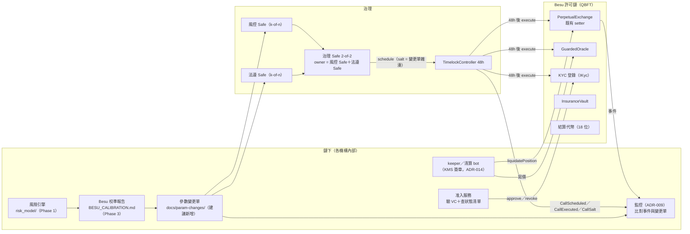
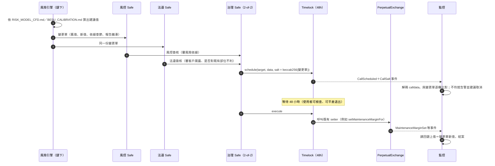

# 設計文件：在 Besu 許可鏈上運行 PepeLab 鏈上 CFD（Phase 4）

> **狀態：設計草案，只寫設計，不實作、不部署。** 日期 2026-10-05。
> 原始碼基準：`master`＋Phase 0 盤點（[`PARAMS_INVENTORY.md`](PARAMS_INVENTORY.md)，基準 24b515b）。行號一律是 `檔案:行號`。
> **本文件不是法律意見。** 第 5 章的法規名稱只是查證到的出處，是否適用、如何適用一律「需法遵確認」。
> 外部事實的查證日期都是 **2026-10-05**，來源列在每一節與文末 §9；查不到一手來源的事項寫成「需確認」，不當成事實。
> 全文遵守兩條既有限制：**修改既有合約時不新增方法**；`PerpetualExchange` 的 EIP-170 預算餘裕是 **0 B**（`PARAMS_INVENTORY.md` §8.1）。需要新能力時，一律寫成「獨立的新合約」或「鏈下元件」。

---

## 0. 一頁摘要（給第一次看的人）

| 章 | 一句話結論 |
|---|---|
| 1 架構 | 鏈下風險引擎算參數、鏈上合約只用**既有 setter**執行參數；每一次變更都要風控與法遵兩方簽、經 48 小時 timelock 才生效，並留下事件與變更單雜湊，任何人都能對帳。 |
| 2 隱私 | **不採用 Tessera**（Besu 24.12.0 列入 sunsetting、25.6.0 已移除）。近期靠「許可鏈＋鏈上不放個資」；中期用「部位承諾＋零知識保證金證明」做在**獨立新合約**，不動既有 exchange；不自建 privacy plugin。 |
| 3 身分准入 | 沿用 exchange 既有的 `kyc()`／`rwaAsset` 閘門與 `IKyc.isVerified(address)` 介面；「合格投資人」VC 在**鏈下驗證**、結果寫進**只存旗標與到期日**的鏈上登錄，撤銷沿用 ADR-016 的狀態清單格式。 |
| 4 結算資產 | MockUSDC 只留給 PoC。正式設計以銀行發行的**代幣化存款**為首選；exchange 只收 18 位小數，小數位不同時比照 ADR-011 用 1:1 包裝幣；凍結、贖回、對帳要在發行端與營運流程處理。 |
| 5 監理定位 | 台灣的 CFD 屬於受監管的槓桿交易業務；本設計只定位為**內部 PoC**，或在《金融科技發展與創新實驗條例》下申請的**沙盒實驗**，都需法遵確認。 |
| 6 延伸研究 | 壞帳期望值可改用量子振幅估計（QAE），抽樣複雜度理論上從 O(1/ε²) 降到 O(1/ε)；但價格分布載入與容錯硬體的成本，現在會吃掉這個加速，只適合當研究題目。 |
| 7 銜接 | 每一次參數提案都必須引用 `RISK_MODEL_CFD.md`（Phase 1）與 `BESU_CALIBRATION.md`（Phase 3）的版本與章節；這兩份還在進行，§7 先留待填位置。 |

### 0.1 名詞（白話）

| 名詞 | 白話解釋 |
|---|---|
| Besu | 一套以太坊用戶端軟體，可以跑公鏈，也可以跑**只有被邀請的機構才能加入**的私有／聯盟鏈。 |
| QBFT | Besu 給私有鏈用的共識方式：由一組事先指定的「驗證者」節點輪流出塊、互相投票確認，出塊後不會被推翻。 |
| 許可制（permissioning） | 白名單：只有名單上的節點能連進網路、只有名單上的帳戶能送交易。 |
| timelock | 一個「延遲執行」合約：參數變更先排隊、公開等一段時間（本專案 48 小時）才能執行，讓大家有時間檢查或退出。 |
| 多簽（Safe） | 一個需要多把鑰匙共同簽名才能動作的錢包合約。 |
| 承諾（commitment） | 把資料加上一段隨機數（salt）後取雜湊，只公開雜湊。之後可以「打開」證明當初放的是什麼，但在打開前別人看不出內容。 |
| 零知識證明（ZKP） | 一種數學證明：讓別人相信「某件事成立」（例如保證金足夠），卻不必讓對方看到背後的數字。 |
| VC（可驗證憑證） | 一張帶數位簽章的電子證書，例如「某機構證明此人是合格投資人」。誰都能驗簽，但只有簽發者能簽。 |
| 代幣化存款 | 銀行把**存款本身**記在鏈上變成代幣；代幣代表的是對該銀行的存款債權。 |
| QAE | 量子振幅估計，一種用量子電路估計機率或期望值的方法。 |

### 0.2 這份設計建立在哪些既有元件上

| 既有元件 | 位置 | 本設計怎麼用 |
|---|---|---|
| exchange 的 owner setter（費率、槓桿、MMR、OI、獲利上限、`maxPriceAge`…） | `PARAMS_INVENTORY.md` §8.2 | 鏈上「執行參數」的唯一入口，不新增方法 |
| setter 事件（`MaintenanceMarginSet`、`MaxLeverageSet`、`MaxOpenInterestSet`、`MaxPriceAgeSet`…） | `contracts/src/PerpetualExchange.sol:505-560`、`:1014-1028` | 稽核軌跡的鏈上一半 |
| `TimelockController`（48h）＋ Safe 提案者 | [`GOVERNANCE_HANDOVER.md`](GOVERNANCE_HANDOVER.md)、`contracts/script/DeployGovernance.s.sol` | 參數變更的延遲與多簽 |
| 每租戶一套合約與金鑰 | [`ADR-008`](ADR-008-tenant-isolation.md) | Besu 上照樣每租戶一套 |
| 18 位小數結算幣、`WrappedUSDC18` | [`ADR-011`](ADR-011-settlement-token-decimals.md)、`contracts/src/settlement/WrappedUSDC18.sol` | 結算資產的小數位處理 |
| KMS 簽章、無原始私鑰 | [`ADR-014`](ADR-014-signer-custody-kms-mpc.md) | keeper、登錄寫入者、發證者的金鑰 |
| V3 兩個 timelock 的分類 | [`ADR-015`](ADR-015-v3-upgradeability.md) §4.2 | 哪類參數走 48 小時、哪類走 7 天 |
| VC 狀態清單（EIP-712 簽章） | [`ADR-016`](ADR-016-vc-credential-status.md) | 合格投資人 VC 的撤銷 |
| KYC 閘門：`IKyc.isVerified`、`kyc`、`rwaAsset` | `PerpetualExchange.sol:27-29`、`:270-271`、`:750-760`、`:1767-1771` | 身分准入的鏈上強制點 |
| `KYCRegistry`（送件／核准／撤銷） | `contracts/src/KYCRegistry.sol` | 可直接沿用；但不得寫入真實個資（§2.4、§3.2） |
| `AgentSessionManager` | `contracts/src/AgentSessionManager.sol` | agent 代開倉時，KYC 閘門檢查的是 session 的使用者 |
| 風險瀑布 | [`RISK_WATERFALL.md`](RISK_WATERFALL.md) | 壞帳定義（§6 QAE 的估計對象） |

---

## 1. 架構

### 1.1 三層分工

| 層 | 負責 | 不負責 | 對應 |
|---|---|---|---|
| **鏈下：風險引擎** | 用歷史與模擬資料**算出**建議參數（MMR、槓桿上限、OI 上限、獲利上限、`maxPriceAge`、清算罰金…），產出校準報告 | 不持有任何能改鏈上狀態的金鑰 | Phase 1 `risk_model/`、[`RISK_MODEL_CFD.md`](RISK_MODEL_CFD.md)；Phase 3 [`BESU_CALIBRATION.md`](BESU_CALIBRATION.md)（待產出） |
| **治理：多簽＋timelock** | 決定**要不要**採用建議；風控與法遵兩方都簽才能排程；排程後公開等待 48 小時 | 不計算參數 | `GOVERNANCE_HANDOVER.md`、ADR-015 §4.2 |
| **鏈上：合約** | **強制執行**目前生效的參數：開倉檢查槓桿與 KYC、清算檢查保證金、價格過期就拒絕 | 不判斷參數好不好；只檢查硬上下限（例如 `MAX_LEVERAGE = 5`、MMR ≤ 9,999 bps） | `PARAMS_INVENTORY.md` §8 |

這樣分的理由：風險模型會一直改版（換分布、加壓力情境），寫在鏈上就要重新部署；合約只負責「照參數做」，參數由人類治理決定，模型只提供依據。

### 1.2 架構圖



### 1.3 參數變更流程



**如何做到「風控＋法遵兩方都要核可」**（不寫新合約）：

- **建議作法：巢狀 Safe。** 治理 Safe 設 2-of-2，兩個 owner 分別是「風控 Safe」與「法遵 Safe」（各自 k-of-n）。Safe 允許 owner 是實作 EIP-1271 的合約帳戶（包括另一個 Safe），所以這個結構不需要任何新合約（來源：Safe 文件 <https://docs.safe.global/advanced/smart-account-signatures>、<https://docs.safe.global/advanced/smart-account-concepts>，查證 2026-10-05）。治理 Safe 擔任 timelock 的 proposer（因而也是 canceller）。
- **備案：拆 proposer 與 executor。** 風控 Safe 只當 proposer、法遵 Safe 只當 executor。法遵不執行，變更就不會生效。缺點是法遵的核可落在 48 小時**之後**，公開等待期內大家看到的是「只有風控同意」的提案；而且 executor 不能是「任何人」，與 ADR-015 §4.2「執行者【待擁有者決定】」的選項衝突。
- 不採用：只把兩方的人都放進同一個 k-of-n Safe。Safe 的門檻只數「幾把簽名」，不分「來自哪一方」，風控三個人就能湊滿門檻。
- 需確認：Safe 合約與介面要在私有 Besu 上自行部署（官方託管的介面不一定支援私有鏈），Phase 3 一併驗證。

**哪些參數走 48 小時**：沿用 ADR-015 §4.2 的分類——在程式碼硬上下限內的數值（OI 上限、獲利上限、費率、MMR、`maxPriceAge`、清算罰金）走 48 小時；oracle 位址、KYC 登錄位址（`setKycRegistry`）、代客下單授權（`setAgentAuthorized`）效果等同換邏輯，V3 走 7 天。V1 只有一個 timelock，所以在 V1 上這些也是 48 小時，這是已知差距（ADR-015 §1）。

**對既有部位不利的變更**：ADR-015 §4.2 規定 V3 要改成「只適用新開部位」；V1 的 MMR 與清算罰金**會立即套用到既有部位**（`PerpetualExchange.sol:301`、`:790-794`），所以法遵簽核時要確認已對客戶揭露，並把生效時間告知客戶。

### 1.4 可稽核

| 稽核問題 | 證據來源 | 備註 |
|---|---|---|
| 誰提的、何時排程、何時執行 | Timelock 的 `CallScheduled`、`CallExecuted`、`Cancelled`、`CallSalt` 事件（OpenZeppelin `TimelockController`，`contracts/lib/openzeppelin-contracts/contracts/governance/TimelockController.sol:72`、`:90`） | Safe 交易本身也有簽署人紀錄 |
| 改了什麼 | exchange setter 事件（`MaintenanceMarginSet`、`MaxLeverageSet`、`MaxOpenInterestSet`、`MaxProfitBpsSet`、`MaxPriceAgeSet`、`LiquidationPenaltyBpsSet`、`KycRegistrySet`、`RwaAssetSet`…） | 都已存在，不用改合約 |
| 為什麼改 | 鏈下變更單 `docs/param-changes/<日期>-<資產>-<參數>.md`（建議新增）：舊值、新值、引用 `RISK_MODEL_CFD.md`／`BESU_CALIBRATION.md` 的版本與章節、校準報告檔案雜湊、兩方簽核人 | 變更單的 keccak256 放進 timelock 的 `salt`，鏈上事件 `CallSalt` 就把「鏈上這筆變更」綁到「鏈下這份理由」 |
| 實際生效值對不對 | 監控在 `CallExecuted` 後讀回鏈上值、比對變更單 | 沿用 ADR-009 的告警管道 |

`salt` 的用法是 OpenZeppelin `TimelockController` 原本就有的欄位（同一筆呼叫要靠不同 salt 才能重複排程），這裡只是約定它的內容，不需要改 timelock。

### 1.5 Besu 網路：QBFT 驗證者與許可制

**驗證者由誰營運。** Besu 官方文件說明「QBFT 需要四個驗證者才能容錯拜占庭錯誤」，以及「超過 1/3 驗證者停止參與時，網路停止出塊」；並把 QBFT 描述為私有網路建議採用的企業級共識（來源：<https://docs.besu-eth.org/private-networks/how-to/configure/consensus/qbft>，頁面標示 2026-09-16 更新，查證 2026-10-05）。據此建議：

| 階段 | 驗證者配置 | 理由 |
|---|---|---|
| 內部 PoC | 4 個驗證者，全部由營運方內部的不同團隊、不同主機營運 | 達到文件說的最低容錯門檻；掛 1 個仍能出塊 |
| 沙盒／聯盟 | 至少 4 個，分給不同法人：營運方（技術）、持牌租戶、託管或清算銀行、（選用）獨立第三方；監理機關以**非驗證者的唯讀節點**觀察 | 沒有單一機構能自己湊到 2/3 以上；監理觀察不需要出塊權 |

- **驗證者的增減**：Besu 提供兩種方式——現有驗證者以 JSON-RPC 投票（block header validator selection），或由一個智慧合約指定驗證者名單（contract validator selection）（同上來源）。建議用**投票**，並把每一次投票也寫成變更單，因為合約方式等於多一顆需要治理的合約。
- **出塊時間**：QBFT 的 `blockperiodseconds` 預設 1 秒（同上來源）。exchange 的價格新鮮度與資金費都用秒數計，出塊時間只影響交易延遲，不影響參數意義。
- **驗證者金鑰**：ADR-014 處理的是 keeper／結算 signer，**驗證者節點金鑰**不在它的範圍。Besu 能否把節點金鑰放進外部 HSM／KMS，本次沒有查證，**需確認**。

**許可制（節點與帳戶白名單）**：

| 機制 | 現況（查證 2026-10-05） | 來源 |
|---|---|---|
| **local permissioning**（節點與帳戶白名單） | **仍支援**。官方文件：「Local permissioning supports node and account allowlisting.」設定檔 `permissions_config.toml`（`nodes-allowlist`、`accounts-allowlist`），可用 `perm_reloadPermissionsFromFile` 重新載入 | <https://docs.besu-eth.org/private-networks/how-to/use-local-permissioning> |
| **onchain permissioning**（以智慧合約管理白名單） | 24.12.0 列入「Sunsetting features」，**25.6.0 已移除**（CHANGELOG：「Remove onchain permissioning [#8597]」）；現行文件不再提及 | <https://github.com/hyperledger/besu/releases/tag/24.12.0>、<https://github.com/hyperledger/besu/releases/tag/25.6.0> |
| 更複雜的規則 | 官方建議自行寫 plugin（「To implement more complex permissioning rules, you can write your own plugin」）；25.3.0 起 Plugin API 支援交易層的 permissioning 規則（#8365） | <https://docs.besu-eth.org/private-networks/concepts/permissioning>、Besu CHANGELOG <https://raw.githubusercontent.com/besu-eth/besu/main/CHANGELOG.md> |
| 共識 | QBFT 是建議的企業級共識；IBFT 2.0「is supported for existing private networks」，不是新網路的建議；Clique 已在 26.4.0 移除 | <https://docs.besu-eth.org/private-networks/how-to/configure/consensus/ibft>、CHANGELOG |

**本設計的做法**：

- 用 **local permissioning**：每個節點的 `permissions_config.toml` 放節點白名單（enode）與帳戶白名單（可送交易的地址）。
- **白名單是每個節點各自的設定檔**，不是鏈上狀態，所以「改名單」本身沒有鏈上稽核軌跡。補法：名單檔放在版本控制、每次變更走與參數相同的變更單（§1.4），並由監控定期比對各節點以 `perm_getAccountsAllowlist`／`perm_getNodesAllowlist` 讀回的名單是否一致（各節點名單不一致時，交易可能被某些節點接受、被另一些拒絕）。
- 帳戶白名單要包含：使用者錢包（KYC 通過後由准入服務提出新增）、keeper、清算 bot、准入服務、治理 Safe 的簽署人、timelock 執行者。合約地址不需要列（白名單管的是**送交易的帳戶**）。**需在 Phase 3 實測**合約部署、Safe 執行等路徑在帳戶白名單下是否都能通過。
- 不採用 onchain permissioning（已移除），也不先寫 plugin；local permissioning＋流程控管在 PoC 規模已足夠。

### 1.6 與既有 ADR 的關係

| ADR | 在 Besu 上的意義 |
|---|---|
| ADR-008 租戶隔離 | 一條 Besu 聯盟鏈上，每個租戶仍各自一套合約與金鑰。注意：**帳戶白名單是全鏈共用的**（誰能送交易），而「誰能在某租戶開倉」仍由該租戶自己的 KYC 登錄決定，兩者不要混用。若租戶要求連交易資料都不讓其他租戶的節點看到，只能每租戶一條鏈（§2 會說明為什麼承諾／ZK 也只能部分解決）。 |
| ADR-011 結算幣小數 | exchange 的會計假設結算幣是 18 位；建構子以 try/catch 軟性檢查，`decimals()` 不是 18 就 revert（`PerpetualExchange.sol:637-646`）；見 §4。 |
| ADR-014 KMS | keeper、清算 bot、KYC 登錄的寫入者（verifier）、VC 發證者都用 KMS 金鑰。私有鏈上的 JSON-RPC 不一定經過雲端，KMS 需要能被節點所在網路存取，Phase 3 驗證。 |
| ADR-015 V3 | Besu 上先部署 V1（`DeployTenant.s.sol`，只靠部署參數與 setter，`PARAMS_INVENTORY.md` §8.3）。V3 的 ConfigTimelock／UpgradeTimelock 分類先當作簽核規則使用。 |
| ADR-016 VC 狀態清單 | 合格投資人 VC 的撤銷沿用它的格式，見 §3.5。 |

---

## 2. 隱私

### 2.1 先講清楚：要對誰保密

| 觀察者 | 在公鏈（Base） | 在許可制 Besu（不做任何隱私技術） |
|---|---|---|
| 一般大眾 | 看得到一切 | 看不到（節點白名單擋住）|
| 其他交易者 | 看得到一切 | 若他們能用 JSON-RPC 查詢，看得到一切 |
| 其他節點營運者（其他機構） | — | **看得到一切**：每個節點都有完整狀態 |
| 監理機關（觀察節點） | 看得到一切 | 看得到一切（這通常是想要的） |

所以許可鏈本身已經擋掉「大眾」，剩下的問題是「同一條鏈上的其他機構與交易者」。

**常見誤解**：`PerpetualExchange` 的 `positions` 宣告成 `internal`（`PerpetualExchange.sol:219`），但 `internal` 只是「其他合約不能直接呼叫」，**任何節點都能直接讀 storage**；而且 `PositionOpened` 事件（`:487` 起）本身就帶有部位資訊。現行合約對節點營運者沒有任何保密。

### 2.2 Tessera 隱私：現況與決定

| 事實（查證 2026-10-05） | 來源 |
|---|---|
| Besu **24.12.0** 的 CHANGELOG 在「Upcoming Breaking Changes」列出要下架的功能（原文用 *sunsetting*，並說明「deprecation of these features」的理由）：Tessera privacy、onchain permissioning、Proof of Work、Fast Sync。24.10.0 與 24.9.1 沒有這段 | <https://github.com/hyperledger/besu/releases/tag/24.12.0>；CHANGELOG（repo 已改名 besu-eth/besu）<https://raw.githubusercontent.com/besu-eth/besu/main/CHANGELOG.md> |
| **25.6.0 已移除**：「Remove Tessera Privacy feature [#8369]」 | <https://github.com/hyperledger/besu/releases/tag/25.6.0> |
| **25.7.0 再移除隱私 RPC**：「Privacy RPC API groups removed: `EEA` and `PRIV` [#8803]」；26.7.0 寫「Sunsetting features is now complete」 | CHANGELOG（同上） |
| 官方公告（2024-09-24）說明分階段下架，隱私需求建議改用應用層方案（「existing and novel app-layer solutions」） | <https://www.lfdecentralizedtrust.org/blog/sunsetting-tessera-and-simplifying-hyperledger-besu> |

換句話說，Tessera 隱私在 24.12.0 列入 sunsetting、25.6.0 已移除，**新版 Besu 根本沒有這個功能**；要用就得停在 25.6.0 之前的舊版，等於放棄安全更新。

**決定：不採用 Tessera。**

### 2.3 隱私外掛（privacy plugin）：現況

| 事實（查證 2026-10-05） | 來源 |
|---|---|
| 舊版官方文件：「The privacy plugin is an early access feature and plugin interfaces are subject to change between releases.」以 `--Xprivacy-plugin-enabled` 啟用 | Wayback 存檔 <http://web.archive.org/web/20240526081936/https://besu.hyperledger.org/private-networks/concepts/privacy/plugin> |
| 現行文件：besu.hyperledger.org 已轉址到 docs.besu-eth.org，privacy 頁面被導回 private networks 總覽，**文件已下架** | <https://docs.besu-eth.org/private-networks/concepts/privacy> |
| CHANGELOG 的 Unreleased 段寫明私有交易支援移除後，隱私相關型別「were orphaned」，標為 deprecated for removal | CHANGELOG（同上） |

結論：privacy plugin 是**依附在私有交易功能上**的 early access 介面，私有交易已隨 Tessera 一起移除，它**不能再當現行功能引用**。Besu 仍有一般的 Plugin API（例如 §1.5 提到的交易 permissioning 規則），但那不是隱私功能。

### 2.4 一定要先做的事（與技術選型無關）

1. **鏈上不放個資。** 現行 `KYCRegistry.submitKYC(fullName, nationality)` 會把字串寫進鏈上（`contracts/src/KYCRegistry.sol` 的 `KYCRecord`）。在許可鏈上，所有節點營運者都看得到。Besu 部署時：前端與准入服務只能送空字串或雜湊（`COMPLIANCE_BOUNDARY.md` §2 已寫「前端只送雜湊」），或改用 §3.3 的新登錄（只存旗標與到期日）。
2. **JSON-RPC 不對交易者開放。** 交易者經營運方的 API 或前端存取，節點的 RPC 只對內；否則「其他交易者」那一列永遠是「看得到一切」。
3. **事件與日誌的保存**：監控、keeper 的日誌也含部位資料，依法遵的資料保存規則處理（需法遵確認）。

### 2.5 方案 (a)：鏈上只存部位承諾

**做法**：部位不以明文存放，只存承諾

```
C = Poseidon(asset, side, M, L, S_0, f, r, I_entry, t_open, owner, salt)
```

- `salt`：每個部位一個 ≥ 128 位元的隨機數，由交易者錢包產生並保管（也加密一份給 §2.5.2 的受信 keeper）。沒有 salt，猜測 M、L 的組合就能用暴力法試出承諾內容（金額與槓桿的可能值不多）。
- 承諾內容涵蓋清算判斷需要的全部欄位（符號見 `PARAMS_INVENTORY.md` §0）：方向、保證金 M、槓桿 L、開倉價 S_0、開倉時凍結的手續費率 f 與借貸費率 r、開倉時的資金費指數 I_entry、開倉時間 t_open、持有人。
- 用 Poseidon 而不是 keccak256，是因為 Poseidon 在零知識電路裡便宜很多（方案 (b) 要在電路裡打開它）。

**何時揭露**：平倉時由持有人揭露（合約重算損益後付款，平倉後的部位本來就要結算，揭露可以接受）；被清算時由清算者揭露（見下）；監理或稽核要求時，以檢視金鑰離線揭露。

**清算怎麼還能執行**（承諾隱藏了部位，清算者看不到誰該被清算）——三種做法：

| 做法 | 怎麼運作 | 代價 |
|---|---|---|
| ① 持有人定期證明健康 | 每次價格更新後的期限 T 內，持有人提交一份 §2.6 的零知識證明（「以目前價格，我的權益仍 ≥ 維持保證金」）。超過期限沒有證明，部位進入「可清算」狀態 | 持有人（或其 agent）必須持續在線；斷線就被清算，對散戶不友善 |
| ② 受信 keeper 持有檢視金鑰 | 開倉時把承諾的開啟值以 keeper 公鑰加密上鏈；keeper 解密、在鏈下找出不健康的部位，**揭露開啟值**後清算（被清算的部位因而公開） | keeper 能看到所有部位，等於把「信任節點營運者」換成「信任 keeper」；keeper 金鑰要用 KMS（ADR-014）並有存取稽核 |
| ③ keeper 證明不健康 | 同 ②，但 keeper 提交「此部位權益 < 維持保證金」的零知識證明後才可清算，不必公開開啟值 | 電路要多一個版本；清算後的結算仍需要金額，最終還是要對結算合約揭露 |

**建議**：PoC 用 ②（最簡單、清算可靠），把 ① 作為「持有人可以自己證明健康、避免被誤清算」的補充。③ 留給研究。

### 2.6 方案 (b)：零知識證明保證金充足

**要證明的命題**（與本程式的清算不等式一致，`PARAMS_INVENTORY.md` §1.3）：

```
E = M + σ·Q·(S − S_0) − M·L·f − M·(L−1)·r·h − Φ
健康 ⇔ E > m·M·L          （注意：本程式的維持保證金基數是開倉名目 M·L，不是 Q·S）
```

#### 2.6.1 電路的輸入與約束

| 類別 | 欄位 | 說明 |
|---|---|---|
| **公開輸入** | `C` | 鏈上存的承諾 |
| | `asset` | 資產 ID |
| | `P` | 證明所用的價格（18 位小數）。由證明者在產生證明時從 oracle 讀取並當作公開輸入；**驗證合約不信任它**，驗證時自己讀 oracle 現價 `P_now`，要求 `|P_now − P| ≤ δ·P` 且價格未過期（見下方「價格綁定」） |
| | `δ` | 價格容差（bps），見下方「價格綁定」 |
| | `m` | 該資產目前的 MMR（bps），由驗證合約讀 `_maintenanceMarginBps` 的公開值傳入 |
| | `I_long`、`I_short` | 兩側目前的資金費累積指數（方向是私密的，所以兩側都公開，電路依方向選一個） |
| | `t_now` | 證明對應的時間（決定借貸費小時數 h） |
| | `nonce` | 防重放（例如證明輪次） |
| **私密輸入** | `σ`（方向）、`M`、`L`、`S_0`、`Q`、`f`、`r`、`I_entry`、`t_open`、`owner`、`salt` | 承諾的開啟值 |
| | 除法的商與餘數 | 電路裡沒有整數除法，要由證明者提供商與餘數，再用約束檢查 |

| # | 約束 | 目的 |
|---|---|---|
| 1 | `Poseidon(…, salt) == C` | **承諾開啟**：證明用的就是當初承諾的部位 |
| 2 | `σ ∈ {0,1}`；`1 ≤ L ≤ 5`；`M ≥ MIN_MARGIN` | 與合約的硬上下限一致（`PerpetualExchange.sol:51-52`） |
| 3 | 所有金額、價格、指數都 `< 2^128`（**範圍證明**） | 電路在有限體上運算，數字太大會「繞回來」變成小數字；沒有範圍證明，證明者可以偽造出很大的權益 |
| 4 | `Q·S_0 ≤ M·L·10^18 < (Q+1)·S_0` | 與合約 `size = M·L·1e18 / S_0`（向下取整，`:2020`）一致 |
| 5 | `h = ⌊(t_now − t_open) / 3600⌋`，以商＋餘數（`0 ≤ 餘數 < 3600`）表達 | 借貸費小時數。合約另外扣掉暫停時間（`:1948-1953`），電路要把「累計停機秒數」也當公開輸入，**需在實作時對齊** |
| 6 | `I_side = σ ? I_long : I_short`；`Φ = M·L·(I_side − I_entry) / 10^18` | 資金費（可正可負，以「付」「收」兩個非負數表示） |
| 7 | 不利價格 `P_adv = σ ? P·(1−δ) : P·(1+δ)` | 價格綁定（見下） |
| 8 | 以 `P_adv` 算出 E，`E·10^4 − m·M·L − 1 ≥ 0`，並對這個差做範圍證明 | 核心命題：權益嚴格大於維持保證金 |

**價格綁定**：exchange 讀的 `IOracle.getPrice` 只回傳最新價（`PerpetualExchange.sol:13-15`），證明產生到上鏈之間價格可能已經更新。作法是讓電路在**不利方向打折 δ 後的價格**下仍證明健康；驗證合約在驗證時讀 oracle 現價 `P_now`，檢查 `|P_now − P| ≤ δ·P` 且價格未過期（沿用 `maxPriceAge`），才接受證明。這樣證明者不能自選價格，也不必每個區塊重算。δ 是新的治理參數（建議與 GuardedOracle 的單次偏離上限一起校準，Phase 3）。

#### 2.6.2 工具比較

| 工具 | 證明系統 | 可信設定 | 鏈上驗證 | 成熟度與維護（查證 2026-10-05） | 來源 |
|---|---|---|---|---|---|
| **Circom＋snarkjs** | Groth16／PLONK／Fflonk | PLONK／Fflonk 只需通用的 phase-1（Powers of Tau）；Groth16 另需每個電路各自的 phase-2（Groth16 的一般性質，本次沒有另找一手原文） | 實測（snarkjs 產生的 verifier）：Groth16 約 219k gas、PLONK 約 298k、Fflonk 約 209k | 生態最久、教材最多；Groth16 證明最小、驗證成本接近最低（實測 Fflonk 約 209k 略低於 Groth16 約 219k） | arXiv:2409.01976 <https://arxiv.org/abs/2409.01976>；Perpetual Powers of Tau <https://github.com/privacy-scaling-explorations/perpetualpowersoftau>（README：只要有一位參與者誠實即可信；repo 已 archived） |
| **Noir**（Aztec，Barretenberg 後端） | Barretenberg 的證明系統 | 通用設定 | `bb write_solidity_verifier` 產生 Solidity verifier；官方頁沒有 gas 數字 | 最新 tag 是 v1.0.0-rc.3（2026-09-18，GitHub 標為**預發行版** pre-release），1.0 仍在候選階段；README 仍寫「early development… not been reviewed or audited… not suitable to be used in production」 | <https://github.com/noir-lang/noir>、<https://barretenberg.aztec.network/docs/how_to_guides/how-to-solidity-verifier/> |
| **halo2** | Zcash 原版：IPA，**不需要可信設定**；PSE fork：改 KZG，附 Solidity verifier | 原版無；KZG 版需通用設定 | PSE fork 有 Solidity verifier；本次沒查到一手 gas 數字 | Zcash NU5 已採用（「removing the need for the trusted setup」）；**PSE fork 2025-01 起 maintenance mode、repo 已 archived** | <https://z.cash/upgrade/nu5/>、<https://github.com/privacy-scaling-explorations/halo2> |
| **gnark**（Consensys，Go） | Groth16、PlonK | 同各證明系統 | BN254 上可 `ExportSolidity()` 匯出 verifier | 現行 v0.16.3；Go 函式庫，適合把證明產生器整合進 Go 服務 | <https://docs.gnark.consensys.io/HowTo/prove> |

**鏈上驗證的底層成本**：Groth16 與 KZG 類驗證都靠 alt_bn128 的預編譯合約。EIP-197 在位址 0x8 提供配對檢查（「required in order to perform zkSNARK verification」，Byzantium 起）；EIP-1108 把配對成本降為 `34 000·k + 45 000` gas（加法 150、純量乘法 6,000）。Groth16 驗證做 4 組配對，約 45,000＋4×34,000＝181,000 gas，再加上每個公開輸入一次純量乘法，與上面約 219k 的實測一致（這是推算，不是一手數字）。Besu 的原始碼有 `AltBN128Add`／`Mul`／`PairingPrecompiledContract`，Istanbul 參數同為 34,000／45,000。來源：<https://eips.ethereum.org/EIPS/eip-197>、<https://eips.ethereum.org/EIPS/eip-1108>、<https://github.com/besu-eth/besu/tree/main/evm/src/main/java/org/hyperledger/besu/evm/precompile>。

**證明產生時間**：各工具的證明時間高度依賴電路大小與硬體，本次沒有找到能直接套用到本電路的一手數字，**需在原型階段實測**（本電路主要成本是一次 Poseidon 開啟與十幾個 128 位元範圍證明，屬於小型電路）。

**選型建議**：研究原型用 **Circom＋Groth16**（證明最小、驗證成本接近最低、工具最成熟、Solidity verifier 最常見），可信設定的 phase-2 由風控、法遵、外部稽核三方各貢獻一次（只要一方誠實即可）。若不想做逐電路設定，改用同一電路的 PLONK（實測約多 8 萬 gas）。Noir 寫起來最接近一般程式、可讀性最好，但官方仍標示不適合正式環境；gnark 適合後端是 Go 的團隊。halo2 的 PSE 版已封存，不建議新專案採用。私有鏈上 gas 價格通常可設為 0，gas 只影響區塊 gas 上限，所以驗證成本在 Besu 上不是瓶頸，**工具成熟度與電路稽核才是**。

#### 2.6.3 鏈上整合點與「不新增既有合約方法」

- 既有 exchange 的部位是明文，**沒有任何既有方法能接受承諾或證明**；加方法違反規則，exchange 也沒有剩餘位元組（EIP-170 餘裕 0 B）。
- 因此 (a)＋(b) 只能做在**獨立的新合約**，形成一條新的產品路徑，不是幫現有 exchange「加隱私」：

| 新合約（暫名） | 職責 |
|---|---|
| `MarginProofVerifier` | 由工具自動產生的驗證合約，只有 `verifyProof`，無狀態、無權限 |
| `PrivatePositionBook` | 存承諾、保證金池；開倉、揭露平倉、受信 keeper 清算；讀**同一顆** GuardedOracle 與同一個 KYC 登錄（`IKyc`）；壞帳仍走該租戶的 `InsuranceVault`——但 `InsuranceVault.bailout` 只接受自己的 exchange（ADR-008），所以要嘛另配一個保險庫，要嘛等 V3 的 handler 架構（ADR-015：新 handler 取得 CONTROLLER 即可，不動資金合約） |

- **V3 是比較自然的落點**：ADR-015 的資金合約與狀態合約不可變、邏輯 handler 可替換，`PrivateOrderHandler` 可以作為新的 handler 經 7 天 timelock 加入，資金仍在同一個 `MarginBank`。
- 驗證合約的大小、Besu 的 `contractSizeLimit` 與預編譯合約（alt_bn128 配對）的支援要在 Phase 3 實測；就算私有鏈可以放寬大小上限，預算規則不因 Besu 放鬆（`PARAMS_INVENTORY.md` §8.3）。

**做不到的事（要寫給客戶看）**：

- 部位的**存在**、開倉與平倉的**時間**、保證金存入的**金額**（從代幣轉帳看得到）仍然公開。要隱藏金額，保證金也要在承諾池裡，複雜度大增。
- OI 上限、ADL、mark premium 都需要「全市場的部位總和」。部位私密後，總和要另外證明（例如每筆開倉附「對 OI 總和承諾的更新」），本設計不涵蓋；在這條路徑上先關掉 ADL 與 mark premium，並以保守的 OI 上限代替。
- 受信 keeper（§2.5 ②）看得到所有部位。

### 2.7 方案 (c)：自建 privacy plugin

Tessera 下架後，官方建議改用應用層方案（§2.2）。「自己寫一個 Besu plugin 做私有交易」在技術上可能，但風險如下：

| 風險 | 說明 |
|---|---|
| API 變動 | 舊 privacy plugin 介面本來就標示「subject to change between releases」，而且已經隨私有交易一起被移除（§2.3）；Plugin API 的其他部分也在持續調整（例如 25.3.0 才加入交易 permissioning 規則）。自建 plugin 每次升級 Besu 都要重新相容 |
| 維護 | 私有狀態的儲存、同步、重組處理要自己寫；官方不再維護任何私有交易路徑，等於自己維護一個 Besu 分支級的功能 |
| 稽核 | plugin 跑在節點裡、能看到所有交易內容，錯誤會直接變成資料外洩或狀態分叉；稽核範圍是 Java 節點程式，與合約稽核是不同的專業 |
| 與合約的關係 | 私有狀態與公開狀態分離時，exchange 的清算、保險庫、oracle 都在公開狀態，私有部位要和它們互動就要重做跨狀態的邏輯 |

**結論：不採用。** 應用層的 (a)＋(b) 至少可以用現有的合約稽核與電路稽核方法驗證，而且不綁定 Besu 版本。

### 2.8 建議與取捨

| 方案 | 對其他機構保密 | 清算可靠度 | 改既有合約 | 工程量 | 主要風險 |
|---|---|---|---|---|---|
| 許可鏈＋鏈上無個資＋RPC 不外開（§2.4） | 否（節點營運者看得到） | 不受影響 | 否 | 小 | 信任其他節點營運者 |
| Tessera | 是（交易層） | 受影響（私有狀態與公開狀態分離） | — | — | 24.12.0 列入 sunsetting、25.6.0 已移除，不採用 |
| (a) 承諾＋受信 keeper | 部分（keeper 看得到） | 依賴 keeper | 否（新合約） | 中 | keeper 成為集中信任點 |
| (a)＋(b) 承諾＋ZK 健康證明 | 是（除了 keeper，或改用 ③） | 依賴持有人或 keeper 在線 | 否（新合約） | 大 | 電路錯誤＝可以偽造保證金；需電路稽核 |
| 每租戶一條鏈 | 是（跨租戶） | 不受影響 | 否 | 中（多套網路維運） | 維運成本、跨租戶流動性分裂 |
| (c) 自建 plugin | 是 | 視設計 | 否 | 最大 | 見 §2.7 |

**建議**：

1. **PoC（現在）**：只做 §2.4＋許可制；在設計說明與客戶揭露中明寫「節點營運者看得到部位」。如果某個租戶不能接受，就給它獨立的鏈。
2. **研究原型（之後）**：(a)＋(b) 做成獨立新合約，以小額、單一資產、受信 keeper 清算；工具選型依 §2.6.2。上線前必須有電路稽核。
3. **不做**：Tessera、自建 plugin。

---

## 3. 身分准入

### 3.1 現況（讀程式確認）

| 元件 | 現況 | 位置 |
|---|---|---|
| exchange 的閘門 | 只有在「資產被標成 `rwaAsset`」**而且**「`kyc` 已接上」時，開倉要求 `kyc.isVerified(owner)`；平倉、清算、提領都**不檢查** | `PerpetualExchange.sol:1767-1771` |
| 介面 | `IKyc.isVerified(address) → bool`，只有這一個函式 | `:27-29` |
| 接線 | `setKycRegistry`、`setRwaAsset`（owner，都會發事件） | `:750-760` |
| 租戶部署 | `DeployTenant` 為每個租戶部署一顆 `KYCRegistry`、接上 exchange，並把 RWA 資產標成 `rwaAsset` | `contracts/script/DeployTenant.s.sol:221`、`:278-288` |
| `KYCRegistry` | 使用者 `submitKYC`（存字串）→ owner 或 verifier `approveKYC`／`revokeKYC`；沒有到期日 | `contracts/src/KYCRegistry.sol` |
| agent 代開倉 | `AgentSessionManager.openPositionForSession` 呼叫 `exchange.openPositionFor(s.user, …)`，閘門檢查的是 **session 的使用者**，不是 agent | `contracts/src/AgentSessionManager.sol:201-224` |
| 現有 VC | 是「使用者授權 agent」的 VC（`AgentTradingAuthorization`，`did:pkh`、EIP-712），**不是** KYC 憑證；撤銷用 ADR-016 狀態清單 | `docs/AGENT_IDENTITY_VC_SSI.md` §2-§3、ADR-016 |

閘門只在開倉檢查，代表**撤銷 KYC 不會把人鎖在部位裡**——撤銷後不能再開新倉，但平倉與提領照常。這是刻意的好性質（與 guardian 只能收緊到 ReduceOnly 同一個原則），應該保留。

### 3.2 設計：「合格投資人」VC

```
發證者（持牌租戶的 KYC／法遵單位）──簽發──► 持有人（投資人錢包）──出示──► 准入服務（鏈下驗證者）──寫入──► 鏈上 KYC 登錄
```

| 角色 | 由誰擔任 | 金鑰 |
|---|---|---|
| 發證者 | 每個租戶自己的 KYC 單位（ADR-008：誰通過 KYC 是持牌機構自己的法遵決定） | KMS（ADR-014）；DID 用 `did:pkh`（沿用現有作法，免額外基礎設施）或 `did:web`（機構網域可對外證明身分），**需擁有者決定** |
| 持有人 | 投資人的錢包（`did:pkh:eip155:<Besu chainId>:<地址>`） | 投資人自己 |
| 驗證者 | 准入服務，跑在租戶內部 | 它持有 KYC 登錄的 verifier 權限（`KYCRegistry.verifiers`），用 KMS |

VC 內容（EIP-712 typed data，沿用現有 VC 的簽章堆疊；類型名稱暫定）：

```
QualifiedInvestorCredential(
  address issuer, address subject,
  bytes32 tier,          // 例如 "professional"；分級定義由法遵決定
  uint256 issuedAt, uint256 validUntil,
  bytes32 nonce)         // 當作 jti，供狀態清單撤銷
```

**VC 裡不放姓名、身分證號、財力證明**；這些留在發證者的 KYC 系統。VC 只聲明「此地址的持有人經本機構審查屬於某一級」。

### 3.3 鏈上怎麼檢查：兩種作法

| | (A) 鏈下驗證＋鏈上白名單（**建議**） | (B) 鏈上驗簽 |
|---|---|---|
| 流程 | 准入服務驗 VC 簽章、查狀態清單、檢查到期 → 呼叫登錄的 `approve`；撤銷時呼叫 `revoke` | 投資人把 VC 與簽章送進一顆新登錄合約，合約用 `ecrecover` 驗發證者簽章後記錄 |
| 與 exchange 的接法 | 不用改：exchange 只呼叫 `isVerified(address)` | 也不用改 exchange（它只會呼叫 `isVerified`，沒有地方能把 VC 傳進去），所以 (B) 一樣是「先登記、後查詢」，只是登記改成自助 |
| 撤銷 | 准入服務監看狀態清單，發現撤銷就送 `revoke`；延遲取決於服務的輪詢間隔（要訂 SLA） | 合約要能讀鏈上撤銷狀態（ADR-016 §6 的 `IAgentCredentialStatus` 草案的同類物），否則已登記的 VC 無法撤銷 |
| 信任 | 信任准入服務誠實寫入 | 不需要信任服務，但要信任發證者金鑰 |
| 隱私 | 鏈上只有「地址→通過／到期日」 | VC 內容（含 tier、到期日）上鏈 |
| 成本 | 低 | 新合約＋鏈上撤銷登錄 |

**(A) 的兩個實作選項**：

- **A1 沿用既有 `KYCRegistry`**：零新合約。投資人 `submitKYC("", "")`（或雜湊），准入服務驗完 VC 後 `approveKYC`。缺點：沒有到期日（VC 到期時要靠准入服務主動 `revokeKYC`），而且字串欄位仍存在，要靠流程保證不寫個資。適合 PoC。
- **A2 新的 `CredentialKycRegistry`（實作 `IKyc`）**：只存 `地址 → (validUntil, credentialHash)`，`isVerified` 回傳 `block.timestamp < validUntil` 而且未撤銷；VC 到期自動失效，不依賴服務在線。經既有的 `setKycRegistry`（timelock）換上即可。適合正式環境。

**讓所有市場都要 KYC**：exchange 只對 `rwaAsset` 檢查，而 `setRwaAsset` 是既有 setter，Besu 部署時把**每個**資產都標成 `true` 即可，不用改合約。（名稱叫 RWA，實際語意是「需要 KYC 的市場」，文件與介面要說清楚。）

**agent 路徑**：投資人本人要有合格投資人 VC（閘門檢查 session 的使用者）；agent 只需要投資人簽給它的授權 VC（既有）。兩張 VC 的發證者不同、用途不同，不要合併。

### 3.4 撤銷（對照 ADR-016）

- 沿用 ADR-016 §4.1 的狀態清單結構（`sequence` 單調遞增、`revokedBefore`、排序的 `revoked` jti、有效期上限），改一個新的 primary type（例如 `InvestorCredentialStatusList`），同一套驗證程式（`agent/shared/src/vcStatus.ts`）可以參數化重用。
- **差別**：ADR-016 的撤銷者是使用者本人（VC 的簽發者是使用者）；這裡的簽發者是機構，所以撤銷者是機構的 KYC 單位。
- ADR-016 §4.4 的「讀不到清單就拒絕寫入」在這裡的對應是：准入服務讀不到清單時**不核准新的投資人**，但**不自動撤銷**既有名單（避免清單主機故障就把所有人擋在開倉門外）；這是 fail-closed（新核准）與 fail-open（既有名單）的取捨，**需法遵確認**。
- 撤銷的鏈上效果只有「不能再開新倉」。要強制處理既有部位（例如制裁命中），exchange 沒有逐使用者的處置方法（不能新增），只能整個資產 ReduceOnly 或由法遵走鏈下程序；這是已知限制。

### 3.5 與隱私的關係

- 鏈上的白名單本身就是「這個地址屬於合格投資人」的公開資訊；在許可鏈上所有節點營運者都看得到。A2 只存到期日與雜湊，已是最少揭露。
- 更進一步的作法是用零知識證明「我持有某發證者簽的有效 VC」而不揭露是哪個地址（匿名憑證／成員證明）。但 exchange 的閘門是以地址查詢，部位也以地址記錄，地址匿名化要等 §2 的私密路徑一起做，本設計不涵蓋。

---

## 4. 結算資產

### 4.1 現況

- 測試網用 `MockUSDC`：18 位、任何 EOA 可 `faucet`、owner 或 swapRouter 可 `mint`（`PARAMS_INVENTORY.md` §7 #5）。**只能用在 PoC**。
- exchange 的會計（`MIN_MARGIN`、價格 ×1e10）假設結算幣是 18 位；建構子以 try/catch **軟性檢查**：`decimals()` 回傳非 18 會 revert，但沒有實作 `decimals()` 的代幣會直接通過（`PerpetualExchange.sol:637-646`，`PARAMS_INVENTORY.md` §5）。所以發行方的代幣**必須**實作 `decimals()` 並回傳 18，否則錯誤的小數位不會被擋下。
- `usdc`、InsuranceVault、FeeRouter 的代幣都是 immutable；**換結算資產＝整套重新部署**（ADR-015 §1.2 的連鎖重部署）。
- 6 位的 USDC 用 `WrappedUSDC18`＋`SettlementDepositRouter`（ADR-011）。注意 `WrappedUSDC18` 寫死底層必須是 6 位（`contracts/src/settlement/WrappedUSDC18.sol:60`、`:81`），其他小數位要另寫一顆同構的包裝合約。

### 4.2 選項

| 選項 | 說明 | 適合 |
|---|---|---|
| (i) 銀行代幣化存款 | 銀行在 Besu 上發行代表存款的代幣，持有人對銀行有存款債權 | 銀行或其合作機構營運的聯盟鏈；**建議的正式選項** |
| (ii) 穩定幣 | 由發行商以準備資產支持的代幣；私有 Besu 上沒有原生的公鏈穩定幣，要靠發行商在這條鏈上發行，或經跨鏈橋 | 若發行商願意在私有鏈發行；跨鏈橋多一層風險，不建議 |
| (iii) MockUSDC | 測試代幣 | 只限 PoC，且 `faucet` 要關（或部署不帶 faucet 的版本）以免帳戶白名單形同虛設 |

### 4.3 設計考量

| 考量 | 說明 | 本設計的處理 |
|---|---|---|
| **小數位數** | exchange 只收 18 位 | 發行方若能發 18 位最省事；否則比照 ADR-011 包一顆 1:1 包裝幣（新合約，小數換算是唯一邏輯），既有合約一行不改 |
| **發行者風險** | 代幣化存款是**對單一銀行的債權**，銀行出問題時代幣價值取決於該銀行；穩定幣是對發行商與其準備的債權 | 由法遵與風控評估；InsuranceVault 不涵蓋發行者風險，要寫進客戶揭露（`RISK_WATERFALL.md` §6 的「持牌客戶要承擔或決定的部分」） |
| **凍結** | 發行方通常有凍結或黑名單功能 | exchange 是**集中保管池**：發行方若凍結 exchange 合約地址，**所有人**都無法提領；凍結個別使用者只對他錢包裡的餘額有效，對 exchange 內的保證金無效。與 ADR-011 Q2、Q10 同一類問題，事故手冊要寫明「結算幣暫停或凍結時是否由 guardian 把市場轉 ReduceOnly」 |
| **贖回** | 鏈上銷毀 → 銀行帳上入帳 | 贖回只發生在使用者錢包與發行方之間，不經過 exchange；exchange 只看得到「提領保證金到錢包」 |
| **對帳** | 鏈上總供給 vs 銀行帳上對應的存款（或保管帳戶）餘額 | 每日以鏈上 `Transfer`／mint／burn 事件與銀行帳務逐筆對帳；exchange 端以 `freeMargin` 總和＋部位保證金＋保險庫資產對 exchange 合約的代幣餘額做內部對帳（沿用 ADR-009 的監控思路）。與央行或跨行清算系統的接軌方式**需銀行與法遵確認**，本設計不假設任何特定系統 |
| **許可鏈上的合規** | 誰能持有代幣 | 第一層是 Besu 帳戶白名單（全鏈）；第二層是代幣合約自己的持有人限制（若發行方要求）；第三層才是 exchange 的 KYC 閘門。三層名單要有一致的增刪流程，避免「能持有代幣但不能開倉」或反過來的狀態 |
| **利息** | 代幣化存款可能計息 | exchange 的會計假設代幣數量不變，不能用「餘額自動增加」（rebasing）的代幣；計息要以發行方另行發放的方式處理，**需發行方確認** |

---

## 5. 監理定位

> 本章只列出查到的法規名稱與出處，**不是法律意見**；是否適用、如何適用一律需法遵確認。

### 5.1 查到的規範（查證 2026-10-05）

| 項目 | 內容 | 來源 | 確認方式 |
|---|---|---|---|
| 母法 | 《期貨交易法》：第 3 條定義「槓桿保證金契約」（依約定方式結算差價或交付約定物之契約）；第 80 條規定槓桿交易商須經主管機關許可 | <https://law.moj.gov.tw/LawClass/LawAll.aspx?pcode=G0400100> | 打開原文 |
| 槓桿交易商 | 《槓桿交易商管理規則》（金管會，pcode G0400151，最新修正 114-05-06）：第 1 條「本規則依期貨交易法第八十條第四項規定訂定之」；第 5 條：期貨商得申請兼營槓桿交易商，經營槓桿保證金契約自營業務 | <https://law.moj.gov.tw/LawClass/LawAll.aspx?pcode=G0400151> | 打開原文 |
| 槓桿交易商的業務規則 | 《財團法人中華民國證券櫃檯買賣中心槓桿交易商經營槓桿保證金契約交易業務規則》；櫃買中心 FAQ 提到「股權差價契約」 | <https://dsp.tpex.org.tw/storage/derivatives_download/槓桿交易商業務諮詢常見問答.pdf> | 打開 FAQ；「差價契約是槓桿保證金契約的型態之一」這句**只在二手來源看到，需確認** |
| 證券商辦理 CFD | 依櫃買中心《證券商營業處所經營衍生性金融商品交易業務規則》；FAQ 2.3：「差價契約係指客戶支付一定成數之保證金，證券商提供一定槓桿倍數…以現金結算損益之衍生性金融商品契約」 | <https://dsp.tpex.org.tw/storage/derivatives_download/證券商衍生性商品業務諮詢常見問答題庫.pdf> | 打開 FAQ；開放日期**查不到一手來源** |
| 沙盒 | 《金融科技發展與創新實驗條例》：主管機關金管會（第 2 條）；107-01-31 制定公布，自 107-04-30 施行，沒有修正紀錄 | <https://law.moj.gov.tw/LawClass/LawAll.aspx?pcode=G0380254> | 打開原文 |

### 5.2 本設計的定位

- 台灣的 CFD 是**受監管的槓桿交易業務**：查到至少兩條路徑——期貨商兼營槓桿交易商（《期貨交易法》第 80 條、《槓桿交易商管理規則》），以及證券商在營業處所經營的衍生性商品（櫃買中心業務規則）。哪一條適用於本設計的商品（永續型、資金費、碳分級費率、代幣化結算資產），**需法遵確認**。
- 本設計只定位為以下兩者之一，**都需法遵確認**：
  1. **內部 PoC**：只在持牌機構內部、以測試資產運行，不對外招攬客戶、不收受真實客戶資金。
  2. **金融監理沙盒**：由持牌機構或合作方依《金融科技發展與創新實驗條例》向金管會申請創新實驗，在核准的範圍、期間、客戶數與金額內運行。申請主體、需要豁免哪些規定、實驗範圍如何訂定，**需法遵確認**。
- PepeLab 本身沒有任何金融業務許可（[`COMPLIANCE_BOUNDARY.md`](COMPLIANCE_BOUNDARY.md) 開頭），角色是技術提供者；對終端客戶的契約與合規責任在持牌機構（同文件 §1）。
- 下列事項本設計**無法替法遵回答**，列為需確認：槓桿倍數上限（合約硬上限是 5 倍，`PerpetualExchange.sol:51`，是否符合主管機關或自律規範的上限）、適合度與合格投資人的認定標準（§3 的 VC tier 定義）、客戶資產分離保管（exchange 是集中保管池，§4.3）、代幣化存款或穩定幣能否作為保證金、交易與部位資料的申報與保存、許可鏈上其他節點營運者看得到客戶部位是否構成資料揭露（§2.1）。
- 新聞報導提到 2019-12 開放一般自然人交易黃金、原油 CFD（工商時報 <https://www.ctee.com.tw/news/20191218700669-439803>），但本次**沒有找到**櫃買中心或金管會的一手新聞稿，也沒有找到 2024–2025 年開放 CFD 的一手公告，所以不寫成事實。

---

## 6. 延伸研究：以量子振幅估計（QAE）估計期望壞帳

> 只寫文字，不實作。

### 6.1 要估計的量

Phase 1–3 用蒙地卡羅估計「期望壞帳」：在一段時間（例如 keeper 一個間隔、或價格跳空）之後，價格從 S_0 變成 S，若清算來不及執行，部位的權益變成負數，負的部分就是壞帳（`PARAMS_INVENTORY.md` §1.3、§4；`RISK_WATERFALL.md`）。對一張多單：

```
E(S) = M + Q·(S − S_0) − 費用              （費用在估計期間內視為已知常數）
D(S) = max(0, −E(S)) = max(0, Q·(S_b − S))   其中 S_b = S_0 − (M − 費用)/Q 是「權益歸零價」
期望壞帳 = 𝔼[D(S)]
```

D(S) 是**分段線性**函數（S ≥ S_b 時是 0，S < S_b 時是斜率 −Q 的直線），形狀和賣權（put）的到期報酬一樣。所以這個問題在數學上就是「為一個賣權定價」，可以直接套用量子選擇權定價的文獻。古典蒙地卡羅要把誤差壓到 ε，需要約 1/ε² 個樣本；QAE 理論上只需要約 1/ε 次「呼叫機率分布電路」——這就是 O(1/ε²) → O(1/ε) 的二次加速（Brassard et al. 2002；Woerner & Egger 2019）。

### 6.2 怎麼映射到 QAE（三步）

1. **把價格分布載入量子態**：用 n 個量子位元把價格離散成 2ⁿ 個格點 S_i，準備一個量子態，使得量到格點 i 的機率等於 p_i（例如對數常態或 Phase 1 擬合的分布）。這一步叫狀態載入（state preparation）。
2. **把壞帳函數編碼成振幅**：再加一個「目標」量子位元。對每個格點，依 D(S_i) 的大小把目標量子位元旋轉一個角度，使「目標＝1」的機率是 D 的正規化值。D 是分段線性，做法是：
   - 先用一個比較器電路判斷 S_i < S_b（把「是否落在壞帳區」寫進一個輔助位元）；
   - 在壞帳區內，以**受控旋轉**實作線性函數：旋轉角度是格點索引的線性函數，每個價格位元控制一個固定角度的 R_y 旋轉；
   - 因為 sin² 不是線性的，用小角度近似 sin²(c·x + π/4) ≈ 1/2 + c·x，並以縮放係數 c 控制近似誤差（Woerner & Egger 2019、Stamatopoulos et al. 2020 的作法）。
3. **正規化與還原**：把 D 線性映射到 [0, 1]（除以 D 在格點上的最大值，例如 Q·(S_b − S_min)），QAE 估出「目標＝1」的機率 a，再由 a ≈ 1/2 + c·𝔼[D 的正規化值] 反推，乘回縮放因子。小角度近似與離散化各自帶來偏差，要和 ε 一起配置。

QAE 的變體：原始版用量子相位估計（需要很多受控運算）；Suzuki et al. 2020 改用最大概似估計、Grinko et al. 2021 的 Iterative QAE 都不需要相位估計，仍保有二次加速（扣除雙對數因子），是近期硬體上比較實際的版本。

### 6.3 資源量級

| 部分 | 量級 | 說明 |
|---|---|---|
| 價格位元 n | 數個到十幾個 | 2ⁿ 個格點；離散化誤差隨 n 降低 |
| 比較器與受控旋轉的輔助位元 | 約 n 個 | 比較器需要進位用的輔助位元 |
| 目標位元 | 1 | — |
| 單一資產、單一部位的總量子位元 | 約 2n＋數個 | 小型示範可以在幾十個量子位元內（這是依上面結構的推算）；要算一整本部位（多資產、相關性、數千部位的聚合），需要的位元與深度會大幅增加 |
| 電路深度 | 每次 Grover 迭代都要重跑「載入＋編碼」及其反運算；QAE 需要 O(1/ε) 次迭代 | 深度 ≈（載入深度＋編碼深度）× 迭代次數 |
| 達到實際量子優勢的估計 | Chakrabarti et al. 2021（衍生品定價）：約 **8k 個邏輯量子位元、T-depth 約 5,400 萬**，而且要在約 1 秒量級內跑完才有優勢 | 期刊正式版數字；早期 arXiv 版是 7.5k 與 4,600 萬，兩者不要混用 |

### 6.4 目前硬體的限制

- **雜訊**：QAE 的加速來自很深的電路（迭代次數隨 1/ε 增加），而目前的硬體沒有容錯，深電路的雜訊會吃掉精度。Stamatopoulos et al. 2020 在 IBM 實機上只做了很小的示範。上表的 8k 邏輯量子位元指的是**經過量子錯誤更正後**的位元，需要的實體位元多很多。
- **載入成本可能抵銷加速**：Herbert 2021 證明，對 log-concave 分布（例如常態分布）用 Grover–Rudolph 方式載入時，**沒有量子加速**——載入本身的成本就把二次加速吃掉了。對數常態分布**不是** log-concave，這個結論不能直接套用到對數常態；但它說明載入成本必須和 QAE 的加速一起算，不能假設載入是免費的。Zoufal et al. 2019 的 qGAN 可以用 O(poly(n)) 個閘近似載入（精確載入要 O(2ⁿ)），但近似誤差會直接成為估計誤差，而且訓練 qGAN 本身有成本。
- **實務結論**：本專案 Phase 1–3 的壞帳估計是單一資產、少量部位，古典蒙地卡羅在一般電腦上就足夠；QAE **在可預見的硬體上不會更快**。這一章的價值是研究題目（例如：以 Phase 1 擬合的分布做 qGAN 載入、在模擬器上比較 IQAE 與古典 MC 的誤差對樣本數曲線），不是工程路線。

### 6.5 主要文獻

| 論文 | 出處 | 連結 | 與本章的關係 |
|---|---|---|---|
| Brassard, Høyer, Mosca, Tapp, "Quantum amplitude amplification and estimation" | AMS Contemp. Math. 305:53–74 (2002) | <https://doi.org/10.1090/conm/305/05215>、arXiv:quant-ph/0005055 | 振幅估計的原始論文 |
| Woerner & Egger, "Quantum risk analysis" | npj Quantum Information 5, 15 (2019) | <https://doi.org/10.1038/s41534-019-0130-6>、arXiv:1806.06893 | 風險量測以 QAE 估計；收斂率 O(M^-2/3) 到 O(M^-1)，古典 MC 是 O(M^-1/2)（M 是樣本數） |
| Stamatopoulos et al., "Option pricing using quantum computers" | Quantum 4, 291 (2020) | <https://doi.org/10.22331/q-2020-07-06-291>、arXiv:1905.02666 | 分段線性報酬的振幅編碼；壞帳函數與賣權報酬同形 |
| Suzuki et al., "Amplitude estimation without phase estimation" | Quantum Inf. Process. 19, 75 (2020) | <https://doi.org/10.1007/s11128-019-2565-2>、arXiv:1904.10246 | 不需相位估計的 QAE |
| Grinko et al., "Iterative quantum amplitude estimation" | npj Quantum Information 7, 52 (2021) | <https://doi.org/10.1038/s41534-021-00379-1>、arXiv:1912.05559 | IQAE |
| Chakrabarti et al., "A threshold for quantum advantage in derivative pricing" | Quantum 5, 463 (2021) | <https://doi.org/10.22331/q-2021-06-01-463>、arXiv:2012.03819 | 量子優勢需要的資源量級 |
| Herbert, "No quantum speedup with Grover–Rudolph state preparation for quantum Monte Carlo integration" | Phys. Rev. E 103, 063302 (2021) | <https://doi.org/10.1103/PhysRevE.103.063302>、arXiv:2101.02240 | 載入成本抵銷加速 |
| Zoufal, Lucchi, Woerner, "Quantum generative adversarial networks for learning and loading random distributions" | npj Quantum Information 5, 103 (2019) | <https://doi.org/10.1038/s41534-019-0223-2>、arXiv:1904.00043 | qGAN 近似載入 |

---

## 7. 與 Phase 1–3 的銜接

| 參數 | 鏈上 setter（既有） | 依據文件（待填） | 治理類別（ADR-015 §4.2） |
|---|---|---|---|
| 逐資產 MMR `m` | `setMaintenanceMarginFor` | `RISK_MODEL_CFD.md` §⟦待填⟧（Phase 1.1／1.2）；`BESU_CALIBRATION.md` §⟦待填⟧ | 48h；對既有部位立即生效，需揭露（§1.3） |
| 逐資產槓桿上限 | `setMaxLeverageFor`（只能比碳分級更緊） | `RISK_MODEL_CFD.md` §⟦待填⟧ | 48h |
| OI 上限 | `setMaxOpenInterest` | `RISK_MODEL_CFD.md` §⟦待填⟧（1.2）；`BESU_CALIBRATION.md` §⟦待填⟧ | 48h |
| 獲利上限 | `setMaxProfitBps` | `RISK_MODEL_CFD.md` §⟦待填⟧（1.2） | 48h（只適用新開部位） |
| `maxPriceAge` | `setMaxPriceAge` | `RISK_MODEL_CFD.md` §⟦待填⟧（1.3 keeper 間隔與價格過期風險）；`BESU_CALIBRATION.md` §⟦待填⟧（3.3 Besu 上 keeper 實測間隔） | 48h |
| 清算罰金 | `setLiquidationPenaltyBps` | `RISK_MODEL_CFD.md` §⟦待填⟧ | 48h；對既有部位立即生效 |
| GuardedOracle 偏離與時間窗 | `setRiskParams`、`setWindowLimit` | `BESU_CALIBRATION.md` §⟦待填⟧ | 48h |
| ZK 價格容差 δ（若做 §2.6） | 新合約參數 | `BESU_CALIBRATION.md` §⟦待填⟧ | 48h |

**規則**：

1. 變更單（§1.4）的「依據」欄必須寫出上表文件的 **commit 雜湊＋章節**；文件還沒有對應章節的參數，不得提案（例外：只收緊、不放寬的變更，可先以 guardian／ReduceOnly 處理，事後補依據）。
2. 校準報告的輸出檔（Phase 1 `risk_model/` 產出）以檔案雜湊記入變更單，再把變更單雜湊放進 timelock `salt`，形成「模型版本 → 報告 → 變更單 → 鏈上事件」的完整鏈。
3. Phase 2 的 Foundry 測試（只加測試）若證明某個封閉式與合約不一致，相關參數的提案凍結到文件修正為止。
4. Phase 1 的 exchange 風險模型在 [`RISK_MODEL_CFD.md`](RISK_MODEL_CFD.md)；[`RISK_MODEL.md`](RISK_MODEL.md) 仍是 AssetVault 的風險模型。[`BESU_CALIBRATION.md`](BESU_CALIBRATION.md) 尚未建立（Phase 3 產出），本文件的連結先指向預定位置。

---

## 8. 待決與需確認清單

| # | 項目 | 誰決定／確認 |
|---|---|---|
| D1 | 治理採巢狀 Safe（建議）或 proposer／executor 拆分 | 擁有者 |
| D2 | QBFT 驗證者的法人分配；監理觀察節點是否提供 | 擁有者＋租戶＋法遵 |
| D3 | KYC 登錄用 A1（既有 `KYCRegistry`）或 A2（新登錄） | 擁有者 |
| D4 | 准入服務讀不到狀態清單時的行為（§3.4） | 法遵 |
| D5 | 結算資產選項與發行方 | 擁有者＋銀行＋法遵 |
| D6 | 是否投入 §2.6 的 ZK 研究原型、選哪個工具 | 擁有者 |
| C1 | 驗證者節點金鑰能否放 HSM／KMS | Phase 3 查證 |
| C2 | Safe 合約與介面能否在私有 Besu 部署 | Phase 3 實測 |
| C3 | Besu genesis 的 hard fork、`contractSizeLimit`、alt_bn128 預編譯在目標版本的支援 | Phase 3 實測 |
| C4 | 第 5 章所有法規的適用性與條文 | 法遵 |
| C5 | 「差價契約是槓桿保證金契約的型態之一」的一手條文 | 法遵 |
| C6 | 台灣開放 CFD（含 2019-12 黃金、原油）的一手公告 | 法遵 |
| C7 | ZK 證明產生時間、驗證合約大小在 Besu 上的實測 | 研究原型 |
| C8 | 帳戶白名單下合約部署、Safe 執行、keeper 路徑是否都能通過 | Phase 3 實測 |

---

## 9. 參考來源（查證日期 2026-10-05）

**Besu**

- Besu 24.12.0 release（Tessera、onchain permissioning 列入 sunsetting）：<https://github.com/hyperledger/besu/releases/tag/24.12.0>
- Besu 25.6.0 release（移除 Tessera 隱私、onchain permissioning）：<https://github.com/hyperledger/besu/releases/tag/25.6.0>
- Besu CHANGELOG（25.7.0 移除 EEA／PRIV、26.4.0 移除 Clique、26.7.0 sunsetting 完成）：<https://raw.githubusercontent.com/besu-eth/besu/main/CHANGELOG.md>
- LF Decentralized Trust 公告（2024-09-24）：<https://www.lfdecentralizedtrust.org/blog/sunsetting-tessera-and-simplifying-hyperledger-besu>
- privacy plugin 舊文件（存檔）：<http://web.archive.org/web/20240526081936/https://besu.hyperledger.org/private-networks/concepts/privacy/plugin>
- 現行 privacy 頁（已導回總覽）：<https://docs.besu-eth.org/private-networks/concepts/privacy>
- QBFT：<https://docs.besu-eth.org/private-networks/how-to/configure/consensus/qbft>
- IBFT 2.0：<https://docs.besu-eth.org/private-networks/how-to/configure/consensus/ibft>
- Local permissioning：<https://docs.besu-eth.org/private-networks/how-to/use-local-permissioning>
- Permissioning 概念：<https://docs.besu-eth.org/private-networks/concepts/permissioning>
- Besu 預編譯合約原始碼：<https://github.com/besu-eth/besu/tree/main/evm/src/main/java/org/hyperledger/besu/evm/precompile>

**治理**

- Safe 簽章（EIP-1271 合約 owner）：<https://docs.safe.global/advanced/smart-account-signatures>、<https://docs.safe.global/advanced/smart-account-concepts>

**零知識證明**

- EIP-197：<https://eips.ethereum.org/EIPS/eip-197>；EIP-1108：<https://eips.ethereum.org/EIPS/eip-1108>
- snarkjs 驗證 gas 實測：<https://arxiv.org/abs/2409.01976>
- Perpetual Powers of Tau：<https://github.com/privacy-scaling-explorations/perpetualpowersoftau>
- Noir：<https://github.com/noir-lang/noir>、releases <https://github.com/noir-lang/noir/releases>；Barretenberg Solidity verifier：<https://barretenberg.aztec.network/docs/how_to_guides/how-to-solidity-verifier/>
- halo2：<https://z.cash/upgrade/nu5/>、<https://github.com/privacy-scaling-explorations/halo2>
- gnark：<https://docs.gnark.consensys.io/HowTo/prove>

**台灣法規**

- 《期貨交易法》：<https://law.moj.gov.tw/LawClass/LawAll.aspx?pcode=G0400100>
- 《槓桿交易商管理規則》：<https://law.moj.gov.tw/LawClass/LawAll.aspx?pcode=G0400151>
- 《金融科技發展與創新實驗條例》：<https://law.moj.gov.tw/LawClass/LawAll.aspx?pcode=G0380254>
- 櫃買中心槓桿交易商 FAQ：<https://dsp.tpex.org.tw/storage/derivatives_download/槓桿交易商業務諮詢常見問答.pdf>
- 櫃買中心證券商衍生性商品 FAQ：<https://dsp.tpex.org.tw/storage/derivatives_download/證券商衍生性商品業務諮詢常見問答題庫.pdf>
- 工商時報 2019-12-18（二手，僅供參考）：<https://www.ctee.com.tw/news/20191218700669-439803>

**QAE**：見 §6.5。
