# PerpetualExchange 金融風險模型（Phase 1）

> 對象：要決定槓桿、保證金、價格新鮮度、清算與保險庫參數的人。以初學者看得懂為標準，每個公式都逐步推導。
> 模型**以程式實際邏輯為準**（參數出處：[`PARAMS_INVENTORY.md`](PARAMS_INVENTORY.md)，原始碼基準 master 3f5ea28；行號指 `contracts/src/PerpetualExchange.sol`），任務書公式只當對照。
> 程式：[`risk_model/`](../risk_model/)。一鍵重現：`risk_model/.venv/Scripts/python.exe risk_model/run_all.py`（完整模式，本機約 9–13 分鐘）；`--only <段落>` 只跑部分段落；CI 跑 `--quick --offline`。亂數種子固定（20261005），重跑得到同樣的數字。
> 輸出（表格、彙總數字）寫到 `risk_model/output/`，**不進版控**；文件引用的圖在 `docs/figures/risk_model/`。AssetVault（合成資產金庫）的風險另見 [`RISK_MODEL.md`](RISK_MODEL.md)。

## 0. 先講結論

1. **清算價是線性的，不是任務書的分式。** 多單 S\* = S₀(1 − 1/L + m + f + β + φ)，空單 S\* = S₀(1 + 1/L − m − f − β − φ)；清算價與破產價恰好相距 m·S₀。以 Python 逐行重寫程式的整數運算後，與封閉式逐點一致（20,000 點中 19,998 點一致，其餘 2 點距邊界 < 10⁻⁹）——這是對照 Python 重寫的邏輯，不是直接執行合約。
2. **首次穿越封閉解與 Monte Carlo 一致**（Brownian bridge 修正，8 組情境 |z| ≤ 1.28，全部在 95% 信賴區間內，§2.6）。Low 5x 的 24 小時清算機率在 σ = 80%／100%／150% 時是 0.013%／0.22%／4.3%；用含跳躍的 Merton 過程，ETH 5x 是 1.0 × 10⁻⁴（MC 標準誤 0.4 × 10⁻⁴），同總波動的 GBM 只有 2.2 × 10⁻⁶，**相差 1–2 個數量級**——清算與壞帳由跳空主導，不是擴散。
3. **跳空壞帳：檢查間隔 Δ 的影響小於跳躍本身。** 沒有跳躍時，σ = 50%、5x 的帳簿就算 6 小時才檢查一次，壞帳也是 0；有跳躍時，把推價從 6 小時縮到 1 分鐘只把期望壞帳降約 40%（崩跌型、λ = 250/年：3.47 → 1.96 bps/日）。Base Sepolia 現況（推價約 90 分、無清算 bot）下，sETH 5x 帳簿的單日壞帳：期望 0.17 bps of OI、P(>0) = 1.6%/日、VaR₉₉ = 1.7 bps、**ES₉₉ = 16 bps**。
4. **價格時效過長屬高風險。** 鏈上開倉接受的價格時效等於 maxPriceAge（6h），而推價實測約 90 分鐘一次：交易者能取得對池子不利的開倉價，風險與 maxPriceAge、推價間隔同向增加。建議開倉可用的價格時效遠小於現值（§3.5）。
5. **保險庫：** 現況下 sETH 5x 要達到「年破產 < 0.1%」需要約 3.4% of OI（95% 信賴區間 3.2–3.7%）；sAAPL 5x 需要約 9.4%，而且在現行參數與本校準下罰金收入的期望低於壞帳的期望；sBTC、sTSLA 目前是 1x，需求在 1% 以下（§4.4）。
6. **ADL 不保護保險庫**：程式先動用保險庫、保險庫見底才 ADL。若改成先 ADL，sETH 5x 的保險庫需求可從 3.4% 降到 2.0% of OI。
7. **資金費以快照結算、持有時間不加權，屬中高風險。** 回復失衡的資金不需要持續停留就能分到資金費，常駐失衡的回復力因此被削弱；建議改為按持有時間累積（§5.4）。若回復資金持續持有，θ = 20 時半衰期約 37 小時。
8. **建議參數表**見 §6.4：sETH、sBTC、sTSLA 維持；sAAPL 在現況基礎設施下降到 4x 且 MMR 10%；推價改為常駐、分鐘級的 keeper，補清算 bot，並把開倉可用的價格時效大幅縮短。

## 1. 價格過程與校準（任務書 1-1）

### 1.1 GBM：為什麼取對數

幾何布朗運動 dS = μS dt + σS dW 的意思是「每一小段時間，價格的**報酬率**是常態的」。對 ln S 用 Itô 引理（二階項不能丟，因為 (dW)² = dt）：

d(ln S) = dS/S − (1/2)(dS)²/S² = μ dt + σ dW − (1/2)σ² dt

積分得到

**ln S_t = ln S₀ + νt + σW_t，ν = μ − σ²/2**

所以 ln(S_t/S₀) ~ N(νt, σ²t)：對數報酬是常態、價格本身是對數常態、永遠為正。ν 比 μ 小 σ²/2 是「波動拖累」：即使價格的期望成長率 μ = 0，對數價格的中位數仍以 −σ²/2 的速度往下走。

### 1.2 Merton 跳躍擴散

真實價格偶爾會「跳空」（新聞、清算連鎖、開盤跳空），GBM 的常態尾巴太薄。Merton 模型在 GBM 上加一個複合 Poisson 跳躍：

ln S_t = ln S₀ + νt + σW_t + Σ_{i=1}^{N_t} Y_i，N_t ~ Poisson(λt)，Y_i ~ N(μ_J, σ_J²)

- λ：每年平均跳幾次；μ_J、σ_J：對數跳幅的平均與標準差。
- 為了讓 E[S_t] = S₀e^{μt}，漂移要扣掉跳躍的平均貢獻：ν = μ − σ²/2 − λκ，κ = E[e^Y] − 1 = e^{μ_J + σ_J²/2} − 1。
- dt 期的對數報酬是「Poisson 加權的常態混合」：f(x) = Σ_n P(N = n)·φ(x; ν dt + nμ_J, σ² dt + nσ_J²)。這個密度用在最大概似估計。
- 模擬時，同一個格點裡 N 次跳躍的總和是 N·μ_J + √N·σ_J·Z，精確、不需要逐次抽。

### 1.3 校準方法

1. **GBM**：σ̂ = 對數報酬標準差/√dt，μ̂ = 平均/dt + σ̂²/2（dt：加密 1/8760 年、股票 1/252 年）。
2. **門檻法（Mancini 型）**：先用 bipower variation BV = (π/2)·mean(|r_i||r_{i−1}|) 估「不受跳躍影響」的單期擴散變異數（相鄰兩期同時是跳躍的機率很小，所以乘積幾乎不被跳躍污染），把 |r − 中位數| > 4√BV 的報酬判為跳躍。λ̂ = 跳躍數/樣本年數，μ̂_J、σ̂_J 由跳躍報酬算（σ_J² 扣掉一期擴散變異數）。注意它只抓得到大於門檻的跳躍，所以 λ̂ 偏低、σ̂_J 偏大，兩者相乘的「跳躍變異」大致保留（測試 `test_threshold_method_recovers_jumps_on_synthetic_data` 驗證了這個偏誤的大小）。
3. **最大概似（MLE）**：以門檻法為起點，最大化 1.2 的混合密度。為了可辨識，限制 σ_J ≥ 2σ√dt、λdt ≤ 0.25。

**主參數用門檻法。** 實測四個資產的 MLE 都把 λdt 推到上限（每小時或每天 25% 機率跳一次）：資料偏好「很多小跳」，這其實是波動群聚（隨機波動度）被混合常態吸收，不是真的跳空。跳空壞帳要的是「少而大」的跳躍，門檻法正好對應；MLE 結果列為對照（下表與圖）。

**加密資產另加「崩盤成分」**（壓力假設）：每年 1 次、對數跳幅 N(−15%, 5%²)。依據：校準樣本內 BTC／ETH 最差的 24 小時約 −15%、−16%，而一般跳躍的常態跳幅對這種尾端給的機率太低；2020-03、2021-05 的單日跌幅更大。

### 1.4 校準結果

資料來源（抓取日期 2026-10-05）：

| 資產 | 來源 | 頻率／區間 | 筆數 |
|---|---|---|---|
| BTC | Binance 公開 klines `BTCUSDT`（data-api.binance.vision） | 1 小時，2025-10-05 ~ 2026-10-05 | 8,760 |
| ETH | Binance 公開 klines `ETHUSDT` | 1 小時，同上 | 8,760 |
| AAPL | Yahoo Finance chart API | 1 日，2021-10-04 ~ 2026-10-02 | 1,255 |
| TSLA | Yahoo Finance chart API | 1 日，同上 | 1,255 |

**原始價格不進版控**：資料提供者的使用條款沒有明確允許再散布，所以 repo 只放校準後的參數 `risk_model/data/calibrated_params.json`（下表的摘要統計量）。為了可重現，`run_all.py` **預設一律讀這個參數檔**，不連網、不改參數檔；只有明確加 `--refresh-data` 才下載當天資料（存到已 gitignore 的 `risk_model/data/*.csv`）、重新校準並更新參數檔（同時加 `--offline` 時改用本機快取 CSV）。參數檔不存在時才用本機快取校準，連快取都沒有時用 `calibration.DEFAULTS` 的保守預設並在輸出中註明。校準圖（圖 1 的經驗分布）需要本機快取才畫得出來。

| 資產 | GBM σ | 門檻 σ | 門檻 λ（次/年） | 門檻 μ_J | 門檻 σ_J | MLE σ | MLE λ | MLE σ_J | LR 統計量 |
|---|---|---|---|---|---|---|---|---|---|
| BTC | 43.8% | 41.9% | 86 | −0.19% | 2.36% | 24.1% | 2,190（頂到上限） | 0.76% | 2,662 |
| ETH | 60.3% | 56.2% | 98 | −0.04% | 3.27% | 30.7% | 2,190（頂到上限） | 1.07% | 3,304 |
| AAPL | 28.0% | 27.3% | 1.4 | +1.74% | 9.57% | 19.2% | 63（頂到上限） | 2.42% | 172 |
| TSLA | 59.8% | 55.7% | 1.2 | +1.11% | 18.5% | 46.7% | 41 | 5.89% | 95 |

- LR 統計量 = 2×(Merton 對數概似 − GBM 對數概似)，自由度 3 的 χ² 臨界值約 7.8：四個資產都強烈拒絕「沒有跳躍」。
- 樣本漂移 μ̂（BTC −26%、ETH −33%、AAPL +21%、TSLA +25%）的標準誤是 σ/√年數（加密約 45–60%），完全不顯著，所以**風險模擬一律令 μ = 0**。
- 股票的門檻法只抓到 6–7 次跳躍（多半是財報跳空），參數不確定性大。

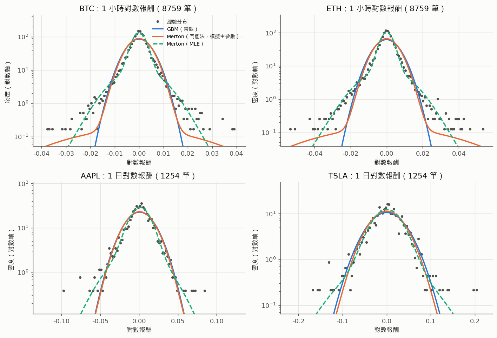

圖：對數報酬的經驗分布（點）與三種模型密度（對數縱軸）。GBM 的尾巴明顯太薄；門檻法 Merton 在 ±2–4% 有一段「肩膀」，對應少而大的跳空；MLE 貼合中段但尾巴仍偏薄。

## 2. 清算價與清算機率（任務書 1-2）

### 2.1 從程式寫出「權益」

`liquidatePosition`（`PerpetualExchange.sol:1160-1177`）先算一個數 closeAmount，再跟維持保證金比：

```
closeAmount       = M + pnl − (M·L·f + M·(L−1)·r·h) − Φ          (:1168)
maintenanceMargin = M·L·m                                          (:1171)
closeAmount ≤ maintenanceMargin  →  可以清算                        (:1175)
```

closeAmount 就是「如果現在平倉，這個倉位還剩多少錢」，以下叫它**權益 E**。各項的意思：

| 項 | 意思 | 程式 |
|---|---|---|
| M | 保證金（開倉手續費另外從帳戶扣，不從 M 扣） | `pos.margin` |
| pnl | 多單 Q·(S − S₀)、空單 −Q·(S − S₀)，Q = M·L/S₀ 是標的數量 | `_calcPnL` `:2010-2026` |
| M·L·f | **平倉那一側**的手續費（開倉時凍結的 f） | `:1163` |
| M·(L−1)·r·h | 借貸費：只對借來的 M·(L−1) 計，h 是整數小時 | `_borrowFee` `:1947-1953` |
| Φ | 累積資金費（正值＝要付） | `_calcFunding` `:2085-2096` |

### 2.2 程式版清算價（線性）——逐步推導

**多單。** 把 Q = M·L/S₀ 代進去：

1. E = M + (M·L/S₀)(S − S₀) − M·L·f − M·(L−1)·r·h − Φ
2. 兩邊同除以開倉名目 M·L（這一步只是換單位，讓式子跟 M 無關）：
   E/(M·L) = 1/L + S/S₀ − 1 − f − r·h·(L−1)/L − Φ/(M·L)
3. 定義 β = r·h·(L−1)/L（每單位名目累積的借貸費）、φ = Φ/(M·L)（每單位名目累積的資金費），得到
   **E/(M·L) = S/S₀ − (1 − 1/L + f + β + φ)**
4. 可清算 ⇔ E ≤ m·M·L ⇔ E/(M·L) ≤ m ⇔
   **S ≤ S\* = S₀·(1 − 1/L + m + f + β + φ)**

**空單。** pnl 變號：

1. E/(M·L) = 1/L − (S/S₀ − 1) − f − β − φ = (1 + 1/L − f − β − φ) − S/S₀
2. 可清算 ⇔ E/(M·L) ≤ m ⇔ **S ≥ S\* = S₀·(1 + 1/L − m − f − β − φ)**

**破產價**（E = 0，倉位的錢剛好歸零）：把上面的 m 換成 0：

- 多單 S_b = S₀·(1 − 1/L + f + β + φ)；空單 S_b = S₀·(1 + 1/L − f − β − φ)。

兩個重要的推論：

- **S\* 與 S_b 之間的距離恰好是 m·S₀**（不論 L 是多少）。清算價到破產價這段「緩衝」就是 MMR，跳空只要超過「現價到 S\* 的距離＋m」就會產生壞帳。
- **多空對稱**：S\*_多/S₀ + S\*_空/S₀ = 2（β、φ 相同時）。

再把權益寫成價格的函數，壞帳公式就出來了：

- 多單 E = M·L·(S − S_b)/S₀；若清算當下的價格 S_liq < S_b，壞帳 = M·L·(S_b − S_liq)/S₀。
- 空單 E = M·L·(S_b − S)/S₀；若 S_liq > S_b，壞帳 = M·L·(S_liq − S_b)/S₀。

### 2.3 任務書版清算價（分式）——推導與差異

任務書假設維持保證金以**現價名目**計（MM = m·Q·S）、而且不含任何費用：

- 多單：M + Q(S − S₀) ≤ m·Q·S ⇒ M/Q + S − S₀ ≤ m·S ⇒ S(1 − m) ≤ S₀ − M/Q = S₀(1 − 1/L) ⇒ **S\* = S₀(1 − 1/L)/(1 − m)**
- 空單：M − Q(S − S₀) ≤ m·Q·S ⇒ S₀(1 + 1/L) ≤ S(1 + m) ⇒ **S\* = S₀(1 + 1/L)/(1 + m)**

兩者的差（先令 f = β = φ = 0，把分式用 1/(1−m) = 1 + m + m² + … 展開）：

- 多單：任務書 ≈ S₀(1 − 1/L + m − m/L + …)，程式 = S₀(1 − 1/L + m)。**程式比任務書高約 m/L·S₀ → 多單在程式裡較早被清算（較保守）。**
- 空單：任務書 ≈ S₀(1 + 1/L − m − m/L + …)，程式 = S₀(1 + 1/L − m)。**程式也高約 m/L·S₀ → 空單在程式裡較晚被清算（較不保守）。**

直覺：任務書的 MM 隨現價變。多單虧錢時價格下跌、現價名目變小、MM 跟著變小，所以要跌更多才清算；空單虧錢時價格上漲、MM 變大，所以比較早清算。程式把 MM 固定在開倉名目，兩邊都不隨價格變。再加上程式的權益扣了 f、β、φ，清算價又往不利方向移 f + β + φ。

### 2.4 首次穿越（清算）機率的封閉解——推導

令 X_t = ln(S_t/S₀) = νt + σW_t（GBM，ν = μ − σ²/2），障礙 b = ln(S\*/S₀)。

**多單（下界 b < 0）。** 想要 P(min_{s≤T} X_s ≤ b)。

1. 拆成兩塊：P(min ≤ b) = P(X_T ≤ b) + P(min ≤ b 且 X_T > b)。第一塊（終點已在障礙下方，一定碰過）是常態分布：Φ((b − νT)/(σ√T))。
2. 第二塊用**反射原理**：先看沒有漂移的情形（ν = 0）。一條路徑在第一次碰到 b 之後，把後半段沿 b 鏡射，終點 x 變成 2b − x。這是一對一對應，而且布朗運動對稱，所以「碰過 b 且終點在 x」的機率密度 = 「終點在 2b − x」的密度 q(2b − x)，q 是 N(0, σ²T) 的密度。
3. 有漂移時用 **Girsanov 定理**換測度：在「無漂移」測度 Q 下 X = σW，真實測度 P 的密度比是 dP/dQ = exp(νX_T/σ² − ν²T/(2σ²))。它只跟終點有關，所以
   P(min ≤ b, X_T ∈ dx) = exp(νx/σ² − ν²T/(2σ²)) · q(2b − x) dx。
4. 把指數合併（配方）：−(x − 2b)²/(2σ²T) + νx/σ² − ν²T/(2σ²) = −(x − 2b − νT)²/(2σ²T) + 2νb/σ²。所以這塊密度是 e^{2νb/σ²} 乘上 N(2b + νT, σ²T) 的密度。
5. 對 x > b 積分：e^{2νb/σ²}·P(N(2b + νT, σ²T) > b) = e^{2νb/σ²}·Φ((b + νT)/(σ√T))。

合起來就是任務書的式子：

**P(τ ≤ T) = Φ((b − νT)/(σ√T)) + exp(2νb/σ²)·Φ((b + νT)/(σ√T))，b < 0。**

**空單（上界 c = ln(S\*/S₀) > 0）。** 「X 的最大值 ≥ c」等於「−X 的最小值 ≤ −c」，而 −X 是漂移 −ν 的布朗運動。把 b → −c、ν → −ν 代進上式：

**P(τ ≤ T) = Φ((νT − c)/(σ√T)) + exp(2νc/σ²)·Φ((−c − νT)/(σ√T))，c > 0。**

檢查：c → 0 時第一項 → 1/2、第二項 → 1/2，機率 → 1（一開倉就在障礙上）；σ → 0、ν = 0 時兩項都 → 0。這些都寫成了測試（`risk_model/tests/test_liquidation.py::test_first_passage_limits`）。

**借貸費與資金費讓障礙隨時間移動。** β = r·⌊t⌋·(L−1)/L 每小時把障礙往不利方向推一小格（Low 5x 每小時 0.008%、24 小時 0.192%）。封閉解假設固定障礙，所以實務上用 β(0) 與 β(T) 各算一次當上下界；24 小時內差異很小。

### 2.5 Monte Carlo 驗證：Brownian bridge 修正

直接在格點上檢查「價格 ≤ S\*」會漏掉「兩個格點之間穿過去又回來」的路徑，所以只看格點的 MC 一定**低估**連續監控的機率。修正方法：已知相鄰兩點 x₁、x₂ 都在障礙上方時，中間碰到障礙的條件機率是（布朗橋的穿越機率，與漂移無關）

p = exp(−2(x₁ − b)(x₂ − b)/(σ²Δt))

每條路徑的「沒碰到」機率是 Π(1 − p_i)，取 1 − Π(1 − p_i) 的平均當估計值。這對 GBM 是**不偏**的（任何步長都對），只剩抽樣誤差，所以可以拿來嚴格檢驗封閉解。

離散監控本身也有封閉近似（Broadie–Glasserman–Kou）：每 Δ 才檢查一次，相當於把障礙往遠離起點的方向移 0.5826·σ√Δ。程式的清算正是離散監控（只在推價時點），這是第 3 節「檢查點」模型的起點。

### 2.6 結果

**清算價對照**（h = 0、φ = 0，`output/tables/liq_prices.csv`；與 `PARAMS_INVENTORY.md` §1.4 一致）：

| 分級 | L | f | 程式 多 S\*/S₀ | 多 破產 | 任務書 多 | 程式 空 S\*/S₀ | 空 破產 | 任務書 空 |
|---|---|---|---|---|---|---|---|---|
| Low | 1 | 0.10% | 0.0510 | 0.0010 | 0 | 1.9490 | 1.9990 | 1.9048 |
| Low | 2 | 0.10% | 0.5510 | 0.5010 | 0.5263 | 1.4490 | 1.4990 | 1.4286 |
| Low | 3 | 0.10% | 0.7177 | 0.6677 | 0.7018 | 1.2823 | 1.3323 | 1.2698 |
| Low | 4 | 0.10% | 0.8010 | 0.7510 | 0.7895 | 1.1990 | 1.2490 | 1.1905 |
| Low | 5 | 0.10% | 0.8510 | 0.8010 | 0.8421 | 1.1490 | 1.1990 | 1.1429 |
| Mid | 2 | 0.40% | 0.5540 | 0.5040 | 0.5263 | 1.4460 | 1.4960 | 1.4286 |
| High | 1 | 1.00% | 0.0600 | 0.0100 | 0 | 1.9400 | 1.9900 | 1.9048 |

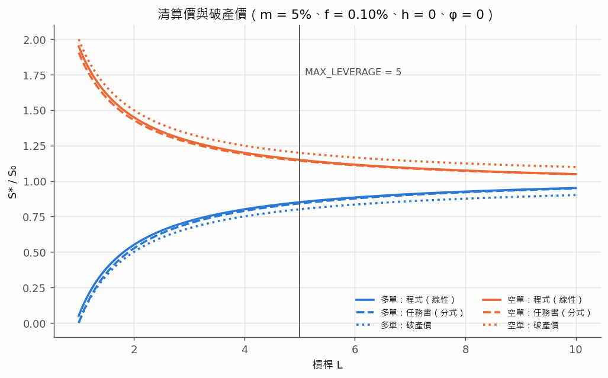

**邊界情況**（都寫成測試，`risk_model/tests/test_liquidation.py`）：

- L = 1：多單 S\* = S₀(m + f)，價格要跌到 6%（High）才清算；任務書式是 0（永遠不清算）。
- m → 0：清算價 = 破產價（沒有緩衝）；再令 f = 0 時程式式與任務書式都退化成 1 ∓ 1/L。
- L 很大：多單 S\*/S₀ → 1 + m + f > 1，一開倉就可清算。程式只靠 `MAX_LEVERAGE = 5` 擋住；一般地，**一開倉就可清算 ⇔ m ≥ 1/L − f**，而 `setMaintenanceMarginFor` 只檢查 m ≤ 99.99%，不檢查這條（測試用整數模擬程式驗證了 1990／1989 bps 的分界）。
- 多空對稱：S\*_多 + S\*_空 = 2S₀、S_b,多 + S_b,空 = 2S₀、S\* − S_b = ±m·S₀。

**程式不等式逐點對照**（對照的是 Python 逐行重寫的邏輯，不是直接執行合約）。`liquidation.program_close_amount` 逐行重現 `liquidatePosition` 的整數運算（18 位小數、向零截斷的有號除法、整數小時的借貸費、資金費指數差）。隨機抽 20,000 組（L、分級、多空、保證金、開倉價、0–200 小時、在清算價 ±2% 附近的價格）：**19,998 組與封閉式判斷一致，其餘 2 組距離邊界 < 10⁻⁹（截斷誤差範圍），不列入比較**；測試另以 3,000 組含資金費與不同 MMR 的樣本檢查。

**封閉解 vs Monte Carlo**（GBM、μ = 0、Low 費率；MC 400,000 條路徑、每條 96 步，bridge 修正）：

| 方向 L、σ、期間 | 封閉解 | MC（bridge） | 標準誤 | z | 只看格點 | BGK 修正 |
|---|---|---|---|---|---|---|
| 多 5x、60%、7 天 | 5.651% | 5.697% | 0.036% | +1.28 | 4.867% | 4.927% |
| 空 5x、60%、7 天 | 8.821% | 8.831% | 0.044% | +0.22 | 7.706% | 7.761% |
| 多 5x、100%、1 天 | 0.2225% | 0.2146% | 0.0071% | −1.10 | 0.188% | 0.182% |
| 空 5x、150%、1 天 | 7.169% | 7.143% | 0.040% | −0.66 | 6.191% | 6.277% |
| 多 3x、200%、1 天 | 0.1803% | 0.1818% | 0.0066% | +0.23 | 0.156% | 0.147% |
| 空 3x、250%、1 天 | 5.059% | 5.072% | 0.034% | +0.37 | 4.378% | 4.392% |
| 多 2x、100%、30 天 | 5.029% | 5.032% | 0.034% | +0.08 | 4.370% | 4.379% |
| 多 4x、120%、3 天 | 4.619% | 4.619% | 0.033% | −0.01 | 3.986% | 4.010% |

**所有情境 |z| ≤ 1.28，最大絕對誤差 0.046 個百分點，都在 95% 信賴區間（|z| < 1.96）內。** 只看 96 個格點的 MC 一律低估約 14%，而 BGK 離散修正把封閉解拉到格點 MC 附近——這正是「清算只在檢查點發生」的效果。測試 `test_closed_form_matches_mc_within_ci` 以較小樣本在 CI 重跑 5 組，要求 |z| ≤ 4。

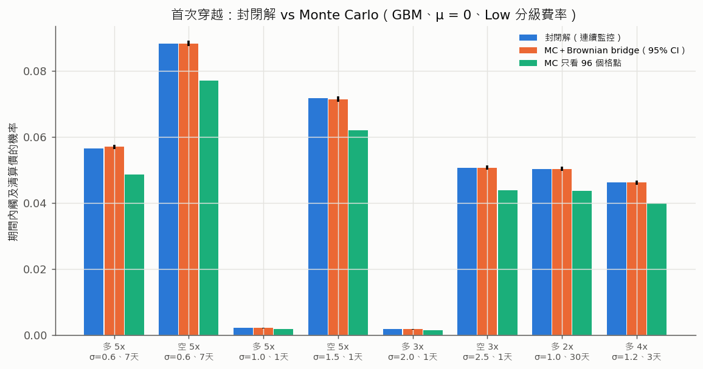

**24 小時清算機率熱圖**（L × σ，色階為對數；Low 費率、m = 5%、μ = 0）。多單代表值：

| L | σ = 50% | 80% | 100% | 150% |
|---|---|---|---|---|
| 2 | 1 × 10⁻¹¹⁴ | 8 × 10⁻⁴⁶ | 7 × 10⁻³⁰ | 4 × 10⁻¹⁴ |
| 3 | 9.5 × 10⁻³⁷ | 2.7 × 10⁻¹⁵ | 2.7 × 10⁻¹⁰ | 0.003% |
| 5 | 7.6 × 10⁻¹⁰ | 0.013% | 0.22% | 4.3% |

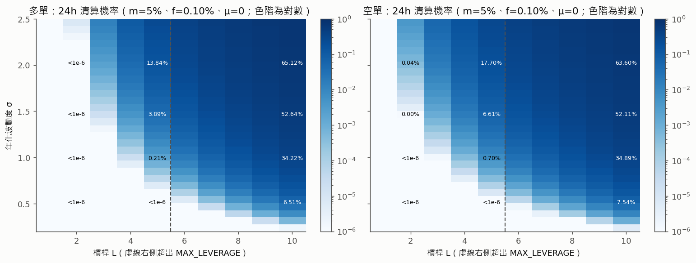

**用校準參數的代表值**（剛開倉的多單、24 小時；股票是一個交易日）：

| 資產 | 總波動 σ | L = 5：GBM 封閉解 | L = 5：Merton MC（門檻法參數、不含崩盤成分；±標準誤） |
|---|---|---|---|
| BTC | 47.3% | 8 × 10⁻¹¹ | < 1/60,000（樣本內 0） |
| ETH | 64.9% | 2.2 × 10⁻⁶ | 1.0 × 10⁻⁴ ± 0.4 × 10⁻⁴ |
| AAPL | 29.6% | 5 × 10⁻¹⁸ | 3.0 × 10⁻⁴ ± 0.7 × 10⁻⁴ |
| TSLA | 59.3% | 1.7 × 10⁻⁵ | 1.05 × 10⁻³ ± 0.13 × 10⁻³ |

L ≤ 2 時兩種模型都是 0。**跳躍讓 5x 的一日清算機率高出 1–2 個數量級**（MC 估計的相對標準誤約 13–40%，見表）：GBM 只有常態的薄尾，一天要跌 15% 對 σ = 65% 是 6 個標準差，跳躍模型則每年有幾十次 3% 級的跳空（這張表不含崩盤成分）。

## 3. 跳空壞帳（任務書 1-3，核心）

### 3.1 檢查點：Δ 由兩件事決定

清算價公式假設「價格一碰到 S\* 就清算」。程式實際上有兩個關卡：

1. **價格要先被推上鏈。** exchange 讀的是 keeper 寫進 MockOracle 的價格（`PerpetualExchange.sol:1718-1736`），兩次推價之間是常數。市價在兩次推價之間怎麼走，exchange 都看不到；下一次推價時，價格一次跳到位。
2. **要有人呼叫 `liquidatePosition`。** repo 內沒有清算 bot（`PARAMS_INVENTORY.md` §3.4），唯一的呼叫者是前端的手動按鈕。

所以模型把檢查點拆成兩個參數：

| 參數 | 意思 | 現況值 | 模型 |
|---|---|---|---|
| Δ_p | 推價間隔 | 名目 15 分，實測 68–169 分、平均約 90 分 | 固定間隔，或「68 分＋截斷指數分布（平均 22 分，上限 169 分）」 |
| ρ | 清算人平均到達間隔 | 無 bot（未知） | 清算人到達是 Poisson 過程，平均間隔 ρ；ρ = 0 代表常駐 bot（價格一更新就清算）。現況假設 ρ = 4 小時 |
| A | maxPriceAge | 鏈上 6h（原始碼 24h） | 價格年齡 > A 時 `_requireFresh` revert，不能清算 |

第 k 次推價（時間 t_k、價格 P_k）之後，「可清算時間窗」是

w_k = min(t_{k+1}, t_k + A, T) − t_k

窗內至少一位清算人到達的機率是 q_k = 1 − e^{−w_k/ρ}。第一個「P_k 已達清算價、而且有人到達」的 k，就以 P_k 清算（因為那段時間 exchange 看到的價格就是 P_k）。

**maxPriceAge 的角色。** A 不會讓跳空變小：只要推價間隔 Δ_p 大於 A，(t_k + A, t_{k+1}) 這段時間任何人都不能清算（也不能開平倉），但下一次推價時價格一樣一次跳到位。所以 A 只會**縮短可清算時間窗**、在清算人很慢時讓壞帳變大；「Δ 的上限受 maxPriceAge 約束」的正確意思是：**實際被拿來清算的價格，年齡一定 ≤ A**，而跳空大小仍由推價間隔決定。

### 3.2 壞帳

由 §2.2，清算當下的每單位名目權益是 e = P_k/S₀ − S_b/S₀（多單）或 S_b/S₀ − P_k/S₀（空單）：

- e ≥ 0：沒有壞帳。closeAmount = e·M·L 依程式分配：清算人 5%、保險庫 20%、持有人 75%（`:1204-1219`）。
- e < 0：壞帳 −e·M·L，走 `_absorbShortfall`：保險庫 bailout → ADL → `BadDebt` 事件（`:1247-1270`）。清算人拿 0（沒有清算誘因）。

模擬到期末（一天）還沒被清算、但以最後一次推價計算 e < 0 的倉位，也計入當日的「未實現虧空」——沒有清算 bot 時這部分不會自己消失。

### 3.3 帳簿模型（每單位 OI）

保險庫看的是整本帳簿，而不是單一倉位。每個資產建一本代表性帳簿：

- 60 個倉位，多空各半（名目），槓桿都等於該分級上限（保守）；
- 開倉時間在過去 7 天內均勻分布，開倉價相對現價 ln(S₀,ᵢ/S_now) ~ N(0, σ²_總·年齡)；
- 已經達到清算價的倉位視為已被清算、不在帳上；借貸費 β 依年齡計入；
- 所有倉位面對**同一條**市價路徑（同一資產完全相關）。

損失以「佔該資產 OI 的比例」表示，所以結果與 OI 規模無關（線性放大）。

### 3.4 重要性抽樣

年破產機率 0.1% 對應每日約 3×10⁻⁶ 的尾端，直接模擬需要上百萬天。做法：以放大的跳躍強度 λ' = s·λ 產生路徑，再給每個情境概似比權重

w = (λ/λ')^N · exp((λ' − λ)·T)

（N 是情境內的跳躍次數）。加權後的期望值不偏（`test_importance_sampling_is_unbiased`），極端日的樣本多約 s 倍。加密資產放大「崩盤成分」20 倍，股票放大一般跳躍 30 倍。

### 3.5 價格時效（maxPriceAge 的另一面）

價格時效過長不只影響壞帳。開倉只檢查價格年齡 ≤ maxPriceAge（`_freshPrice`），鏈上是 6 小時，而推價實測約 90 分鐘一次：在這段時間內，鏈上價格與市價的偏離隨時間擴大，**交易者能取得對池子不利的開倉價**（逆選擇），損失由交易所池子（全體交易者的 freeMargin）承擔，而且不會出現在 BadDebt 事件裡。

- **風險等級：高。**
- **參數關係：** 開倉價的期望偏離約與 √(價格年齡) 成正比（純擴散近似 E|x| = σ√(2a/π)），所以風險隨 maxPriceAge 與推價間隔同向增加；手續費越高、波動越低的資產受影響越小。
- **建議：** 開倉可用的價格時效要遠小於現值；單靠縮短 maxPriceAge 無法完全消除（任何非零的時效都可能被利用），較完整的做法是限制開倉可用的價格時效、或延遲成交並以成交後的價格結算。

### 3.6 結果

**(a) 網格：Δ × L × λ × 跳幅分布。** σ = 50%、Low 費率、常駐 bot（Δ = 推價間隔），帳簿每單位 OI 的每日期望壞帳（bps of OI）。同一列的各 Δ 用同一批帳簿與市價路徑（common random numbers），差異只來自檢查點：

| 跳幅分布 | λ（次/年） | Δ = 1 分 | 15 分 | 1 時 | 1.5 時 | 3 時 | 6 時 |
|---|---|---|---|---|---|---|---|
| 無跳躍 | 0 | 0 | 0 | 0 | 0 | 0 | 0 |
| 對稱 N(0, 3%²) | 12 | 0.001 | 0.001 | 0.002 | 0.002 | 0.002 | 0.002 |
| 對稱 N(0, 3%²) | 52 | 0.005 | 0.006 | 0.008 | 0.009 | 0.011 | 0.014 |
| 對稱 N(0, 3%²) | 250 | 0.050 | 0.059 | 0.057 | 0.073 | 0.100 | 0.155 |
| 崩跌 N(−8%, 4%²) | 12 | 0.080 | 0.082 | 0.084 | 0.086 | 0.089 | 0.094 |
| 崩跌 N(−8%, 4%²) | 52 | 0.512 | 0.542 | 0.568 | 0.566 | 0.619 | 0.684 |
| 崩跌 N(−8%, 4%²) | 250 | 1.96 | 2.06 | 2.18 | 2.34 | 2.67 | 3.47 |

對應的單日 ES₉₉（bps of OI）在崩跌型、λ = 250 時從 62（1 分）升到 144（6 時）。槓桿的影響遠大於 Δ：Δ = 1.5 時、崩跌型 λ = 250 的期望壞帳，L = 2／3／5 分別是 0／0.47／2.34 bps。完整表：`output/tables/gap_grid.csv`。

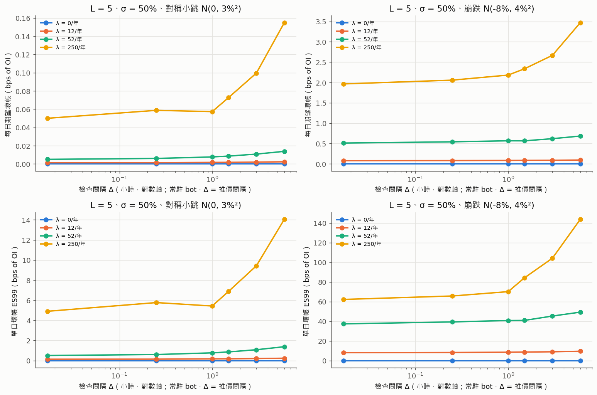

讀法：

- **λ = 0（純擴散）時壞帳一律是 0**，連 6 小時才檢查一次也一樣：5x 的清算價到破產價有 m = 5% 的緩衝，σ = 50% 時 6 小時的標準差只有 1.3%。這也是測試 `test_bad_debt_vanishes_as_delta_to_zero_without_jumps` 檢查的性質（σ = 80% 時，Δ = 1 分的壞帳 < 10⁻⁹）。
- **有跳躍時 Δ → 0 也不會讓壞帳歸零**：跳躍本身就會一次跨過 5% 的緩衝，再頻繁的推價也來不及。Δ 只決定「跳躍之外的擴散」多累積多少。

**(b) Δ 的兩個來源分開看。** ETH（校準＋崩盤成分）、L = 5、每格 5,000 天，同一批帳簿與路徑：

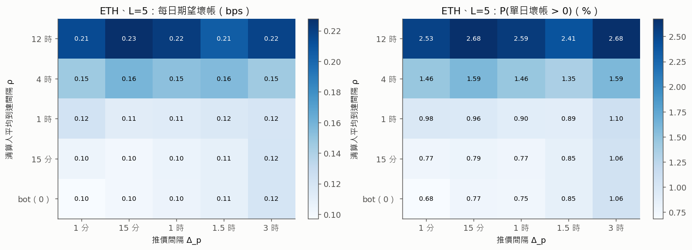

清算人的反應時間 ρ 比推價間隔重要：從 bot 到 12 小時，期望壞帳約從 0.10–0.12 升到 0.21–0.23 bps/日、P(>0) 從 0.7–1.1% 升到 2.4–2.7%；推價間隔從 1 分到 3 小時（bot）只把期望從 0.097 推到 0.119 bps/日、P(>0) 從 0.68% 推到 1.06%。清算人到達另用一條子亂數流，所以 25 格看到的是同一批帳簿、市價路徑與跳躍。原因是「價格已經過了清算價但沒人清算」的倉位，會繼續承受之後的波動與跳空。

**(c) maxPriceAge。** ETH 5x，實測推價分布（另加每次推價 2% 機率的 4.5 小時停擺）。有 bot 時，maxPriceAge 從 1 小時到 24 小時，期望壞帳都在 1.07–1.34 × 10⁻⁵（抽樣誤差內）；清算人平均 4 小時才來時，maxPriceAge = 1 小時（短於推價間隔）把期望壞帳推到 2.6 × 10⁻⁵、P(>0) 2.3%，約是其他設定的 1.3–2 倍——可清算時間窗被切掉，等於清算人更慢。`output/tables/gap_max_price_age.csv`。

**(d) Base Sepolia 現況（逐資產、鏈上分級與槓桿上限）。** 單位：bps of 該資產 OI，每日；每格 40,000 天、重要性抽樣：

| 資產（鏈上分級、L） | 情境 | 期望 | P(>0) | VaR₉₅ | ES₉₅ | VaR₉₉ | ES₉₉ |
|---|---|---|---|---|---|---|---|
| sETH（Low、5x） | 現況：推價約 90 分＋手動清算（ρ = 4h） | 0.166 | 1.59% | 0 | 3.32 | 1.66 | 16.1 |
| sETH（Low、5x） | 只補清算 bot | 0.122 | 1.04% | 0 | 2.45 | 0.17 | 12.2 |
| sETH（Low、5x） | 改善：每分鐘推價＋bot | 0.115 | 0.82% | 0 | 2.30 | 0 | 11.5 |
| sAAPL（Low、5x） | 現況 | 0.087 | 0.13% | 0 | 1.75 | 0 | 8.7 |
| sAAPL（Low、5x） | 改善 | 0.099 | 0.14% | 0 | 1.98 | 0 | 9.9 |
| sBTC（High、1x） | 三種情境 | 0 | 0 | 0 | 0 | 0 | 0 |
| sTSLA（High、1x） | 現況 | 0.003 | 0.001% | 0 | 0.05 | 0 | 0.26 |

把四個資產都放到 L = 5（現況基礎設施）：BTC ES₉₉ 9.0、ETH 16.8、AAPL 8.7、**TSLA 81.5** bps，TSLA 的 P(>0) 達 3.3%/日。sAAPL 的「改善」略高於「現況」在抽樣誤差內：股票的壞帳幾乎全來自財報型的大跳空，推價頻率幫不上忙。

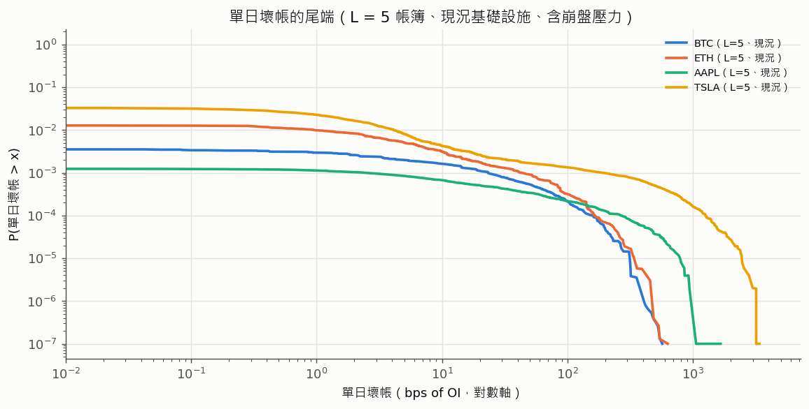

**(e) 價格時效。** 下圖是開倉價與市價的期望偏離對價格時效的關係（相對刻度，以 6 小時 = 1）。四個資產的形狀幾乎相同（約與 √時效 成正比）：把開倉可用的時效從鏈上的 6 小時降到實測平均推價間隔，偏離只降到約一半；要讓它降到一成左右，時效要降到分鐘級。風險評估見 §3.5。

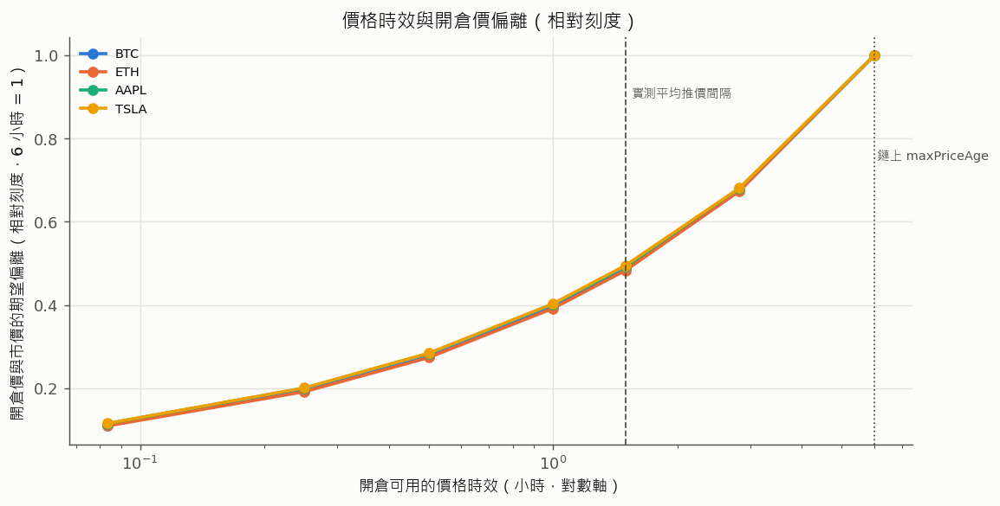

## 4. 保險庫償付（任務書 1-4）

### 4.1 程式實際的資金流

| 方向 | 來源 | 程式 | 模型 |
|---|---|---|---|
| 收入 | 清算罰金：closeAmount > 0 時的 liquidationPenaltyBps（鏈上 20%） | `:1204-1219` | 由帳簿模擬逐筆累加 |
| 收入 | 交易手續費分潤 vaultFeeShareBps（開倉、平倉都路由；鏈上 0） | `:1705-1715`、`:1841`、`:1939` | 參數：分潤比例 × f × 每日成交名目 |
| 收入 | FeeRouter 績效費：跟單獲利 × 10% × 10% = 1% | `FeeRouter.sol:24-25`、`:161-170` | 參數（預設 0） |
| 收入 | LP 存入、owner 注資 | `InsuranceVault.sol:140`、`:162-170` | 不計（保守） |
| 支出 | 壞帳 bailout(min(缺口, totalAssets)) | `:1247-1260` | 帳簿模擬的每日壞帳（含未實現） |

**順序很重要：程式先動用保險庫，保險庫不夠才 ADL**（`_absorbShortfall`）。所以 ADL 不會減少保險庫的支出；任務書「扣除 ADL 可吸收的部分」只能當作「如果改成先 ADL」的反事實情境來算。ADL 的可吸收量也要保守估：`MAX_ADL_SCAN = 128` 是**索引槽數**，同向、虧損、已平倉的倉位都佔槽，模型假設只有 25% 的反方向獲利倉位會被掃到。

### 4.2 盈餘過程與「打穿所需規模」

以日為步，U_t 是保險庫餘額（佔 OI 的比例），I_t、D_t 是當日收入與壞帳：

U_t = U_{t−1} − D_t + I_t，U₀ = u₀

當 D_t > U_{t−1}，保險庫無法全額 bailout（**被打穿**），缺口進入 ADL／BadDebt。

一次模擬算出所有 u₀ 的破產機率的方法：令 C_{t−1} = Σ_{s<t}(I_s − D_s)。還沒被打穿之前 U_{t−1} = u₀ + C_{t−1}，所以

第 t 天被打穿 ⇔ D_t > u₀ + C_{t−1} ⇔ u₀ < D_t − C_{t−1}

定義每條路徑的 **M = max_t (D_t − C_{t−1})**，則「一年內被打穿」⇔ u₀ < M，

**ψ(u₀) = P(M > u₀)**，而滿足 ψ ≤ 0.1% 的最小保險庫就是 M 的 99.9% 分位數。

(I_t, D_t) 從帳簿模擬的日樣本成對抽出（保留「同一天罰金收入與壞帳」的相關性），依重要性抽樣權重抽樣。

### 4.3 Cramér–Lundberg 對照

經典 Cramér–Lundberg 模型是「固定保費收入＋複合 Poisson 理賠」。離散時間的對應：每日淨理賠 Z = D − I 獨立同分布、E[Z] < 0（收入的期望大於損失）。若存在 R > 0 使 E[e^{RZ}] = 1（**調整係數**），則 e^{R·(累積淨理賠)} 是鞅，由選擇停止定理得到無限期的破產機率上界

**ψ_∞(u₀) ≤ e^{−R·u₀}**

這個上界不需要模擬尾端的細節，但只在 E[Z] < 0 時存在，而且是無限期（比一年寬鬆）。

### 4.4 結果

收入只算清算罰金（鏈上 vaultFeeShareBps = 0、FeeRouter 分潤預設 0，保守）。年破產機率（一年內被打穿），每個資產用**同一批**樣本（40,000 天帳簿模擬＋50,000 條一年 bootstrap 路徑）算出整列，± 是 95% 信賴區間的半寬；「< 0.006%」表示 50,000 條路徑中沒有一條被打穿（三分之一法則的上界）：

| 資產（L） | u₀ = 0.5% OI | 1% | 2% | 3% | 5% | 10% | 20% | 年破產 < 0.1% 的最小 u₀（95% CI） | ES 條件的最小 u₀ |
|---|---|---|---|---|---|---|---|---|---|
| sETH（5x） | 3.67% ± 0.16 | 1.94% ± 0.12 | 0.58% ± 0.07 | 0.16% ± 0.04 | 0.012% ± 0.010 | < 0.006% | < 0.006% | **3.4%**（3.2–3.7%） | 1.6% |
| BTC 若 5x | 6.79% ± 0.22 | 3.33% ± 0.16 | 0.94% ± 0.08 | 0.24% ± 0.04 | 0.012% ± 0.010 | < 0.006% | < 0.006% | **3.8%**（3.4–4.0%） | 0.9% |
| sAAPL（5x） | 9.13% ± 0.25 | 6.02% ± 0.21 | 3.29% ± 0.16 | 1.88% ± 0.12 | 0.75% ± 0.08 | 0.074% ± 0.024 | < 0.006% | **9.4%**（9.0–10.1%） | 0.9% |
| TSLA 若 5x | 27.2% ± 0.4 | 23.8% ± 0.4 | 19.6% ± 0.4 | 16.5% ± 0.3 | 11.3% ± 0.3 | 4.6% ± 0.2 | 0.89% ± 0.08 | **31.7%**（31.3–32.9%） | 8.2% |
| sTSLA（1x） | 0.12% ± 0.03 | 0.09% ± 0.03 | 0.05% ± 0.02 | 0.05% ± 0.02 | 0.03% ± 0.02 | 0.03% ± 0.02 | < 0.006% | **0.8%**（0.4–1.7%） | 0.03% |
| sBTC（1x） | < 0.006% | < 0.006% | < 0.006% | < 0.006% | < 0.006% | < 0.006% | < 0.006% | **0** | 0 |

「最小 u₀」要同時滿足兩個條件：年破產 < 0.1%（M 的 99.9% 分位數，信賴區間用順序統計量的二項近似），以及單日 ES₉₉ ≤ 10% × u₀（最後一欄）；本表各資產都由前者決定。同一列內兩者一致：例如 sAAPL 在 u₀ = 10% 時年破產 0.074%，最小 u₀ 9.4% 落在 10% 之下。§6 的反推每組參數用獨立的較小樣本，所以數字與本表有抽樣差異（例如 sAAPL 5x 在 §6.2 是 11.8%），本表的信賴區間可以當作那個差異的量級。

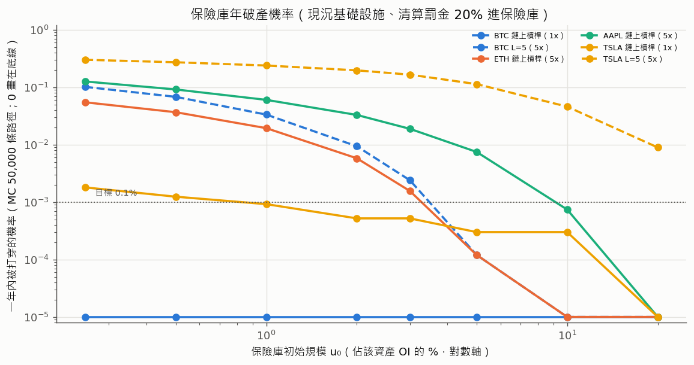

**三種算法互相對照**（sETH 5x，`run_all.py` 輸出的 `ruin_mc_check_ETH`）：

| u₀ | 單日近似 | 「打穿所需規模」M 的分布 | 逐日模擬餘額（±1 標準誤） |
|---|---|---|---|
| 1% | 1.89% | 1.97% | 1.96% ± 0.06% |
| 2% | 0.51% | 0.56% | 0.55% ± 0.03% |
| 5% | 0.013% | 0.012% | 0.012% ± 0.005% |

M 的方法與逐日模擬一致；單日近似略低（忽略了連續幾天損失的累積）。

**Cramér–Lundberg。** sETH 5x 的每日淨理賠期望 −1.19 × 10⁻⁴（收入大於損失），調整係數 R = 112，所以無限期破產機率 ψ_∞(u₀) ≤ e^{−112u₀}：u₀ = 5% 時上界 0.36%，比一年期的 MC（0.012%）寬鬆約 30 倍，是合理的保守上界。sAAPL 5x、TSLA 5x 與 sTSLA 1x **在現行參數與本校準下，罰金收入的期望低於壞帳的期望**（R 不存在，保險庫長期期望為負），需要注資、降槓桿或提高 MMR。這個結論有兩個前提：鏈上 vaultFeeShareBps = 0（手續費分潤會增加收入）；股票的跳躍參數只由五年內少數幾次跳空估計（AAPL 7 次、TSLA 6 次），不確定性大。

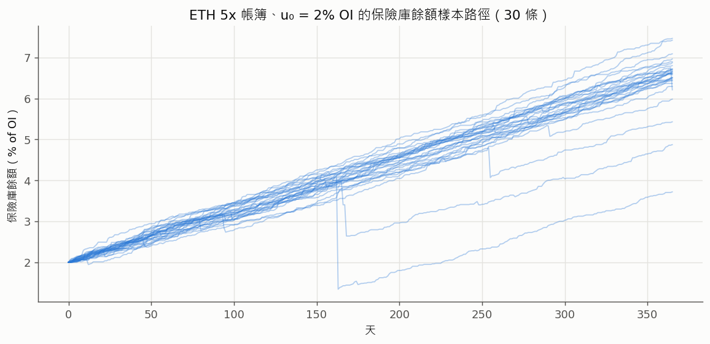

**敏感度。**

- **保險庫分配比例**（清算人固定 5%，持有人拿剩下的；ETH 5x、u₀ = 5% 時都滿足目標）：達標的最小保險庫隨比例下降——0% → 4.5%、10% → 3.1%、20%（現值）→ 2.7%、40% → 2.2%、60% → 1.9%、95%（任務書假設）→ 1.4% of OI。這組敏感度用另一批 20,000 天的樣本，20% 時的 2.7% 與上表的 3.4% 之差反映抽樣誤差（約 ±1% of OI）。
- **初始保險庫規模與 OI**：損失與收入都與 OI 成正比，所以只看比例 u₀ = 保險庫／OI。OI 加倍而保險庫不變，等於 u₀ 減半（上表往左一格）。
- **ADL 順序**（反事實，假設只有 25% 的反方向獲利倉位被掃到）：

| 資產（L = 5） | 程式（先保險庫） | 反事實（先 ADL） |
|---|---|---|
| BTC | 3.5% | 2.4% |
| ETH | 3.4% | 2.0% |
| AAPL | 9.4% | 9.3% |
| TSLA | 31.6% | 30.3% |

股票幾乎沒有差：財報型大跳空造成的壞帳，遠大於被掃到的（25%）反方向倉位當下的獲利。

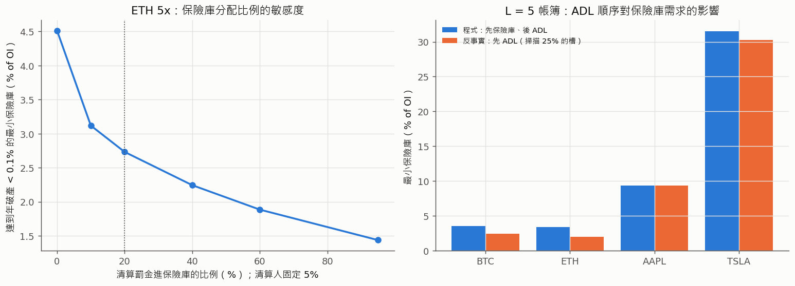

## 5. 資金費率（任務書 1-5）

### 5.1 程式的費率函數

`_fundingRateBps`（`PerpetualExchange.sol:1514-1518`），d = OI_L − OI_S、T = OI_L + OI_S（OI 是開倉名目，不隨價格重估）：

rate_bps = trunc( trunc(10¹⁸·d/T) · 75 / 10¹⁸ )

- **兩段截斷**：先把失衡截成 18 位小數，再乘 75 截成整數 bps。75·d/T 剛好是整數時會少 1（OI 2:1 → 24 bps，不是 25）。
- **死區**：|d/T| < 1/75 ≈ 1.33% 時費率是 0。
- **範圍 [−74, +74]**：兩邊 OI 都 > 0 才累積，d/T 永遠 < 1，所以到不了 75。
- 付方每單位名目付 |rate|·10⁻⁴·區間數；收方拿付方 × OI_付/OI_收，但最多 10 倍，超出的部分留在 exchange 池（`:1503-1509`）。
- 每 8 小時一個區間，只算**滿的**區間，而且**只在有人觸發 `_pokeFunding` 時**累積（開／平／清算／`settleFunding`），並用**觸發當下的 OI** 計算所有經過的區間。

### 5.2 狀態變數 X 的選擇：正規化 OI 失衡

任務書用 OU 過程描述 mark − index 價差。程式的費率由 OI 失衡決定、與價差無關，所以取

**X_t = (OI_L − OI_S)/(OI_L + OI_S) ∈ [−1, 1]**

它也對得上價差：`markPremiumCapBps = c > 0` 時 mark = index·(1 + trunc(trunc(10¹⁸X)·c/10¹⁸)/10⁴)（`:2050-2081`），價差 ≈ c·X/10⁴ 與 X 成正比。所以「X 是 OU」⇔「價差是 OU」，κ 相同、η 乘上 c/10⁴。鏈上 c = 0，價差恆為 0。

### 5.3 OU 過程與半衰期

dX = −κX dt + η dW 的解是 X_t = X₀e^{−κt} + η∫₀ᵗ e^{−κ(t−s)}dW_s，所以

- 平均 E[X_t] = X₀e^{−κt}，偏離減半的時間（**半衰期**）是 ln2/κ；
- 長期變異數 η²/(2κ)；
- 每 Δ 取樣一次是 AR(1)：X_{t+Δ} = e^{−κΔ}X_t + 雜訊，所以用 OLS 估 b 就有 κ̂ = −ln b̂/Δ。

**κ 從哪裡來？** 資金費本身不改變 OI，失衡會回復只因為交易者對資金費有反應。用「回復彈性」θ 表示：付方費率為 F（小數）時，每 8 小時失衡被修正 θ·F。程式 F ≈ 0.0075·X：

- **每區塊連續累積**（假設的對照）：dX = −θ·0.0075·X/(8h) dt ⇒ **κ_連續 = 0.0075θ/8h**。
- **每 8 小時一次**（程式）：X_{k+1} = (1 − 0.0075θ)X_k ⇒ **κ_8h = −ln(1 − 0.0075θ)/8h**，一階展開就是 κ_連續；θ 大時離散版略快，但有 1.33% 的死區（失衡小於它就完全不修正）。

### 5.4 累積方式：快照結算、持有時間不加權

上面的 κ 假設回復失衡的資金「持續持有」。程式是**快照制**：一個區間的資金費，算給結算那一刻還開著的所有倉位，不按持有時間加權。

- **風險等級：中高。**
- **影響：** 回復失衡的資金不需要持續停留就能分到資金費，持續持有的一方被稀釋，常駐失衡的回復力因此被削弱（模擬圖的綠線是「回復資金不持續停留」的情境：常駐失衡沒有持續的回復力）。收方的放大倍數（OI_付/OI_收，最多 10 倍）越大，這個影響越明顯。
- **建議：** 改為按持有時間累積（例如每區塊或每秒累積指數，用高精度而非整數 bps，避免死區），回復力才會像 OU 一樣連續作用。這需要改合約。

**模型假設：** 倉位相對 OI 無限小（單一倉位不改變費率與 OI 比例）；沒有模擬單次補算最多 21 個區間（`MAX_FUNDING_CATCHUP_INTERVALS`）的上限，也就是假設結算至少每 7 天被觸發一次。

### 5.5 純機械效果：資金費把擁擠方逼向清算

不靠任何行為假設，資金費也會讓擁擠方的權益每 8 小時少 |rate|，清算價往不利方向移 φ。開倉時距離清算的緩衝是 1/L − m − f（每單位名目），以最高 74 bps 計，要 (1/L − m − f)/0.0074 個區間才吃光。

### 5.6 結果

**費率函數的實例**（`funding.funding_rate_bps` 逐行重現程式整數運算，有測試）：OI 2:1 → 24 bps（不是 25）；單邊極度擁擠（另一邊只有 1 wei）→ 74 bps；|X| < 1/75 → 0。

**半衰期與累積頻率**（η = 0.02/√小時，模擬 400 條、30 天，每 8 小時取樣擬合 AR(1)）：

| θ | κ 連續（/小時） | 半衰期 連續 | κ 8h 一次 | 半衰期 8h | 擬合 κ（連續） | 擬合 κ（8h＋截斷） |
|---|---|---|---|---|---|---|
| 5 | 0.0047 | 148 h | 0.0048 | 145 h | 0.0049 | 0.0050 |
| 10 | 0.0094 | 74 h | 0.0097 | 71 h | 0.0095 | 0.0095 |
| 20 | 0.0188 | 37 h | 0.0203 | 34 h | 0.0189 | 0.0189 |
| 50 | 0.0469 | 15 h | 0.0588 | 12 h | 0.0485 | 0.0547 |
| 100 | 0.0938 | 7.4 h | 0.1733 | 4.0 h | 0.0964 | 0.1466 |

- θ 不大時，「每 8 小時一次」與「每區塊」的回復速度幾乎一樣（一階展開相同）；擬合值與理論吻合，表示 OU 是 X 的合理描述。
- θ 很大時離散版理論上更快，但模擬擬合值（0.147）低於理論（0.173）：兩段截斷造成的**死區**（|X| < 1.33% 完全不修正）與整數 bps 拖慢了最後一段回復。
- **這張表假設回復資金持續持有。** 在程式的快照制下，回復資金不需要持續停留，常駐失衡的回復力會更弱（§5.4、下圖中間的綠線）。

**純機械效果：** 以最高 74 bps/8h 計，擁擠方要 20 個區間（6.7 天，Low 5x）、60 個區間（20 天，2x）、127 個區間（42 天，High 1x）才會被資金費逼到清算價。

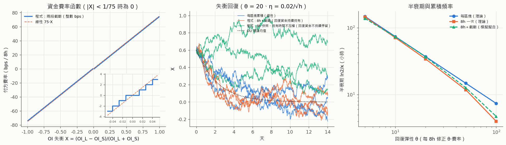

圖左：程式的費率函數（階梯）與線性 75X；右下角放大死區。圖中：三種機制下 X 的回復（θ = 20）。圖右：半衰期與 θ。

## 6. 參數反推（任務書 1-6）

### 6.1 目標與方法

| 目標 | 預設 | 調整方式 |
|---|---|---|
| (T1) 保險庫一年內被打穿的機率 | < 0.1% | `--ruin-target` |
| (T2) 單日壞帳 ES₉₉ | < 保險庫的 10% | `--es-frac` |
| 保險庫規模 u₀（佔該資產 OI） | 5%（鏈上實際規模與 OI 未盤點，這是假設） | `--vault-to-oi` |

流程（`risk_model/inverse.py`）：

1. **槓桿與 MMR**：對每個資產 × 碳分級 × 基礎設施情境，從分級上限往下試 L，m 由現值 5% 往上試（5%、7.5%、10%、15%，且必須 m < 1/L − f），第一組同時滿足 T1、T2 的就是建議值。每組 12,000 天帳簿模擬＋50,000 條一年 bootstrap 路徑。
2. **推價與清算檢查**：在建議的 (L, m) 下掃 Δ_p × ρ（同一批帳簿與路徑），找出滿足目標的範圍；推價間隔另受價格時效風險（§3.5）約束。
3. **maxPriceAge**：下限＝推價間隔的最大值（否則正常運作就會 revert）；開倉可用的價格時效應遠小於現值（§3.5）。
4. **清算分配**：清算人 5% 是 constant（改它要重新部署）；保險庫比例看 T1 的敏感度。

### 6.2 逐資產 × 碳分級的可行槓桿（u₀ = 5%）

建議 L／m（現況基礎設施｜改善後）；括號內是該組的「最小保險庫」（% of OI，同時滿足 T1、T2）。粗體是鏈上實際分級。

| 資產 | Low（上限 5x） | Mid（上限 2x） | High（上限 1x） |
|---|---|---|---|
| BTC | 5x／5%（3.1%）｜5x／5%（2.9%） | 2x／5%（≈0）｜2x／5%（≈0） | **1x／5%（0）｜1x／5%（0）** |
| ETH | **5x／5%（3.5%）｜5x／5%（2.2%）** | 2x／5%（0.09%）｜2x／5%（0） | 1x／5%（0）｜1x／5%（0） |
| AAPL | **4x／10%（4.5%）｜5x／15%（1.4%）** | 2x／5%（≈0）｜2x／5%（≈0） | 1x／5%（0）｜1x／5%（0） |
| TSLA | 1x／5%（0.6%）｜1x／5%（1.2%） | 1x／5%（≈0）｜1x／5%（0.3%） | **1x／5%（1.4%）｜1x／5%（0.3%）** |

現值（L = 分級上限、m = 5%）不可行的組合：AAPL Low 5x（現況年破產 0.85%、需要 11.8% 的保險庫；改善後 1.0%、9.4%）、TSLA Low 5x（12.0%、31.8%）、TSLA Mid 2x（1.2%、15.0%）。完整數字由 `run_all.py` 輸出到 `output/tables/inverse_L_m.csv`（不進版控）。反推每組參數用獨立的 12,000 天樣本，與 §4.4（同一批 40,000 天樣本、附信賴區間）有抽樣差異，例如 sAAPL 5x 的最小保險庫此處 11.8%、§4.4 為 9.4%（95% CI 9.0–10.1%）；兩者都遠高於 5%，結論相同。

讀法：

- **加密資產在 Low 5x、MMR 5% 就可行**（以 5% 保險庫計），改善基礎設施把需要的保險庫從約 3.5% 降到約 2.2–2.9%。
- **股票的跳空是財報型的大跳**（AAPL 門檻法 σ_J ≈ 10%、TSLA ≈ 18%），5% 的 MMR 緩衝不夠。AAPL 有兩條路：現況下 4x＋MMR 10%，或改善基礎設施後 5x＋MMR 15%（兩者不能直接比較：情境不同、各自的抽樣誤差約 ±1% of OI）；TSLA 不論分級都只建議 1x——**與鏈上現值（High、1x）一致**。
- 碳分級把 Mid／High 的槓桿壓在 2x／1x，這兩級幾乎沒有壞帳風險；風險集中在 Low 分級的 5x。

### 6.3 推價與清算檢查間隔

ETH Low 5x、MMR 5%，每格 8,000 天、同一批帳簿與市價路徑（common random numbers），格內是「同時滿足 T1、T2 的最小保險庫」（% of OI；✓＝在 u₀ = 5% 下可行）：

| ρ ＼ Δ_p | 1 分 | 15 分 | 1 時 | 1.5 時 | 3 時 |
|---|---|---|---|---|---|
| bot | 3.57%（✓） | 3.68%（✓） | 3.90%（✓） | 4.01%（✓） | 4.26%（✓） |
| 15 分 | 3.65%（✓） | 3.79%（✓） | 3.90%（✓） | 4.01%（✓） | 4.26%（✓） |
| 1 時 | 3.87%（✓） | 3.89%（✓） | 4.01%（✓） | 4.12%（✓） | 4.15%（✓） |
| 4 時 | 4.21%（✓） | 4.42%（✓） | 4.28%（✓） | 4.54%（✓） | 4.51%（✓） |

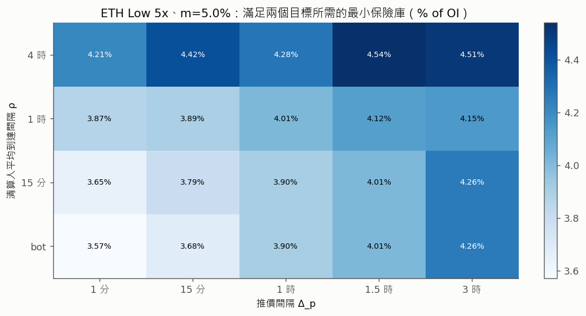

- **單看壞帳，現況的推價與清算速度在 u₀ = 5% 下都可行**；最慢的組合（推價 3 小時、清算人平均 4 小時）需要 4.5%，最快（1 分＋bot）需要 3.6%。檢查間隔每慢一級，需要的保險庫約多 0.1–0.3% of OI。
- **決定推價間隔的主要是價格時效風險**（§3.5），不是壞帳：cron 排程（實測 68–169 分）無論怎麼調都無法讓開倉可用的價格時效降到分鐘級，必須改成常駐 keeper，並以價格偏離觸發補強。
- 清算人：壞帳目標本身容許平均 4 小時的手動清算，但 closeAmount ≤ 0 的倉位清算人拿 0，沒有人有誘因去清算壞帳倉位，所以仍建議協議自營清算 bot（Phase 3.3）。

### 6.4 公鏈版（Base Sepolia 現況）建議參數表

「現況」＝不改 keeper 與清算機制（cron keeper、無 bot），只動 setter；「改善後」＝常駐 keeper（每分鐘或偏離 0.1% 即推）＋清算 bot。所有建議都只需要 owner setter（`setMaxLeverageFor`、`setMaintenanceMarginFor`、`setMaxPriceAge`、`setLiquidationPenaltyBps`）或鏈下程式（keeper、清算 bot），**不需要改合約**；只有資金費快照制的修正（改成按持有時間累積）要改合約，見 §8。前提：保險庫 = 該資產 OI 的 5%（u₀ 不同時查 §4.4）。逐資產的「現況／改善後」數字見 §6.2。

| 參數 | 基礎設施 | 現值 | 建議 | 依據 |
|---|---|---|---|---|
| sBTC 槓桿上限／MMR（High） | 兩者 | 1x／500 bps | **維持** | 1x 幾乎沒有壞帳（§4.4） |
| sETH 槓桿上限／MMR（Low） | 兩者 | 5x／500 bps | **維持** | 最小保險庫約 3.4% of OI（§4.4），改善後約 2.2%（§6.2） |
| sAAPL 槓桿上限／MMR（Low） | 現況 | 5x／500 bps | **4x／1000 bps** | 現值需要約 9–12% of OI 的保險庫，超過 5% 假設；4x＋10% 約 4.5%（§6.2） |
| sAAPL 槓桿上限／MMR（Low） | 改善後 | 5x／500 bps | **5x／1500 bps** | 股票跳空是財報型大跳，靠提高 MMR 加大緩衝（§6.2） |
| sTSLA 槓桿上限／MMR（High） | 兩者 | 1x／500 bps | **維持** | 任何分級都只建議 1x（§6.2） |
| 推價間隔 | — | cron 15 分（實測 68–169 分，平均約 90 分） | **常駐 keeper、分鐘級，並以價格偏離觸發補強** | 價格時效屬高風險（§3.5）；單看壞帳，現況間隔在 u₀ = 5% 下可行（§6.3） |
| 清算檢查 | — | 無清算 bot（只有前端手動） | **常駐清算 bot，每次推價後立即檢查** | 清算人反應比推價間隔更影響壞帳（§3.6(b)）；資不抵債的倉位清算人沒有獎勵 |
| maxPriceAge（exchange） | 現況 | 6 h（原始碼預設 24 h） | **降低，下限為實測最長推價間隔** | 低於推價間隔會讓正常運作 revert；高於它只會擴大價格時效風險 |
| 開倉可用的價格時效 | 改善後 | 與 maxPriceAge 相同 | **遠小於現值；或延遲成交、以成交後的價格結算** | 價格時效屬高風險，風險與 maxPriceAge、推價間隔同向增加；單靠縮短 maxPriceAge 無法完全消除（§3.5） |
| 資金費累積方式 | — | 8h 快照、持有時間不加權 | **改為按持有時間累積（需改合約）** | 中高風險（§5.4） |
| 清算人獎勵 | — | 5%（constant） | **5%（維持）** | 改動要重新部署 |
| 保險庫分配（liquidationPenaltyBps） | — | 20% | **20%（維持）** | 尾端由單日跳空主導，罰金收入幫助有限；提高比例可降低所需保險庫（§4.4 敏感度） |

## 7. 假設與限制

| # | 假設／限制 | 影響方向 | 說明 |
|---|---|---|---|
| 1 | 價格過程：GBM／Merton，跳幅常態、μ = 0 | 不確定 | 樣本漂移不顯著所以取 0；常態跳幅可能低估極端尾端，因此加密另加崩盤成分 N(−15%, 5%²)、每年 1 次（壓力假設，不是估計值） |
| 2 | 門檻法的 λ 只計 4σ 以上的跳躍 | 偏低估 λ、偏高估 σ_J | 「跳躍變異」大致保留；MLE 結果顯示資料有波動群聚，模型沒有隨機波動度 |
| 3 | 股票以「6.5 小時交易日」模擬，跳躍隨機發生在盤中 | 不確定 | 實際的跳空集中在開盤（ReduceOnly 休市、開盤時 keeper 推價），壞帳的「大小」相近、時點不同 |
| 4 | 代表性帳簿：60 個倉位、多空各半、全部用分級上限的槓桿、過去 7 天開倉 | 偏保守（槓桿）／不確定（組成） | 真實帳簿的槓桿分布未知；同一資產的倉位完全相關 |
| 5 | 每日獨立（bootstrap），每個資產各自一個保險庫 | 偏樂觀 | 實際只有一個 InsuranceVault；BTC 與 ETH 的崩盤高度相關，合計需求介於「各自需求的最大值」與「加總」之間 |
| 6 | keeper 推的價格＝真實市價 | 偏樂觀 | 沒有模擬來源錯價、操縱或 MockOracle 寫價沒有偏離上限（`MockOracle.sol:64-75`）的風險 |
| 7 | 收入只算清算罰金；LP 存入、注資不計；LP 隨時可提領（無冷卻期）也不計 | 前者偏保守、後者偏樂觀 | 壓力時 LP 可能在 bailout 前提走資金，實際可用的保險庫可能小於帳面 |
| 8 | 當日未清算、但已資不抵債的倉位計入當日損失 | 偏保守 | 沒有清算 bot 時這部分不會自己消失；價格回升時可能部分收回 |
| 9 | ADL 掃到 25% 的反方向獲利倉位 | 不確定 | `MAX_ADL_SCAN = 128` 是索引槽數；實際比例取決於帳簿的大小與排列 |
| 10 | 清算人的經濟誘因與 gas 沒有模擬 | 偏樂觀 | closeAmount ≤ 0 時清算人拿 0，現況的 ρ（平均 4 小時）是假設 |
| 11 | 鏈上沒有 OI 上限與單倉獲利上限 | — | 原始碼有、鏈上舊版沒有；模型以鏈上為準（沒有上限） |
| 12 | mark = index（`markPremiumCapBps = 0`） | — | 與鏈上一致 |
| 13 | 資金費在壞帳模型中取 φ = 0 | 偏樂觀 | 擁擠方付資金費會讓清算價往不利方向移；§5.5 給了量級 |
| 14 | 資金費的回復彈性 θ 是假設參數 | — | 半衰期以 θ 的函數呈現，沒有實證校準 |
| 15 | 蒙地卡羅誤差 | — | 不同樣本之間「最小保險庫」的差異約 ±1% of OI（例如 sETH 5x 改善情境：反推用的樣本 2.2%、推價掃描的樣本 3.6%）；年破產機率的標準誤由 `run_all.py` 寫到 `risk_model/output/summary_full.json` 的 `annual_ruin_se`（輸出不進版控，重跑即可產生）；網格與推價掃描用 common random numbers 降低格與格之間的雜訊 |
| 16 | 股票跳躍參數只由少數跳空估計（AAPL 7 次、TSLA 6 次） | 不確定 | 股票相關的保險庫需求與建議槓桿不確定性大 |
| 17 | 資金費分析假設倉位相對 OI 無限小，且沒有模擬單次最多補算 21 個區間的上限 | — | 見 §5.4 |

## 8. 與程式不一致、任務書假設不成立之處

| # | 任務書的假設 | 程式實際 | 對模型的影響 |
|---|---|---|---|
| 1 | 清算價 S₀(1 − 1/L)/(1 − m)（MM 以現價名目計、不含費用） | 線性 S₀(1 − 1/L + m + f + β + φ)，MM 以**開倉名目**計，權益扣平倉費、借貸費、資金費（`:1160-1177`） | 多單較早、空單較晚清算（差約 m/L·S₀）；清算價與破產價恆距 m·S₀。全部改用程式式 |
| 2 | 清算獎勵 5% 清算人／95% 保險庫 | 5% 清算人（constant）、20% 保險庫（setter）、75% 退持有人，基數是 closeAmount；closeAmount ≤ 0 時三方都拿 0 | 保險庫收入只有任務書的 20/95；壞帳倉位沒有清算誘因 |
| 3 | 有清算 keeper，清算在觸價時發生 | **沒有清算 bot**，只有前端手動 | Δ 拆成推價間隔與清算人反應時間兩個參數 |
| 4 | 資金費率依 mark − index（OU 價差） | 依 OI 失衡，兩段截斷，[−74, +74] bps，死區 1.33%，快照制、用觸發當下的 OI 計算所有區間（`:1458-1518`） | X 改用正規化 OI 失衡；快照結算、持有時間不加權屬中高風險，回復力取決於回復資金是否持續持有（§5.4） |
| 5 | 壞帳扣除 ADL 後才由保險庫承擔 | **先保險庫、後 ADL**（`_absorbShortfall`） | ADL 不減少保險庫支出；「先 ADL」只能當反事實 |
| 6 | ADL 最多 128 個反方向倉位 | 128 是掃描的**索引槽數**，同向、虧損、已平倉也佔槽 | ADL 可吸收量保守估（25%） |
| 7 | maxPriceAge = 24h、價格新鮮 | 鏈上 6h；keeper 實測約 90 分鐘才推一次；開倉也接受同樣時效的價格 | 價格時效過長屬高風險（§3.5），與壞帳模型分開評估 |
| 8 | 清算機率用連續監控的封閉解 | 只在推價時點（離散）檢查 | 封閉解高估「觸價」機率約 14%（96 步時），BGK 修正可對上 |
| 9 | （隱含）MMR 只要 < 100% 就合理 | `setMaintenanceMarginFor` 不檢查 m < 1/L − f | m ≥ 1/L − f 時新倉一開就可清算；建議在營運手冊加檢查 |
| 10 | （隱含）保險庫收入足以支應壞帳 | 在現行參數與本校準下，sAAPL 5x、TSLA 5x、sTSLA 1x 的罰金收入期望 < 壞帳期望 | 保險庫長期期望為負，需要注資、降槓桿或提高 MMR（前提：vaultFeeShareBps = 0；股票跳躍參數只由少數跳空估計） |
| 11 | 保險庫可用 Cramér–Lundberg 評估 | 收入不是固定保費，而是與清算（也就是與損失）同時發生的隨機量 | 改用成對 bootstrap 的「打穿所需規模」M；Lundberg 只當無限期上界 |

另外兩點與程式邏輯無關、但會影響結論的事實：

- 原始碼與鏈上不同（交易引擎鏈上是 18,861 B 的舊版）：OI 上限、單倉獲利上限、guardian、逐資產模式在鏈上都不存在。模型以鏈上為準。
- 保險庫的實際規模與各資產 OI 沒有盤點；§4、§6 的結論都以「保險庫 = OI 的 5%」為前提，要套用時請以實際比例查 §4.4 的表。

## 9. 檔案與重現

| 檔案 | 內容 |
|---|---|
| `risk_model/params.py` | 程式實際參數（原始碼／鏈上）與三種基礎設施情境 |
| `risk_model/processes.py` | GBM、Merton（含崩盤成分）、對數報酬密度 |
| `risk_model/calibration.py` | 資料抓取與快取、GBM／門檻法／MLE 校準 |
| `risk_model/liquidation.py` | 清算價、破產價、程式不等式的整數重現、首次穿越封閉解、MC 驗證 |
| `risk_model/gap_risk.py` | 推價與清算人檢查點、代表性帳簿、壞帳模擬、重要性抽樣、價格時效 |
| `risk_model/insurance.py` | 保險庫收入、打穿所需規模 M、逐日模擬、Lundberg |
| `risk_model/funding.py` | 程式費率函數、OU 半衰期、累積方式情境 |
| `risk_model/inverse.py` | 參數反推 |
| `risk_model/run_all.py` | 一鍵重現（`--quick` 給 CI、`--only` 只跑部分段落） |
| `risk_model/tests/` | pytest：封閉解 vs MC、清算價邊界、程式不等式（Python 重寫）逐點一致、Δ → 0 壞帳 → 0、重要性抽樣不偏、資金費率實例、離線參數檔… |
| `risk_model/data/calibrated_params.json` | 校準後的參數（原始價格快取 `*.csv` 不進版控） |
| `risk_model/output/`（不進版控） | 重跑產生的數字、表格與圖 |
| `.github/workflows/risk-model.yml` | CI：pytest＋`run_all.py --quick --offline` |

環境：Python 3.10（`py -3.10 -m venv risk_model/.venv`），`pip install -r risk_model/requirements.txt`（numpy 2.2.6、scipy 1.15.3、pandas 2.3.3、matplotlib 3.10.9、pytest 9.1.1）。圖的中文字型用 Microsoft JhengHei，找不到時退回其他 CJK 字型或預設字型、不報錯。
