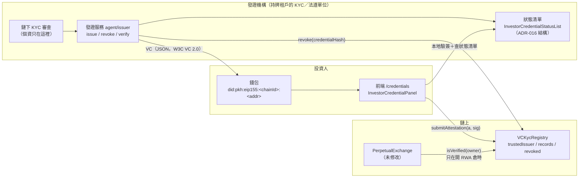
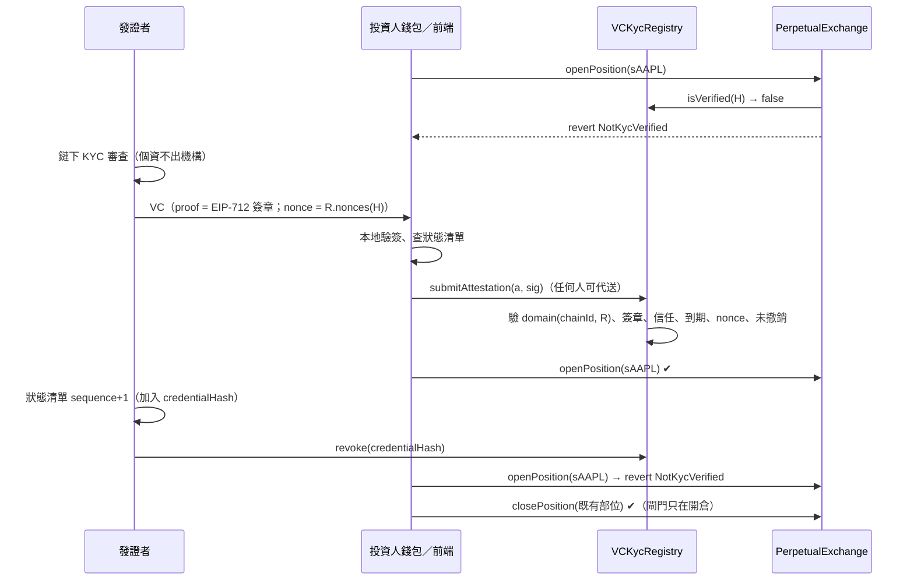

# SSI 准入的 RWA 市場：合格投資人 VC → 鏈上 KYC 登錄

> 2026-10-06。把「可驗證憑證（VC）」真正接到 PerpetualExchange 的 RWA 合規閘門。
> 設計脈絡：[`DESIGN_BESU.md`](DESIGN_BESU.md) §3（身分准入）、[`ADR-016`](ADR-016-vc-credential-status.md)（狀態清單撤銷）、
> [`AGENT_IDENTITY_VC_SSI.md`](AGENT_IDENTITY_VC_SSI.md)（agent 授權 VC，與本文的投資人 VC 用途不同、不合併）。
> **PerpetualExchange 一行都沒改**：閘門本來就是 `rwaAsset[asset] && kyc != 0 && !kyc.isVerified(owner)`，
> 這裡只換一顆實作 `IKyc` 的新登錄，經既有 owner setter `setKycRegistry` 接上。本次沒有部署到任何公開鏈。

## 0. 一頁摘要

| 問題（舊 `KYCRegistry`） | 這次的作法（`VCKycRegistry`） |
|---|---|
| 姓名、國籍字串寫上鏈 | 鏈上只有地址、類型 id、時間戳、憑證 id 的雜湊 |
| 「送件＝使用者自己寫」，審核靠 owner 手動翻 bool | 審核在發證機構（鏈下），結果以 EIP-712 簽章的資格證明上鏈，**合約自己驗簽** |
| 沒有到期 | 每張憑證有 `expiresAt`，到期自動失效 |
| 撤銷只能逐人 `revokeKYC` | 發證者以 `credentialHash` 撤銷、或「某時間前全部撤銷」；移除發證者信任＝其憑證全部失效 |
| 只有一種「通過」 | 類型：`KYC_BASIC`、`QUALIFIED_INVESTOR`（QI 隱含 BASIC）；registry 設定 `isVerified` 要求哪一種 |

一張 VC、一個簽章、兩種用途：VC 的 `proof.proofValue` **就是**發證者對 `QualifiedInvestorAttestation` 的 EIP-712 簽章；
同一組（attestation, signature）直接送進 `VCKycRegistry.submitAttestation`。改 VC 任何欄位，簽章就還原不出發證者。

## 1. 架構



| 檔案 | 角色 |
|---|---|
| `contracts/src/VCKycRegistry.sol` | 新合約，實作 `IKyc.isVerified` |
| `contracts/script/DeployVCKycRegistry.s.sol` | 部署、信任發證者、可選接線 exchange |
| `frontend/src/contracts/investorCredential.ts` | **單一真相來源**：EIP-712 schema、VC／清單文件格式、驗證邏輯（crypto 由呼叫端注入）——發證服務與瀏覽器跑同一份 |
| `agent/issuer/investorVc.ts`、`cli.ts` | 發證服務：簽發、撤銷（清單＋鏈上交易資料）、驗證、送出（本機鏈） |
| `frontend/src/lib/pepefi/investorCredentialCheck.ts`、`components/pepefi/InvestorCredentialPanel.tsx`、`pages/pepefi/InvestorCredentialPage.tsx` | 前端 `/credentials` 頁 |
| `besu/scripts/deploy-vc-kyc.sh` | 接在 `besu/scripts/deploy.sh` 之後的 Besu 選項 |
| `scripts/poc/rwa-ssi-demo.sh`、`agent/issuer/poc.ts` | 一鍵 PoC（anvil） |

## 2. 資料流



## 3. 合約設計

### 3.1 型別與 EIP-712

```
domain = { name: "PepeLabVCKycRegistry", version: "1", chainId, verifyingContract: registry }
QualifiedInvestorAttestation(address subject, bytes32 credentialType, bytes32 credentialHash,
  uint256 statusListIndex, uint64 issuedAt, uint64 expiresAt, uint256 nonce, uint256 deadline)
```

- `credentialType` = `keccak256("KYC_BASIC")` 或 `keccak256("QUALIFIED_INVESTOR")`；owner 可用 `setCredentialType` 登記其他類型。
- `credentialHash` = `keccak256(utf8(VC id))`（VC id 就是 jti，`urn:uuid:…`）。
- `statusListIndex`：發證者紀錄中的序號，給稽核對照與將來的 Bitstring Status List；**撤銷以 `credentialHash` 為準**。
- type string 在 Solidity、前端 schema、agent 三處各有測試互相比對（`test_typehash_isStable`、`issuer.test.ts` §1、`investorCredentialCheck.test.ts`）。

### 3.2 狀態

| 變數 | 意義 |
|---|---|
| `trustedIssuer[issuer][type]` | 某發證者是否受信任簽發某類型（`setIssuer`，事件 `IssuerSet`） |
| `issuerTypeCount[issuer]` | 受信任的類型數；> 0 才能撤銷 |
| `credentialTypeSupported[type]`、`requiredType` | 支援的類型；`isVerified` 要求的類型（`setRequiredType`，事件 `RequiredTypeSet`） |
| `_records[subject][type]` | `(issuer, issuedAt, expiresAt, credentialHash)`，`credentialOf` 讀取 |
| `nonces[subject]` | 下一個可用 nonce |
| `credentialUsed[hash]` | 每個憑證只能登記一次 |
| `revoked[issuer][hash]`、`revokedBefore[issuer]` | 以發證者分命名空間的撤銷；發證者只能撤銷自己的 |

### 3.3 `isVerified(user)`

`hasValidCredential(user, requiredType)`：紀錄存在、`block.timestamp < expiresAt`、發證者**此刻**仍受信任簽該類型、
未被撤銷、`issuedAt ≥ revokedBefore[issuer]`、類型仍支援。要求 `KYC_BASIC` 時，有效的 `QUALIFIED_INVESTOR` 也算數。
**一顆 registry 只有一個 `requiredType`**：exchange 只有一個 `kyc` 欄位、`isVerified` 不帶資產，所以「RWA 市場要 QI、其他市場要 BASIC」
這種逐市場差異做不到（見 §9）。

### 3.4 防重放

| 機制 | 擋什麼 |
|---|---|
| EIP-712 domain 綁 `chainId`＋registry 位址 | 跨鏈、跨部署重放（測試 `test_domain_otherChain_rejected`、`test_domain_otherRegistry_rejected`） |
| `nonce == nonces[subject]`，用過遞增 | 同一簽章重送；拿舊憑證蓋掉新憑證（`test_replay_oldAttestationAfterNewer_rejected`） |
| `deadline` | 簽章無限期可送 |
| `credentialUsed[hash]` | 同一張憑證換 nonce 重簽再登記 |
| subject 在簽章內 | 把別人的簽章改成自己的地址（`test_replay_otherSubject_rejected`） |

代價：發證者簽發時要讀 `nonces(subject)`（CLI 的 `--rpc`），同一投資人的兩張憑證要依序送。

### 3.5 參數

| 參數 | 值 | 位置 |
|---|---|---|
| `requiredType` | 部署預設 `QUALIFIED_INVESTOR` | 建構子、`DeployVCKycRegistry` 的 `VC_KYC_REQUIRED_TYPE` |
| `MAX_CLOCK_SKEW` | 300 秒（與 agent 端 `MAX_CLOCK_SKEW_SEC` 相同） | `VCKycRegistry.sol` |
| VC 有效期 | 預設 365 天、上限 1095 天 | `DEFAULT_INVESTOR_VC_VALIDITY_DAYS`、`issueInvestorCredentialWithSigner` |
| 送出期限 | 預設簽發後 30 天，且不晚於到期 | `DEFAULT_ATTESTATION_SUBMIT_WINDOW_DAYS` |
| 狀態清單有效期 | 預設 30 天、上限 90 天、最多 1000 筆（沿用 ADR-016） | `agentAuthStatus.ts` 常數 |
| `revokeAllBefore` 上限 | `now + 301` 秒（同 ADR-016 `REVOKE_ALL_LEAD_SEC`） | `_setRevokedBefore` |
| 合約大小 | 新合約，與 PerpetualExchange 的 EIP-170 餘裕無關 | — |

## 4. 隱私

- **鏈上**：`subject` 地址、類型 id、`issuedAt`／`expiresAt`、`credentialHash`、`statusListIndex`、發證者地址。沒有姓名、證號、國籍、財力資料。
- **VC 本身**：`credentialSubject` 只有 `id`（did:pkh）與 `credentialType`（測試斷言欄位集合）。
- **發證者本機紀錄**（`agent/.state/investor-issuer-db.json`）：只有索引、VC id、雜湊、地址、時間；個資留在機構原本的 KYC 系統。
- 仍會公開的：「這個地址是某機構認定的合格投資人、到期日是哪天」。在許可鏈上所有節點營運者都看得到（DESIGN_BESU §3.5）。
  地址匿名化（零知識成員證明）要和 §2 的私密路徑一起做，本次不涵蓋。
- 前端只在 VC 指定的狀態清單網址是 https 或本機時才去抓；抓清單會讓清單主機知道有人在查某發證者（ADR-016 §3 同樣的取捨）。

## 5. 撤銷與一致性

兩份撤銷資料，**角色不同**：

| | 鏈下狀態清單（ADR-016 結構） | 鏈上 `revoked` |
|---|---|---|
| 格式 | `InvestorCredentialStatusList`：`sequence`、`revokedBefore`、正規排序的 `revoked`（credentialHash）、有效期 ≤ 90 天，發證者 EIP-712 簽章，domain 綁 registry | `revoke(hash)`、`revokeAllBefore(ts)` |
| 誰讀 | 發證服務 `verify`、前端預檢、將來的鏈下准入服務 | **exchange 的閘門**（經 `isVerified`） |
| 權威性 | 預檢與稽核 | **權威**：開倉只看這份 |

**撤銷順序**（`cli.ts revoke`）：先簽新清單（sequence + 1、累積、驗過舊清單的簽章與 domain 才接續），再產生 `revoke(credentialHash)` 交易資料。
- 正式環境由發證者的錢包／KMS 送出；CLI 加 `--send` 只允許本機 RPC 且 chainId 必須相符。
- 兩步之間的空窗：清單已撤銷但鏈上還沒 → 鏈下預檢已拒絕，但**鏈上閘門仍放行**，直到交易上鏈。所以 SLA 要訂在鏈上交易。
- 反方向（鏈上已撤銷、清單還沒更新）不會放行任何東西：鏈上是權威。
- **預先撤銷**：投資人還沒提交就撤銷，之後 `submitAttestation` 以 `CredentialIsRevoked` 拒絕（`test_preRevoked_cannotBeSubmitted`）。
- **全部撤銷**：清單的 `revokedBefore` 對應鏈上 `revokeAllBefore`；發證者金鑰外洩時 owner 可用 `revokeAllBeforeAsOwner`，或直接 `setIssuer(issuer, type, false)`。
- **不會把人鎖在部位裡**：撤銷只影響開新倉，平倉、清算、提領不檢查 KYC（`test_fullLifecycle_submitOpenRevokeClose`、PoC 步驟 8）。

**與 ADR-016 程式碼的重用**（`agent/issuer/investorVc.ts` 開頭註解）：驗證端的 `StatusStateStore`（sequence 高水位、同號異文偵測、
sticky 撤銷記憶）、`dirStatusSource`／`httpStatusSource`（目錄標記、HTTP 不跟隨轉址、本文上限）、`isCredentialRevoked`、
`statusListExpiryWarning` 都直接重用 `agent/shared/src/vcStatus.ts`。沒有重用的是 `verifyStatusList`／`createVcStatusChecker`：
它們把 domain 寫死成 agent 授權 VC（`PepeLabAgentAuthorization`、chainId 84532、session manager），改它們會讓 signal-api 的 bundle 指紋改變；
新的清單驗簽放在共用 schema（`verifyInvestorStatusListWith`），primary type 不同、domain 綁 registry，清單簽章與 VC 簽章不可互換（測試）。
fail-closed 規則相同：清單目錄未初始化、來源不可達、驗不過、重放、被扣住 → 狀態不明（不簽新的、不放行預檢）。

## 6. 發證服務（`agent/issuer`）

```bash
cd agent
npm run issuer -- init                                   # 建立狀態清單目錄標記（只做一次）
ISSUER_PRIVATE_KEY=… npm run issuer -- issue --subject 0x… --registry 0x… --chain-id 31337 \
  --rpc http://127.0.0.1:8545 --out vc.json             # nonce 由本機 RPC 讀；或給 --nonce
ISSUER_PRIVATE_KEY=… npm run issuer -- revoke --vc vc.json --registry 0x… --chain-id 31337   # 只印交易資料
npm run issuer -- verify --vc vc.json --registry 0x… --chain-id 31337 [--rpc URL]
SUBMITTER_PRIVATE_KEY=… npm run issuer -- submit --vc vc.json --rpc http://127.0.0.1:8545   # 只限本機鏈
```

- 金鑰只讀環境變數。正式環境的發證金鑰應放 KMS（ADR-014），以 `issueInvestorCredentialWithSigner`／`issueInvestorStatusListWithSigner` 接上。
- 測試：`npm run test:issuer`（已併入 `npm test`）。

## 7. 前端（`/credentials`）

上傳或貼上 VC → 本地驗證（簽章、效期、domain、狀態清單）→ 讀鏈上（發證者是否受信任、是否已撤銷／登記、nonce）→
送出 `submitAttestation` → 顯示目前資格與到期日。registry 位址來源：建置時的 `VITE_VC_KYC_REGISTRY`，或
`src/contracts/vcKycRegistry.ts` 的 per-chain 表（目前是空的）；**沒有位址時整個面板降級為「此部署尚未啟用 VC 准入」**。
前端只是預檢，送出後合約會再驗一次。新頁面沒有加進側邊欄（避免與其他前端分支衝突），入口是網址 `/credentials`。

## 8. 部署

| 情境 | 指令 |
|---|---|
| 本機 anvil（PoC） | `bash scripts/poc/rwa-ssi-demo.sh`（見 §10） |
| 本地 Besu | `bash besu/scripts/deploy.sh` 之後 `VC_KYC_ISSUER=0x… bash besu/scripts/deploy-vc-kyc.sh`；位址寫到 `besu/deployments/<chainId>.vc-kyc.json`。要「所有市場都要 KYC」就設 `VC_KYC_RWA_ASSETS=sBTC,sETH,sAAPL,sTSLA` |
| Base Sepolia（由擁有者執行） | `VC_KYC_ISSUER=… VC_KYC_CHAIN_ID=84532 forge script script/DeployVCKycRegistry.s.sol:DeployVCKycRegistry --rpc-url https://sepolia.base.org --account pepelab-rwa-deployer --sender <該 keystore 的地址>`，先不加 `--broadcast` 做 dry-run，確認後再加。這把 keystore 不是現行 exchange 的 owner，接線（`setKycRegistry`／`setRwaAsset`）只會印出來，要由 owner／timelock 送 |
| 其他鏈 | `VC_KYC_ISSUER=… VC_KYC_CHAIN_ID=<chainId> forge script script/DeployVCKycRegistry.s.sol:DeployVCKycRegistry --rpc-url … --account <keystore> --sender <地址> --broadcast` |

`DeployVCKycRegistry.s.sol` 的防呆：broadcaster、owner、發證者若是已知外洩地址（`agent/shared/src/payoutSafety.ts` 的 `COMPROMISED_ADDRESSES`）一律拒絕；
非 31337 的鏈必須以 `VC_KYC_CHAIN_ID` 明確確認；只有 broadcaster **就是** exchange owner 時才送 `setKycRegistry`／`setRwaAsset`，
否則只印出 owner 要送的呼叫。`VC_KYC_OWNER` 與 broadcaster 不同時走 Ownable2Step（新 owner 要 `acceptOwnership`）。
正式 exchange 的 owner 是 timelock 時，`setKycRegistry` 要走 timelock 提案（`GOVERNANCE_HANDOVER.md`）。

## 9. 與 ERC-3643（T-REX）／ONCHAINID 的對照

| | ERC-3643 ＋ ONCHAINID | 本設計 |
|---|---|---|
| 狀態 | ERC-3643 為 Final（2021-07 提出）[1] | PoC，未部署公開鏈 |
| 閘門位置 | 代幣轉帳（`canTransfer`／`isVerified(receiver)`）[1] | 衍生品開倉（`isVerified(owner)`），平倉不檢查 |
| 身分 | 每位投資人一個 ONCHAINID 身分合約（ERC-734 金鑰＋ERC-735 claim）[2] | 錢包地址本身（did:pkh），**不部署**每人一顆身分合約 |
| 資格證明 | 發證者簽的 claim 存進投資人的身分合約 | 發證者簽的 EIP-712 attestation，登錄只存雜湊與時間；VC 文件留在持有人手上（W3C VC 2.0 [3]） |
| 受信任發證者 | Trusted Issuers Registry（發證者 ↔ claim topics）[1] | `trustedIssuer[issuer][type]` |
| 要求的資格 | Claim Topics Registry（可多個 topic）[1] | 單一 `requiredType`（QI 隱含 BASIC） |
| 地址與身分的對應 | Identity Registry＋Identity Registry Storage（可多個 registry 共用）[1] | `_records[subject][type]`（每顆 registry 各自一份） |
| 國別、持有上限等規則 | Compliance 模組 [1] | 沒有；交由 exchange 既有的 OI 上限與市場模式 |
| 撤銷 | 發證者撤銷 claim（ClaimIssuer 合約）[2] | 鏈上 `revoke(hash)`／`revokeAllBefore`＋鏈下狀態清單（ADR-016 結構；W3C Bitstring Status List 的概念 [4]） |

**為什麼不直接用 ERC-3643**：它規範的是**許可型代幣**的轉帳；PepeLab 的 RWA 曝險是合成 CFD 部位，沒有代幣轉帳可以掛 `canTransfer`。
exchange 能接的只有 `IKyc.isVerified(address)`。本設計可以視為 ERC-3643 Identity Registry 的「最小子集」：保留受信任發證者與
資格類型兩個概念，用 EIP-712 attestation 取代每人一顆身分合約。將來若要與 ERC-3643 生態互通，可以寫一顆讀 ONCHAINID claim 的
`IKyc` 轉接器，同樣經 `setKycRegistry` 換上。

來源：
[1] ERC-3643: T-REX — Token for Regulated EXchanges，<https://eips.ethereum.org/EIPS/eip-3643>（查證 2026-10-06：Final）
[2] ONCHAINID Solidity 實作（"implementation of the ERC734 and ERC735 proposal standards"），<https://github.com/onchain-id/solidity>；文件 <https://docs.onchainid.com/>
[3] W3C Verifiable Credentials Data Model v2.0，<https://www.w3.org/TR/vc-data-model-2.0/>
[4] W3C Bitstring Status List v1.0，<https://www.w3.org/TR/vc-bitstring-status-list/>
另：EIP-712 <https://eips.ethereum.org/EIPS/eip-712>；did:pkh <https://github.com/w3c-ccg/did-pkh>；
EthereumEip712Signature2021 <https://w3c-ccg.github.io/ethereum-eip712-signature-2021-spec/>

## 10. 限制

- **鏈下→鏈上撤銷有空窗**：清單先撤、鏈上交易後到之前，閘門仍放行（§5）。
- **逐市場不同資格做不到**：exchange 只有一個 `kyc`、`isVerified` 不帶資產；要逐市場區分只能部署多套 exchange。
- **撤銷不處理既有部位**：與 DESIGN_BESU §3.4 相同，強制處置只能整個資產 ReduceOnly 或走鏈下程序。
- **nonce 要求依序**：同一投資人同時拿到兩張未送出的憑證，只有 nonce 對的那張能先送。
- **發證者是 EOA 簽章**：用 `ECDSA`，沒有支援 ERC-1271（多簽／合約錢包發證者）。KMS 簽 EOA 是可行路徑。
- **前端預檢不含 agent 端的防重放記憶**：瀏覽器每次重抓清單、不記 sequence 高水位；權威仍是鏈上。
- **agent 代開倉**：閘門查的是 session 的使用者（DESIGN_BESU §3.1），所以投資人本人要有 QI；agent 授權 VC 不變。
- **Base Sepolia 正式部署沒有換 registry**：本次只到 PoC；換上要 owner／timelock 決定。
- 狀態清單的 HTTP 主機與 ADR-016 §7.1 有同樣的「有沒有清單由主機回答」信任假設；鏈上撤銷是補強。

## 11. PoC 錄製步驟

前置：Foundry、Node ≥ 20、`agent/` 已 `npm ci`、`contracts/lib` 有 OpenZeppelin（worktree 用 junction）。

```bash
bash scripts/poc/rwa-ssi-demo.sh          # 預設 port 8547；POC_PORT=… 可改
```

多個工作共用一台低記憶體主機時，整支腳本放進同一個共用鎖呼叫裡（anvil 在腳本內啟動、結束時由 trap 關閉，不會跨出鎖的範圍）。

腳本做的事：起 anvil（port 已被佔用就停，不碰別人的節點）→ `Deploy.s.sol` 部署整套 → `DeployVCKycRegistry.s.sol`
部署並接線（印出每筆交易 hash）→ `agent/issuer/poc.ts` 依序：
1. 投資人領測試 USDC、存保證金
2. 未持證開 sAAPL → `NotKycVerified(投資人)`（staticCall 取原因，另送一筆 gasLimit 固定的交易讓失敗也有 hash）
3. 發證者簽發 QI VC，投資人端本地驗證
4. 投資人 `submitAttestation` → `isVerified = true`、顯示到期日
5. 開 sAAPL 多單成功
6. 發證者撤銷：狀態清單 sequence 1 ＋ 鏈上 `revoke`；再驗一次顯示 revoked
7. 再開倉 → `NotKycVerified`
8. 平倉成功
結束時 trap 關閉 anvil。產物在 `scripts/poc/.out/`（gitignored）：VC、狀態清單、廣播紀錄、anvil 紀錄。

用到的金鑰是 anvil 公開助記詞推導的開發帳戶，在 cast 現場推導，檔案裡沒有私鑰字串。

## 12. 驗證紀錄（2026-10-06，本機 Windows）

- `forge test --match-path test/VCKycRegistry.t.sol`：39 項全過（registry 34、與 PerpetualExchange 整合 5）。
- `forge test --match-path test/DeployVCKycRegistry.t.sol`：8 項全過。
- `agent`：`npm run typecheck`（含新的 `tsc -p issuer`）0 錯誤；`npm test` 全量 exit 0（新增 `test:issuer` 7 組）；`npm run bundle:check` 同步（signal-api bundle 未受影響）。
- `frontend`：`tsc --noEmit` 0 錯誤；`yarn test` 84 個檔案 1126 項全過（含新增 `investorCredentialCheck.test.ts`、`InvestorCredentialPanel.test.ts`）。
- PoC：`bash scripts/poc/rwa-ssi-demo.sh` 8 步全部符合預期，anvil 結束後已關閉。
